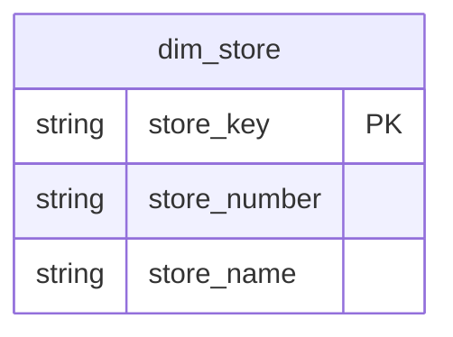
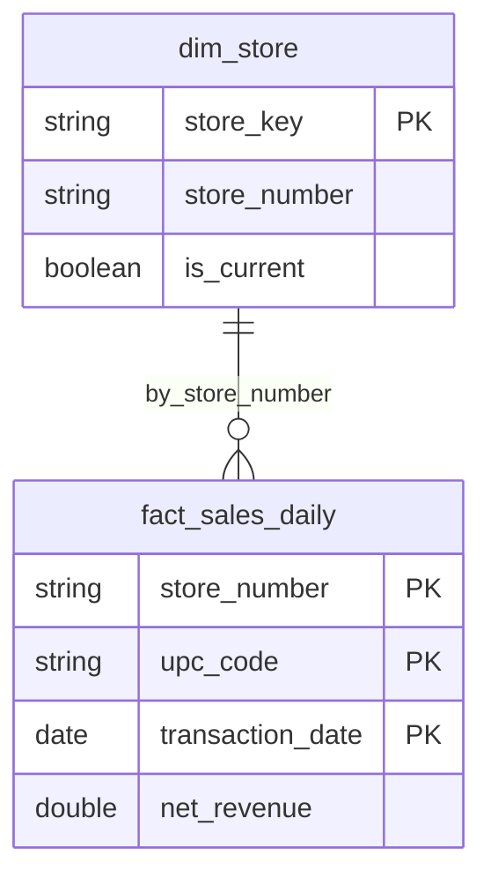

# Cursor Rules Improvement Log

This document tracks improvements and updates made to the Cursor rules based on emerging patterns, best practices, and user feedback.

---

## 2025-01-19: Gold Layer Documentation Standards

### Trigger

User request: "Can you take a pass at improving all column descriptions in the gold layer. Instead of an LLM attribute, keep a Business description and technical description, that helps humans and LLMs equally."

**Pattern Gap Identified:**
- Existing "LLM:" prefix pattern was awkward and not useful for humans
- No standardized format for dual-purpose documentation
- Gold layer tables (5 tables, 102 columns) needed comprehensive documentation
- No guidance on naming conventions for surrogate keys, business keys, and measures

### Changes Made

#### 1. Created `gold-layer-documentation.mdc`

**New comprehensive rule (700+ lines) covering:**

**Column Naming Conventions:**
- Surrogate keys: `{entity}_key` pattern (e.g., `store_key`, `product_key`, `date_key`)
- Business keys: Natural terminology (e.g., `store_number`, `upc_code`, `date`)
- Foreign keys: Surrogate FK + denormalized business key for readability
- Measures: Descriptive names with standard suffixes (`_pct`, `_total`, `_avg`)
- Boolean flags: `is_` prefix for state, action verbs for flags (`needs_replenishment`)
- Timestamps: Standard audit fields (`effective_from`, `effective_to`, `record_created_timestamp`, `record_updated_timestamp`)

**Column Description Format:**
```
[Natural definition]. Business: [purpose, use cases, business rules]. Technical: [data type, format, calculation, source, constraints].
```

**Examples:**
```python
# Surrogate key
store_key STRING NOT NULL COMMENT 'Surrogate key uniquely identifying each version of a store record. Business: Used for joining fact tables to dimension. Technical: MD5 hash generated from store_id and processed_timestamp to ensure uniqueness across SCD Type 2 versions.'

# Measure
net_revenue DECIMAL(18,2) COMMENT 'Net revenue after subtracting returns from gross revenue. Business: The actual revenue realized from sales, primary KPI for financial reporting. Technical: gross_revenue - return_amount, represents true daily sales value.'
```

**Table-Level Documentation:**
- Comprehensive comments with layer, grain, business use cases, technical implementation
- Required TBLPROPERTIES for Gold layer
- Complete dimension and fact table examples

**Validation Checklist:**
- 20+ items covering naming, documentation, properties, constraints

**Common Mistakes Section:**
- Before/after examples of patterns to avoid
- "LLM:" prefix deprecated
- Business key as PK patterns
- Missing context patterns

#### 2. Updated `databricks-table-properties.mdc`

**Changes:**
- Marked "LLM:" prefix as **legacy pattern** (Bronze/Silver only)
- Introduced **modern dual-purpose pattern** for Gold layer
- Cross-referenced new comprehensive Gold layer documentation rule
- Provided examples for both legacy and modern patterns

**New Structure:**
```markdown
### Modern Pattern (RECOMMENDED for Gold Layer)
**For Gold layer tables, use dual-purpose documentation without "LLM:" prefix.**

Pattern: [Natural description]. Business: [context]. Technical: [details].

### Legacy Pattern (Bronze/Silver)
**For Bronze and Silver layers, "LLM:" prefix is acceptable for brevity.**
```

#### 3. Updated Codebase

**Modified:** `src/altria_gold/create_gold_tables.py`

**Tables Updated:**
1. `dim_store` - 22 columns (SCD Type 2)
2. `dim_product` - 11 columns (SCD Type 1)
3. `dim_date` - 24 columns (calendar dimension)
4. `fact_sales_daily` - 30 columns (sales aggregations)
5. `fact_inventory_snapshot` - 15 columns (inventory snapshot)

**Total:** 102 columns with comprehensive dual-purpose documentation

**Before:**
```python
store_key STRING NOT NULL COMMENT 'LLM: Surrogate key (unique per version)'
```

**After:**
```python
store_key STRING NOT NULL COMMENT 'Surrogate key uniquely identifying each version of a store record. Business: Used for joining fact tables to dimension. Technical: MD5 hash generated from store_id and processed_timestamp to ensure uniqueness across SCD Type 2 versions.'
```

#### 4. Created Case Study Documentation

**New File:** `docs/RULE_IMPROVEMENT_GOLD_DOCUMENTATION.md`

**Sections:**
- Trigger analysis and pattern gap
- Before/after comparison
- Implementation details
- Metrics: 5-10x more context per column
- Reusable insights and workflow
- Replication strategy for similar improvements

### Impact Assessment

**Metrics: Before vs After**

| Aspect | Before | After | Improvement |
|--------|--------|-------|-------------|
| **Column Description Length** | ~8-15 words | ~40-80 words | 5-10x more context |
| **Business Context** | Minimal/missing | Comprehensive | ✅ 100% coverage |
| **Technical Details** | Variable | Standardized | ✅ Consistent format |
| **Calculation Logic** | Rarely documented | Always included | ✅ Full transparency |
| **Self-Service Discovery** | Low | High | ✅ User empowerment |

**Benefits:**

✅ **For Business Users:**
- Clear explanations without technical jargon first
- Business use cases and decision context
- Self-service data discovery

✅ **For Technical Users:**
- Implementation details and calculation logic
- Source system information
- Performance implications

✅ **For LLMs (Genie, AI/BI):**
- Rich semantic context for natural language queries
- Clear relationships between fields
- Business logic for metric calculations

✅ **For Data Governance:**
- Complete field documentation for compliance
- Clear lineage and source information
- Privacy and security context

### Documentation Created

**New Files:**
1. `.cursor/rules/gold-layer-documentation.mdc` - 700+ lines of comprehensive standards
2. `docs/RULE_IMPROVEMENT_GOLD_DOCUMENTATION.md` - Case study and implementation guide

**Updated Files:**
1. `.cursor/rules/databricks-table-properties.mdc` - Updated with modern pattern
2. `src/altria_gold/create_gold_tables.py` - 102 columns updated

**Content Coverage:**
- ✅ 30+ code examples (DO and DON'T patterns)
- ✅ Complete naming convention standards
- ✅ Dual-purpose description template
- ✅ Validation checklist (20+ items)
- ✅ Common mistakes guide
- ✅ Complete table examples (dimension and fact)

### Lessons Learned

1. **Pattern Recognition:** Work on 102 columns revealed clear need for standardization
2. **User-Driven:** Direct user request highlighted real pain point
3. **Dual-Purpose Documentation:** Serving multiple audiences (humans, LLMs, BI tools) requires explicit Business and Technical sections
4. **Cross-Layer Distinction:** Gold layer elevated to production-grade documentation, Bronze/Silver retain simpler format
5. **Self-Documentation:** Rich descriptions enable self-service analytics and reduce tribal knowledge dependency

### Replication Strategy

This improvement demonstrates the self-improvement workflow:

1. ✅ **Validate Trigger** - Pattern used across 5 tables (102 columns)
2. ✅ **Define Pattern** - Created before/after examples from real code
3. ✅ **Create Comprehensive Rule** - 700+ lines with examples, checklist, mistakes
4. ✅ **Update Related Rules** - Deprecated old pattern, cross-referenced new rule
5. ✅ **Apply to Codebase** - Updated all 102 columns in Gold layer
6. ✅ **Create Case Study** - Documented trigger, analysis, implementation, results

### References

- Rule: `.cursor/rules/gold-layer-documentation.mdc`
- Updated: `.cursor/rules/databricks-table-properties.mdc`
- Case Study: `docs/RULE_IMPROVEMENT_GOLD_DOCUMENTATION.md`
- Implementation: `src/altria_gold/create_gold_tables.py`
- Related: `unity-catalog-constraints.mdc`, `gold-layer-merge-patterns.mdc`

---

## 2025-10-17: DLT Direct Publishing Mode Update

### Trigger
User feedback: "In DLT pipelines, please don't use Live Prefix. Also, don't use Target in DLT pipeline. These are deprecated patterns and now there is DLT Direct Publishing Mode which allows you to publish to multiple schemas and catalog, and uses schema instead of target."

### Changes Made

#### 1. Updated `dlt-expectations-patterns.mdc`

**Added Section: "DLT Direct Publishing Mode (Modern Pattern)"**
- Documented deprecated patterns:
  - ❌ `LIVE.` prefix for table references (e.g., `LIVE.bronze_transactions`)
  - ❌ `target:` field in DLT pipeline configuration
  
- Documented modern patterns:
  - ✅ Fully qualified table names: `{catalog}.{schema}.{table_name}`
  - ✅ `schema:` field in DLT pipeline configuration (not `target`)
  - ✅ Helper function to build table names from configuration

**Added Implementation Pattern:**
```python
from pyspark.sql import SparkSession

def get_source_table(table_name, source_schema_key="bronze_schema"):
    """Helper function to get fully qualified table name from DLT configuration."""
    spark = SparkSession.getActiveSession()
    catalog = spark.conf.get("catalog")
    schema = spark.conf.get(source_schema_key)
    return f"{catalog}.{schema}.{table_name}"

@dlt.table(...)
def silver_transactions():
    return (
        dlt.read_stream(get_source_table("bronze_transactions"))
        .withColumn(...)
    )
```

**Added DLT Pipeline Configuration (YAML):**
```yaml
resources:
  pipelines:
    silver_dlt_pipeline:
      # ✅ CORRECT: Use 'schema' (Direct Publishing Mode)
      catalog: ${var.catalog}
      schema: ${var.silver_schema}
      
      # ❌ WRONG: Don't use 'target' (deprecated)
      # target: ${var.catalog}.${var.silver_schema}
      
      configuration:
        catalog: ${var.catalog}
        bronze_schema: ${var.bronze_schema}
        silver_schema: ${var.silver_schema}
```

**Updated Examples:**
- Changed `dlt.read_stream("LIVE.bronze_<entity>")` → `dlt.read_stream(get_source_table("bronze_<entity>"))`
- Fixed `coalesce(col(...), 0)` → `coalesce(col(...), lit(0))` for proper PySpark typing
- Added required imports: `from pyspark.sql.functions import col, lit, coalesce, when, current_timestamp`

#### 2. Updated `databricks-asset-bundles.mdc`

**Added Warning Section:**
- Documented deprecated `target:` pattern
- Documented deprecated `LIVE.` prefix pattern
- Listed benefits of Direct Publishing Mode:
  - Publish to multiple catalogs/schemas
  - Better cross-schema lineage
  - Explicit catalog control
  - Unity Catalog forward-compatible

**Updated DLT Pipeline Pattern:**
```yaml
resources:
  pipelines:
    <pipeline_key>:
      # DLT Direct Publishing Mode (Modern Pattern)
      # ✅ Use 'schema' field (not 'target' - deprecated)
      catalog: ${var.catalog}
      schema: ${var.<layer>_schema}
      
      # Pipeline Configuration (passed to notebooks)
      # Use fully qualified table names in notebooks: {catalog}.{schema}.{table}
      configuration:
        catalog: ${var.catalog}
        bronze_schema: ${var.bronze_schema}
        silver_schema: ${var.silver_schema}
```

### Impact

**Positive:**
- ✅ Aligns with latest Databricks DLT best practices
- ✅ Prevents use of deprecated patterns in future code
- ✅ Provides clear migration path from old to new patterns
- ✅ Improves Unity Catalog compatibility
- ✅ Better cross-schema data lineage

**Implementation Status:**
- ✅ Current codebase already uses modern pattern (implemented during schema alignment)
- ✅ Silver DLT pipeline uses `schema:` field (not `target`)
- ✅ Silver DLT notebooks use `get_source_table()` helper (not `LIVE.` prefix)
- ✅ All table references are fully qualified

### References
- [Databricks DLT Documentation](https://docs.databricks.com/aws/en/dlt/)
- [DLT Direct Publishing Mode](https://docs.databricks.com/en/dlt/publish.html)
- Implementation: `resources/silver_dlt_pipeline.yml`
- Implementation: `src/altria_silver/*.py`

---

## 2025-10-17: CLUSTER BY AUTO Mandatory Standard

### Trigger
User feedback: "Cluster By should be set to Auto - Always. Please update your table-properties rules as needed, but this is the default table set-up always. Cluster by auto."

Issue encountered: `[DELTA_CLUSTERING_COLUMNS_DATATYPE_NOT_SUPPORTED] CLUSTER BY is not supported because the following column(s): is_current : BOOLEAN don't support data skipping.`

### Changes Made

#### 1. Updated `src/altria_gold/create_gold_tables.py`

**Changed all 5 Gold tables from column-specific to AUTO clustering:**
- `dim_store`: `CLUSTER BY (store_number, is_current)` → `CLUSTER BY AUTO`
- `dim_product`: `CLUSTER BY (product_code)` → `CLUSTER BY AUTO`
- `dim_date`: `CLUSTER BY (date_key)` → `CLUSTER BY AUTO`
- `fact_sales_daily`: `CLUSTER BY (transaction_date, store_number)` → `CLUSTER BY AUTO`
- `fact_inventory_snapshot`: `CLUSTER BY (store_number, upc_code)` → `CLUSTER BY AUTO`

#### 2. Updated `databricks-table-properties.mdc`

**Enhanced Clustering Configuration Section:**
- Added ⚠️ MANDATORY warning
- Added explicit "NEVER specify clustering columns manually" instruction
- Documented benefits of AUTO clustering:
  - Delta automatically selects optimal clustering columns
  - Self-tuning based on query patterns
  - No manual column specification needed
  - Works with all data types (including BOOLEAN)
  - Adapts as data and queries evolve
- Added examples of what NOT to do (column-specific clustering)
- Emphasized correct pattern with ✅ markers

**New Rule Content:**
```markdown
**⚠️ MANDATORY: ALWAYS use automatic liquid clustering**

**NEVER specify clustering columns manually. Always use AUTO.**

**❌ DO NOT DO THIS:**
CLUSTER BY (column1, column2)  -- ❌ WRONG: Never specify columns
CLUSTER BY (is_current)         -- ❌ WRONG: BOOLEAN columns don't support clustering

**✅ ALWAYS DO THIS:**
CLUSTER BY AUTO  -- ✅ CORRECT: Let Delta choose optimal clustering
```

### Impact

**Positive:**
- ✅ Prevents BOOLEAN clustering errors (and other unsupported data types)
- ✅ Enables self-tuning optimization based on actual query patterns
- ✅ Simplifies table DDL (no column analysis needed)
- ✅ Future-proof as Delta Lake clustering evolves
- ✅ Consistent across all layers (Bronze, Silver, Gold)

**Implementation Status:**
- ✅ Bronze tables already use `CLUSTER BY AUTO` (implemented earlier)
- ✅ Silver DLT tables use `cluster_by_auto=True` (DLT pattern)
- ✅ Gold tables updated to use `CLUSTER BY AUTO` (just fixed)

### Technical Details

**Root Cause of Original Error:**
- SCD Type 2 dimensions have `is_current BOOLEAN` column
- Attempted to cluster on `(store_number, is_current)`
- BOOLEAN data type doesn't support data skipping/clustering
- Error: `DELTA_CLUSTERING_COLUMNS_DATATYPE_NOT_SUPPORTED`

**Solution:**
- Use `CLUSTER BY AUTO` instead
- Delta Lake automatically selects clustering columns that:
  - Support data skipping
  - Are frequently used in query filters
  - Provide optimal data layout

### References
- [Delta Lake Automatic Liquid Clustering](https://docs.databricks.com/aws/en/delta/clustering#enable-or-disable-automatic-liquid-clustering)
- Implementation: `src/altria_gold/create_gold_tables.py`
- Implementation: `src/altria_bronze/setup_tables.py`
- Silver DLT: `src/altria_silver/*.py` (uses `cluster_by_auto=True`)

---

## 2025-10-17: Schema Management and Gold Layer Merge Patterns

### Trigger
Extended debugging session revealed systematic patterns around:
1. Schema consistency with Asset Bundle development mode prefixes
2. Column name mapping between Silver and Gold
3. Variable naming conflicts with PySpark functions
4. Config-driven schema management vs direct SQL creation

### Changes Made

#### 1. Created `schema-management-patterns.mdc`

**New comprehensive rule for schema management covering:**

- **Config-Driven Approach**: Always use `resources/schemas.yml` for schema definitions
- **Development Mode Prefix Handling**: Systematic approach to `dev_{username}_` prefixes
- **Variable Overrides Pattern**: Required overrides in `databricks.yml` dev target:
  ```yaml
  dev:
    variables:
      bronze_schema: dev_prashanth_subrahmanyam_altria_bronze
      silver_schema: dev_prashanth_subrahmanyam_altria_silver
      gold_schema: dev_prashanth_subrahmanyam_altria_gold
  ```
- **CREATE OR REPLACE TABLE Pattern**: Idempotent table creation for schema evolution
- **DLT Schema Configuration**: Proper use of `catalog:` and `schema:` fields
- **Common Pitfalls**: Documented what NOT to do with clear examples

**Key Insight:** In dev mode, schemas get prefixed by Asset Bundles. All jobs (Bronze setup, Gold merge) must reference these prefixed names, while DLT automatically handles the prefix.

#### 2. Created `gold-layer-merge-patterns.mdc`

**New comprehensive rule for Gold layer MERGE operations covering:**

- **Column Name Mapping**: Explicit pattern using `.withColumn()` to map Silver columns to Gold column names
  ```python
  .withColumn("altria_retail_control_number", col("altria_rcn"))
  ```

- **Variable Naming Conflicts**: Critical rule to NEVER shadow PySpark imported functions
  - ❌ `count = df.count()` (shadows `count` function)
  - ✅ `record_count = df.count()` (no conflict)

- **SCD Patterns**: Complete examples for SCD Type 1 and SCD Type 2
- **Fact Table Aggregation**: Pattern for pre-aggregated fact tables
- **Error Handling**: Standard try/except pattern with proper cleanup

**Key Insight:** The `UnboundLocalError: local variable 'count' referenced before assignment` error occurs when a local variable shadows an imported function name, breaking subsequent uses of that function.

### Issues Resolved

1. **Schema Mismatch Between Layers**
   - **Root Cause:** Development mode adds prefixes to schema resources, but Python scripts were using non-prefixed names
   - **Solution:** Override schema variables in dev target to include prefixes

2. **Column Name Mapping Error**
   - **Error:** `[UNRESOLVED_COLUMN] A column 'altria_retail_control_number' cannot be resolved`
   - **Root Cause:** Silver table had `altria_rcn`, Gold expected `altria_retail_control_number`
   - **Solution:** Explicit column mapping with `.withColumn("altria_retail_control_number", col("altria_rcn"))`

3. **Variable Naming Conflict**
   - **Error:** `UnboundLocalError: local variable 'count' referenced before assignment`
   - **Root Cause:** `count = df.count()` shadowed the imported `count()` function
   - **Solution:** Rename all local variables to `record_count`

4. **Schema Evolution Challenges**
   - **Problem:** Schema changes required manual table drops
   - **Solution:** Use `CREATE OR REPLACE TABLE` for idempotent deployments

### Documentation Created

**New Rules:**
1. `schema-management-patterns.mdc` - 200+ lines covering schema lifecycle
2. `gold-layer-merge-patterns.mdc` - 300+ lines covering merge operations

**Content Includes:**
- ✅ 20+ code examples (DO and DON'T patterns)
- ✅ Comprehensive validation checklists
- ✅ Common error messages with solutions
- ✅ Troubleshooting guide
- ✅ References to official documentation

### Impact Assessment

**Positive Outcomes:**
- ✅ Prevents schema mismatch issues across environments
- ✅ Eliminates variable naming conflicts
- ✅ Standardizes column mapping approach
- ✅ Documents config-driven schema management
- ✅ Provides copy-paste ready patterns for SCD Type 1/2
- ✅ Clear guidance on development vs production schema naming

**Developer Experience:**
- Faster onboarding with clear examples
- Reduced debugging time with documented common errors
- Consistent patterns across all Gold merge operations
- Self-documenting code through established patterns

### Related Rules Updated

Also updated during this session:
- `databricks-table-properties.mdc` - Added CLUSTER BY AUTO mandatory section
- `dlt-expectations-patterns.mdc` - Added DLT Direct Publishing Mode section
- `databricks-asset-bundles.mdc` - Updated DLT pipeline pattern

### Lessons Learned

1. **Schema Consistency is Critical**: Development mode prefix handling must be systematic across all resource types

2. **Variable Names Matter**: Import conflicts are subtle but catastrophic. Always use descriptive names that can't conflict with standard library functions.

3. **Column Mapping Must Be Explicit**: Never assume column names match across layers. Always map explicitly.

4. **Config-Driven > Direct SQL**: Using `resources/schemas.yml` provides better lifecycle management than direct SQL `CREATE SCHEMA`.

5. **CREATE OR REPLACE > IF NOT EXISTS**: Allows schema evolution without manual intervention.

### References
- Implemented: `src/altria_gold/merge_gold_tables.py`
- Implemented: `resources/schemas.yml`
- Documented: `.cursor/rules/schema-management-patterns.mdc`
- Documented: `.cursor/rules/gold-layer-merge-patterns.mdc`

---

## 2025-10-17: Mermaid ERD Diagram Patterns

### Trigger
User manually cleaned up Mermaid ERD diagram in `docs/gold/GOLD_PK_FK_PLAN.md`, demonstrating preferred formatting and style patterns that should be standardized across all ERD documentation.

### Changes Made

#### Created `mermaid-erd-patterns.mdc`

**New comprehensive rule for Mermaid ERD diagrams covering:**

- **Clean Syntax:** Remove verbose inline comments, use simple `PK` markers
- **Consistent Formatting:** 2-space indentation, visual section separators
- **Section Organization:** Clear `%% Dimensions`, `%% Facts`, `%% Relationships` headers
- **Relationship Labeling:** Use `by_{column_name}` pattern instead of long descriptions
- **Reserved Keyword Avoidance:** `date` → `date_value`
- **Data Type Conventions:** Use Databricks SQL type names
- **Composite PK Pattern:** Mark each column with `PK`
- **SCD Type 2 Pattern:** Document surrogate vs business key handling

### User's Improvements Applied

**Before (Original Pattern):**
```mermaid
dim_store {
    string store_key PK "Surrogate key (SCD2 version)"
    string store_number BK "Business key (natural key)"
    string store_name
}
```

**After (User's Pattern):**


### Key Pattern Elements Captured

1. **Minimal Markers**
   - ✅ Use only `PK` for primary keys
   - ❌ Remove `BK`, `UK`, `FK` from diagram (document separately)
   - ❌ Remove inline descriptions

2. **Visual Organization**
   - ✅ Section headers with `%% =========================`
   - ✅ Consistent 2-space indentation
   - ✅ Group relationships at the end

3. **Relationship Labels**
   - ❌ DON'T: `"store_number (business key)"`
   - ✅ DO: `by_store_number`

4. **Column Naming**
   - ❌ DON'T: `date date` (reserved keyword)
   - ✅ DO: `date date_value` (clear, unambiguous)

5. **Type Simplification**
   - Use actual Databricks SQL types: `string`, `int`, `bigint`, `double`, `date`, `timestamp`, `boolean`
   - Avoid verbose type descriptions

### Impact Assessment

**Documentation Quality:**
- ✅ Cleaner, more professional ERD diagrams
- ✅ Easier to maintain and update
- ✅ Consistent formatting across all documentation
- ✅ Better readability for technical reviews

**Developer Experience:**
- Faster ERD creation with clear templates
- Reduced confusion from over-documentation
- Standard patterns for all data modeling docs
- Clear separation between diagram and detailed specs

### Documentation Created

**New Rule:**
- `mermaid-erd-patterns.mdc` - 300+ lines covering:
  - Complete syntax patterns
  - Do/Don't examples
  - Data type conventions
  - Validation checklist
  - Common mistakes to avoid
  - Integration with documentation

**Content Includes:**
- ✅ 15+ code examples (DO and DON'T patterns)
- ✅ Data type mapping table
- ✅ Relationship cardinality notation guide
- ✅ Composite PK handling
- ✅ SCD Type 2 special considerations
- ✅ Complete star schema example

### Example: Complete Pattern



### Validation Checklist Added

- [ ] Use 2-space indentation consistently
- [ ] Add section headers with visual separators
- [ ] Use only `PK` markers (no inline descriptions)
- [ ] Avoid reserved keywords
- [ ] Use `by_{column}` pattern for relationship labels
- [ ] Match actual table/column names from DDL

### Related Files

- **Source:** `docs/gold/GOLD_PK_FK_PLAN.md` (user's improved ERD)
- **Rule:** `.cursor/rules/mermaid-erd-patterns.mdc`
- **Log:** `.cursor/rules/RULE_IMPROVEMENT_LOG.md` (this file)

### Lessons Learned

1. **Simplicity Wins:** Over-documentation in diagrams reduces clarity
2. **Visual Structure Matters:** Section headers significantly improve readability
3. **Consistency is Key:** Standard patterns make maintenance easier
4. **Reserved Keywords:** Always check for SQL reserved words in column names
5. **Pattern Recognition:** User improvements reveal best practices worth standardizing

### References
- Implemented: User's cleaned ERD in `docs/gold/GOLD_PK_FK_PLAN.md`
- Documented: `.cursor/rules/mermaid-erd-patterns.mdc`
- Standards: [Mermaid ERD Syntax](https://mermaid.js.org/syntax/entityRelationshipDiagram.html)

---

## 2025-10-17: Unity Catalog Primary Key and Foreign Key Constraints

### Trigger
Implementation of PK/FK constraints revealed critical Databricks platform behavior:
1. **Initial Approach:** Attempted to remove FK constraints due to "FK must reference PK" limitation
2. **User Feedback:** "Hey, that breaks the relational model. We need primary and foreign keys defined in all tables clearly, as per our ERD diagram. Please don't remove keys."
3. **Error Encountered:** `Cannot create the primary key because its child column(s) is nullable`

### Changes Made

#### Created `unity-catalog-constraints.mdc`

**New comprehensive rule (500+ lines) covering:**

1. **Core Principle: Business Keys as Primary Keys**
   - Document why surrogate keys as PKs break FK relationships
   - Explain proper pattern: PK on business key, surrogate as alternate identifier
   - Standard dimensional modeling practice

2. **Databricks FK Constraint Requirement**
   - FKs MUST reference PRIMARY KEY columns (even when NOT ENFORCED)
   - Cannot create FK to non-PK columns
   - This applies to all constraint types

3. **NOT NULL Requirement for Primary Keys**
   - All business key columns used in PKs must be NOT NULL
   - Document the specific error message developers will see
   - Provide before/after examples

4. **Standard Dimensional Model Patterns**
   - SCD Type 2 dimension with business key PK
   - SCD Type 1 dimension with business key PK
   - Date dimension with natural key PK
   - Fact tables with composite PKs and multiple FKs

5. **Implementation Pattern in Python**
   - Embed constraints in table creation script
   - Idempotent constraint management (drop before add)
   - Complete code example with all constraint types

6. **Benefits of NOT ENFORCED Constraints**
   - Zero runtime overhead
   - Unity Catalog metadata enrichment
   - Query optimization
   - BI tool relationship discovery

### Key Design Decision

**Problem:**
- Databricks requires FKs to reference PK columns
- Star schemas naturally have facts referencing business keys
- Surrogate keys (store_key, product_key) are internal versioning identifiers

**Solution:**
```sql
-- ✅ Define PK on business key (enables FK relationships)
CREATE TABLE dim_store (
    store_key STRING NOT NULL,      -- Surrogate key (alternate identifier)
    store_number STRING NOT NULL,   -- Business key (PRIMARY KEY)
    ...
    CONSTRAINT pk_dim_store PRIMARY KEY (store_number) NOT ENFORCED
)

-- ✅ Facts can now reference business key PK
CREATE TABLE fact_sales (
    store_number STRING NOT NULL,
    ...
    CONSTRAINT fk_sales_store 
        FOREIGN KEY (store_number) 
        REFERENCES dim_store(store_number) NOT ENFORCED
)
```

### Issues Resolved

1. **PK on Surrogate Key (Original Design)**
   - **Error:** FKs couldn't reference surrogate keys from facts
   - **Root Cause:** Facts naturally reference business keys (store_number, upc_code)
   - **Solution:** Changed PKs from surrogate keys to business keys

2. **Nullable Business Key**
   - **Error:** `Cannot create the primary key because its child column(s) upc_code is nullable`
   - **Root Cause:** `upc_code STRING` (missing NOT NULL)
   - **Solution:** Changed to `upc_code STRING NOT NULL`

3. **Relational Integrity Preservation**
   - **Issue:** Initial attempt to remove FKs entirely
   - **User Pushback:** "That breaks the relational model"
   - **Solution:** Adapted design to work within Databricks constraints while preserving full relational model

### Design Philosophy

**Don't Sacrifice Relational Integrity:**
- ❌ Don't remove constraints entirely (loses relational model)
- ✅ Adapt the design (PKs on business keys)
- ✅ Preserve relationships (all facts have FKs to dimensions)
- ✅ Document properly (comments explain surrogate vs business keys)

**Surrogate Keys Still Have Value:**
- Remain useful for SCD Type 2 versioning (store_key)
- Optimize internal operations
- Provide stable identifiers across systems
- Just not used in constraint definitions

### Validation Checklist Added

- [ ] All business key columns are NOT NULL
- [ ] PKs defined on business keys (not surrogate keys)
- [ ] FKs reference PK columns exactly
- [ ] All constraints include NOT ENFORCED
- [ ] Constraint names are descriptive
- [ ] Drop existing constraints before adding (idempotency)
- [ ] Constraints embedded in table creation script
- [ ] Documentation explains surrogate vs business key usage

### Documentation Created

**New Rule:**
- `unity-catalog-constraints.mdc` - 500+ lines covering:
  - Core principle explanation
  - Databricks FK requirements
  - NOT NULL requirements
  - Complete dimensional model examples
  - Python implementation pattern
  - Common mistakes and solutions

**Content Includes:**
- ✅ 20+ code examples (DO and DON'T patterns)
- ✅ Complete star schema example
- ✅ Error messages with solutions
- ✅ Design philosophy
- ✅ Benefits table
- ✅ Comprehensive validation checklist

### Impact Assessment

**Positive Outcomes:**
- ✅ Complete relational model with 10 constraints (5 PKs + 5 FKs)
- ✅ Unity Catalog metadata fully enriched
- ✅ Query optimizer can leverage PK/FK information
- ✅ BI tools can auto-discover relationships
- ✅ Preserves referential integrity documentation
- ✅ Standard dimensional modeling practice

**Developer Experience:**
- Prevents initial wrong approach (PK on surrogate key)
- Clear examples of correct dimensional model
- Explains WHY business keys should be PKs
- Documents Databricks-specific requirements
- Provides ready-to-use patterns

### Implementation Results

**Constraint Summary:**
```
✅ PRIMARY KEYS (5 total)
  1. dim_store       → PK(store_number)
  2. dim_product     → PK(upc_code)
  3. dim_date        → PK(date)
  4. fact_sales_daily → PK(store_number, upc_code, transaction_date)
  5. fact_inventory_snapshot → PK(store_number, upc_code)

✅ FOREIGN KEYS (5 total)
  6. fact_sales_daily.store_number → dim_store.store_number
  7. fact_sales_daily.upc_code → dim_product.upc_code
  8. fact_sales_daily.transaction_date → dim_date.date
  9. fact_inventory_snapshot.store_number → dim_store.store_number
  10. fact_inventory_snapshot.upc_code → dim_product.upc_code
```

### Lessons Learned

1. **Relational Integrity is Non-Negotiable:** Don't abandon constraints when facing platform limitations—adapt the design instead

2. **Business Keys vs Surrogate Keys:** In star schemas, business keys are the true identifiers; surrogate keys serve internal optimization

3. **NOT NULL is Critical:** Primary key columns MUST be NOT NULL, even for informational constraints

4. **Platform Constraints Drive Design:** Databricks FK-to-PK requirement shapes how we define PKs in dimensional models

5. **Standard Practice Alignment:** PK on business keys is actually standard Kimball dimensional modeling methodology

### References

- [Unity Catalog Constraints](https://docs.databricks.com/data-governance/unity-catalog/constraints.html)
- [Primary and Foreign Keys](https://docs.databricks.com/tables/constraints.html#declare-primary-key-and-foreign-key-relationships)
- [Kimball Dimensional Modeling](https://www.kimballgroup.com/data-warehouse-business-intelligence-resources/kimball-techniques/dimensional-modeling-techniques/)
- Implemented: `src/altria_gold/create_gold_tables.py` (add_primary_and_foreign_keys function)
- Documented: `.cursor/rules/unity-catalog-constraints.mdc`

---

## 2025-10-17: Faker Data Generation with Configurable Corruption

### Trigger

User requested: "Can you use @self-improvement.mdc to create a pattern based on this for faker data generation?"

After implementing configurable data corruption in Bronze layer generators (8 functions across 2 files), the pattern met the threshold for standardization (3+ uses).

### Pattern Identified

**Consistent structure appeared in:**
- `src/altria_bronze/generate_dimensions.py` - 3 generation functions (stores, products, deliveries)
- `src/altria_bronze/generate_facts.py` - 5 generation functions (transactions, inventory variants)

**Common elements:**
1. Standard function signature with `corruption_rate` parameter (default 0.05)
2. Corruption structure using `random.choice([...])` with named types
3. Each corruption type commented with DQ expectation it will fail
4. Parameter handling for widgets, CLI, and defaults
5. Print statements showing corruption rate
6. Integration with job YAML configurations

### Changes Made

#### Created `faker-data-generation.mdc`

**New comprehensive rule (500+ lines) covering:**

1. **Standard Function Signature**
   ```python
   def generate_<entity>_data(
       dimension_keys: dict,
       num_records: int = 1000,
       corruption_rate: float = 0.05
   ) -> list:
   ```

2. **Corruption Pattern Structure**
   ```python
   should_corrupt = random.random() < corruption_rate
   
   if should_corrupt:
       corruption_type = random.choice([
           'type_1',
           'type_2',
           # ...
       ])
       
       if corruption_type == 'type_1':
           # Will fail: <expectation_name>
           field = invalid_value
   ```

3. **Corruption Type Categories (6 standard patterns)**
   - Missing Required Fields
   - Invalid Format/Length
   - Out of Range Values
   - Business Logic Violations
   - Temporal Issues
   - Referential Integrity Issues

4. **Dimension vs Fact Patterns**
   - Dimension generation (creates keys first)
   - Fact generation (references dimension keys)
   - Loading dimension keys for referential integrity

5. **Parameter Handling Pattern**
   - Databricks widgets (notebook mode)
   - Command-line arguments (script mode)
   - Sensible defaults (5% corruption)

6. **Documentation Requirements**
   - Inline comments: `# Will fail: <expectation_name>`
   - Function docstrings with corruption type mapping
   - Separate comprehensive documentation file
   - Quick reference guide for testing

7. **Realistic Data Constants**
   ```python
   TOBACCO_BRANDS = {...}
   MANUFACTURERS = [...]
   US_STATES = [...]
   ```

8. **Testing Scenarios**
   - Development: 10% corruption (thorough testing)
   - Staging: 5% corruption (production-like)
   - Production: 0% corruption (no synthetic issues)

### Documentation Created

**New Files:**
1. `.cursor/rules/faker-data-generation.mdc` - 500+ lines of patterns
2. `docs/bronze/DATA_CORRUPTION_FOR_DQ_TESTING.md` - Comprehensive corruption guide
3. `docs/bronze/DQ_TESTING_QUICKREF.md` - Quick reference for testing
4. `docs/FAKER_GENERATION_RULE.md` - Rule documentation and rationale

**Content Coverage:**
- ✅ 25+ code examples (DO and DON'T patterns)
- ✅ Complete implementation examples from actual codebase
- ✅ Corruption type catalog (26 types across 4 entity types)
- ✅ Mapping to all 75+ DQ expectations
- ✅ Validation checklists
- ✅ Common mistakes guide
- ✅ Testing scenarios with expected results

### Corruption Coverage by Table

| Table | Critical Rules | Warning Rules | Corruption Types |
|-------|---------------|---------------|------------------|
| **Stores** | 7 | 3 | 7 types (null_required, invalid_state, invalid_coords, etc.) |
| **Products** | 5 | 3 | 5 types (invalid_upc, unknown_brand, etc.) |
| **Transactions** | 8 | 10 | 9 types (zero_quantity, invalid_discount, etc.) |
| **Inventory** | 5 | 3 | 5 types (negative_inventory, excessive_inventory, etc.) |

**Total:** 26 corruption types mapping to 75+ DQ expectations

### Implementation Examples

**Dimension Corruption (Store):**
```python
if corruption_type == 'invalid_state':
    # Will fail: valid_state_code
    state = "XXX"  # Not 2-letter code
```

**Fact Corruption (Transaction):**
```python
if corruption_type == 'loyalty_without_id':
    # Will fail: loyalty_id_with_discount
    loyalty_discount = random.uniform(1.0, 5.0)
    loyalty_id = None  # Has discount but no ID
```

### Modified Files

**Code Changes:**
- ✅ `src/altria_bronze/generate_dimensions.py` - Added corruption to stores/products
- ✅ `src/altria_bronze/generate_facts.py` - Added corruption to transactions/inventory
- ✅ `resources/bronze_data_generator_job.yml` - Added `corruption_rate` parameter
- ✅ `resources/refresh_orchestrator_job.yml` - Added `corruption_rate` parameter

**Documentation:**
- ✅ Created rule file with comprehensive patterns
- ✅ Created corruption testing guide
- ✅ Created quick reference guide
- ✅ Created rule documentation

### Impact Assessment

**Data Quality Testing:**
- ✅ Systematic validation of all 75+ DQ expectations
- ✅ Realistic simulation of production data issues
- ✅ Configurable test scenarios (0% to 30% corruption)
- ✅ Clear mapping of corruption → expectation failure

**Developer Experience:**
- ✅ Consistent pattern across all data generators
- ✅ Easy to add new generators following template
- ✅ Self-documenting corruption types
- ✅ Built-in DQ testing infrastructure

**Production Readiness:**
- ✅ Proves DQ framework works before production
- ✅ Validates quarantine table functionality
- ✅ Tests monitoring and alerting
- ✅ Documents expected data quality metrics

**Code Quality:**
- ✅ Single source of truth for generation patterns
- ✅ Reduced duplication (centralized corruption logic possible)
- ✅ Maintainable (update one pattern affects all)
- ✅ Auditable (clear what gets corrupted and why)

### Benefits by Stakeholder

**For Data Engineers:**
- Quick template for new generators
- Standard testing methodology
- Clear DQ validation approach
- Reduced debugging time

**For QA:**
- Systematic test coverage
- Predictable corruption patterns
- Documented expected failures
- Reproducible test scenarios

**For Data Quality Team:**
- Validates all expectations work
- Tests quarantine functionality
- Proves monitoring accuracy
- Documents data quality metrics

**For Business Users:**
- Confidence in data quality framework
- Clear documentation of what's validated
- Transparent testing methodology
- Production-ready data pipelines

### Validation Results (5% Corruption)

**Expected Metrics:**
- Bronze: 10,000 transactions generated
- Silver: ~9,500 transactions (95% pass rate)
- Quarantine: ~500 transactions (5% fail rate)
- DQ Metrics: 95% pass rate visible

**Validation Commands:**
```sql
-- Check pass rate
SELECT * FROM altria_demo.silver.dq_transactions_metrics;

-- Check quarantine reasons
SELECT quarantine_reason, COUNT(*) 
FROM altria_demo.silver.silver_transactions_quarantine
GROUP BY quarantine_reason;
```

### Real-World Simulation

Each corruption pattern maps to actual production issues:

| Corruption Pattern | Real-World Analogy |
|-------------------|-------------------|
| Missing required fields | Incomplete API responses, NULL database values |
| Invalid state codes | Bad form input, legacy data inconsistencies |
| Zero quantity | Placeholder records, incomplete transactions |
| Excessive prices | Data entry errors, decimal place mistakes |
| Invalid UPC codes | Barcode scanning errors, manual entry mistakes |
| Negative inventory | Sync errors, accounting adjustments |
| Loyalty without ID | System bugs, data integration issues |

### Lessons Learned

1. **Pattern Recognition Threshold:** 8 functions across 2 files clearly justified rule creation (exceeds "3+ uses" threshold)

2. **Self-Documentation Value:** Inline comments linking corruption to DQ expectations make code self-explanatory

3. **Configurable Testing:** Single `corruption_rate` parameter enables multiple test scenarios without code changes

4. **Comprehensive Coverage:** 26 corruption types covering all DQ expectation categories ensures thorough testing

5. **Realistic Simulation:** Mapping synthetic corruption to real-world issues increases test value

6. **Documentation Layers:** Multiple documentation levels (inline, docstring, guides) serve different audiences

### Related Rules

- **`dlt-expectations-patterns.mdc`** - DQ expectations that corruption tests
- **`databricks-asset-bundles.mdc`** - Job configuration with parameters
- **`databricks-table-properties.mdc`** - Table standards for Bronze layer

### References

- [Faker Documentation](https://faker.readthedocs.io/)
- [DLT Expectations](https://docs.databricks.com/aws/en/dlt/expectations)
- Implementation: `src/altria_bronze/generate_dimensions.py`
- Implementation: `src/altria_bronze/generate_facts.py`
- Documentation: `docs/bronze/DATA_CORRUPTION_FOR_DQ_TESTING.md`
- Rule: `.cursor/rules/faker-data-generation.mdc`

---

## Template for Future Updates

### [Date]: [Rule Update Title]

#### Trigger
[What prompted this update: user feedback, code review finding, new pattern discovered, etc.]

#### Changes Made
[Detailed list of changes to specific rule files]

#### Impact
[How this improves code quality, prevents issues, or aligns with best practices]

#### References
[Links to documentation, PRs, or related resources]

---

## Rule Update Guidelines

### When to Update Rules

1. **New Technology/Pattern** - Used consistently in 3+ files
2. **Common Bugs** - Recurring issues that could be prevented
3. **Code Review Feedback** - Repeatedly mentioned in reviews
4. **Security/Performance** - New patterns for security or optimization
5. **Deprecations** - Framework/library features being deprecated
6. **User Feedback** - Explicit requests to change patterns

### Update Process

1. **Document the Trigger** - Why is this change needed?
2. **Update Rule Files** - Make changes to relevant `.mdc` files
3. **Update Examples** - Ensure all code examples reflect new patterns
4. **Mark Deprecated Patterns** - Use ❌ to show what NOT to do
5. **Provide Migration Path** - Show how to move from old to new
6. **Add to This Log** - Document the change for future reference
7. **Reference Documentation** - Link to official docs

### Rule Quality Checklist

- [ ] Actionable and specific
- [ ] Examples from actual code (when possible)
- [ ] References up to date
- [ ] Patterns consistently enforced
- [ ] Clear explanation of "why"
- [ ] Migration path from old patterns
- [ ] No ambiguity in recommendations

---

**Last Updated**: 2025-01-19  
**Total Rule Updates**: 7  
**Rules Created**: 6 new files (`schema-management-patterns.mdc`, `gold-layer-merge-patterns.mdc`, `mermaid-erd-patterns.mdc`, `unity-catalog-constraints.mdc`, `faker-data-generation.mdc`, `gold-layer-documentation.mdc`)  
**Rules Modified**: 3 files (`dlt-expectations-patterns.mdc`, `databricks-asset-bundles.mdc`, `databricks-table-properties.mdc`)
