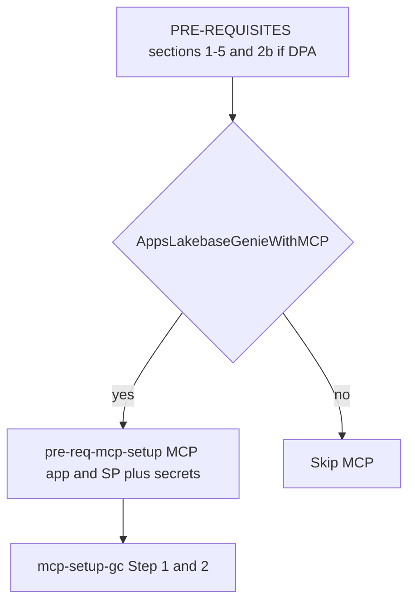

# V2V Genie Code Workshop — Facilitator Setup Guide

> **Audience:** Workshop admins and facilitators.
> **Purpose:** Single reference for setup, prerequisites, modified artifacts, and day-of procedures for both the `apps_lakebase` and `data_product_accelerator` Genie Code tracks.

---

## Contents

0. [End-to-end facilitator checklist](#0-end-to-end-facilitator-checklist)
1. [MCP AppKit App — Setup and Deployment](#1-mcp-appkit-app--setup-and-deployment)
2. [Admin Prerequisites](#2-admin-prerequisites-complete-before-workshop-day)
3. [Files Modified for Genie Code](#3-files-modified-for-genie-code)
4. [Day-of Setup: Admin vs. Participant](#4-day-of-setup-admin-vs-participant)
5. [Lakebase Provisioning](#5-lakebase-provisioning)
6. [Quick Reference: Workspace-Specific Values](#6-quick-reference-workspace-specific-values-to-update-per-deployment)

---

## 0. End-to-end facilitator checklist

Use this **ordered** path from zero to a ready classroom. Workspace foundation (scope legend, **Applies to**) lives in **[`PRE-REQUISITES.md`](PRE-REQUISITES.md)**; MCP deploy + OAuth + secrets live in **[`pre-req-mcp-setup.md`](pre-req-mcp-setup.md)**.

### 0.1 Admin foundation (every delivery)

1. **[`PRE-REQUISITES.md`](PRE-REQUISITES.md) §1** — Workspace access / AD group.
2. **§2** — Unity Catalog workshop catalog + `CREATE SCHEMA` grants.
3. **§2b** — **DPA only:** shared catalog `donotdelete_vibe_coding_catalog` + grants.
4. **§3–§4** — Serverless SQL warehouse + Serverless compute / budget policy.
5. **§5** — Databricks Apps + Lakebase enabled; Consumer entitlement (Apps Lakebase needs this path).

### 0.2 AppKit-MCP branch (Apps Lakebase Genie **with** MCP only)

Skip **0.2** for **DPA-only Genie** (no AppKit MCP).



6. **[`pre-req-mcp-setup.md`](pre-req-mcp-setup.md) §2** — Deploy `mcp-appkit-skill` (or follow [§1](#1-mcp-appkit-app--setup-and-deployment) of this guide).
7. **[`pre-req-mcp-setup.md`](pre-req-mcp-setup.md) §3** — Service principal, OAuth secret, `v2v-gc-agent` scope, ACLs, verify.
8. Participants — **[`apps_lakebase/prompts/mcp-setup-gc.md`](apps_lakebase/prompts/mcp-setup-gc.md)** Step 1 (connectivity) and Step 2 (grant MCP SP `CAN_READ` on the workshop repo).

### 0.3 Workshop repo in the workspace

9. Ensure the template is available at the path used by **`REPO_ROOT`** in [`data_product_accelerator/gc-prompt-conversion/workshop-variables.md`](data_product_accelerator/gc-prompt-conversion/workshop-variables.md) (Genie) or your chosen Shared mirror. Update **`MCP_URL`** / workspace tables in [`apps_lakebase/prompts/mcp-setup-gc.md`](apps_lakebase/prompts/mcp-setup-gc.md) after MCP deploy ([§1](#1-mcp-appkit-app--setup-and-deployment) — After Deployment).

### 0.4 Day-of — pick one track (or both in sequence)

**Apps Lakebase Genie (MCP + SDK)** — canonical order: **[`apps_lakebase/prompts/README.md`](apps_lakebase/prompts/README.md)**. Short overview + links: [`apps_lakebase/Instructions.md`](apps_lakebase/Instructions.md).

**Data Product Accelerator Genie (SDK)** — no MCP required for the core medallion flow:

1. [`data_product_accelerator/gc-prompt-conversion/workshop-variables.md`](data_product_accelerator/gc-prompt-conversion/workshop-variables.md) — bootstrap `APP_NAME`, `DB_SCHEMA`, `w`, helpers.
2. [`data_product_accelerator/prompts/extract_from_tables_gc.md`](data_product_accelerator/prompts/extract_from_tables_gc.md) — if schema CSV is not already in `context/`.
3. [`data_product_accelerator/prompts/gold-layer-design-gc.md`](data_product_accelerator/prompts/gold-layer-design-gc.md)
4. [`data_product_accelerator/prompts/clone-from-source-gc.md`](data_product_accelerator/prompts/clone-from-source-gc.md)
5. [`data_product_accelerator/prompts/silver-layer-pipelines-gc.md`](data_product_accelerator/prompts/silver-layer-pipelines-gc.md)
6. [`data_product_accelerator/prompts/gold-layer-pipeline-gc.md`](data_product_accelerator/prompts/gold-layer-pipeline-gc.md)
7. [`data_product_accelerator/prompts/deploy-assets-gc.md`](data_product_accelerator/prompts/deploy-assets-gc.md)

Stage-by-stage narrative: **[`data_product_accelerator/QUICKSTART.md`](data_product_accelerator/QUICKSTART.md)** (Genie deliveries use the `*-gc.md` prompts listed above).

---

## 1. MCP AppKit App — Setup and Deployment

**What it is:** A Databricks App (`mcp-appkit-skill`) that hosts 11 AppKit tools — scaffold, deploy, validate, add plugins, and manage Lakebase resources. Every participant connects to this single shared app at workshop start via OAuth M2M.

**Deploy once before the workshop. All participants share the same instance.**

### Architecture

```
Admin deploys once:
  mcp-appkit-skill app  →  /mcp endpoint
                                │
  v2v-gc-agent secret scope     │   ← participants read from this scope
    client_id                   │
    client_secret               │
         │                      │
         ▼                      │
  WorkspaceClient(oauth-m2m) ──►│ DatabricksMCPClient
                                │
                         11 AppKit tools:
                           appkit_scaffold_app
                           appkit_deploy
                           appkit_validate
                           appkit_add_lakebase
                           appkit_add_analytics
                           appkit_add_genie_panel
                           appkit_add_files_browser
                           appkit_provision_lakebase
                           appkit_manage_app_resources
                           appkit_list_apps
                           appkit_get_app_status
```

### Deploy the App (admin, in the workspace)

**Canonical steps and SDK snippets:** **[`pre-req-mcp-setup.md`](pre-req-mcp-setup.md) §2**.

**Fastest path:** Open the notebook **`mcp-appkit-skill/deploy_mcp_app`** under your workshop `REPO_ROOT` and run all cells as a workspace admin (it uploads from the notebook directory, creates the app if needed, deploys, and waits until **ACTIVE**).

### After Deployment — Update the MCP URL

The app URL is workspace-specific. After deployment, copy it from **Compute → Apps → mcp-appkit-skill → URL** and append `/mcp`.

Update these two locations in the repo:
- `apps_lakebase/prompts/mcp-setup-gc.md` → Step 1a hardcoded `MCP_URL`
- `apps_lakebase/prompts/mcp-setup-gc.md` → "Workspace-Specific Values" table

---

## 2. Admin Prerequisites (complete before workshop day)

Foundation items are in [`PRE-REQUISITES.md`](PRE-REQUISITES.md). MCP app + SP + secrets are in [`pre-req-mcp-setup.md`](pre-req-mcp-setup.md).

| # | Item | Owner | Applies to |
|---|------|-------|------------|
| 1 | Workspace access for all participants (AD group provisioned) | Admin | Common · Genie |
| 2 | General workshop catalog: `GRANT USE CATALOG` + `CREATE SCHEMA` to AD group | Admin | Common · Genie |
| 2b | `donotdelete_vibe_coding_catalog`: `GRANT USE CATALOG` + `CREATE SCHEMA` to `users` | Admin | **DPA** |
| 3 | Serverless SQL Warehouse created, `CAN USE` granted to AD group | Admin | Common · Genie |
| 4 | Serverless General Compute enabled + budget policy assigned to AD group | Admin | Common · Genie |
| 5a | Databricks Apps enabled in Workspace Settings | Admin | Common · Genie |
| 5b | Lakebase enabled in Workspace Settings → Compute → Lakebase | Admin | Common · Genie |
| 5c | AD group granted **Consumer** entitlement | Admin | Common · Genie |
| 6 | `mcp-appkit-skill` app deployed and ACTIVE ([`pre-req-mcp-setup.md`](pre-req-mcp-setup.md) §2 or Section 1 above) | Admin | **AppKit-MCP** · Genie |
| 7a | Service principal `v2v-workshop-mcp-sp` created | Admin | **AppKit-MCP** · Genie |
| 7b | OAuth client secret generated (save immediately — shown only once) | Admin | **AppKit-MCP** · Genie |
| 7c | SP granted `CAN_USE` on `mcp-appkit-skill` app | Admin | **AppKit-MCP** · Genie |
| 7d | Secret scope `v2v-gc-agent` created with `client_id` + `client_secret` | Admin | **AppKit-MCP** · Genie |
| 7e | `READ` permission on `v2v-gc-agent` granted to `users` | Admin | **AppKit-MCP** · Genie |

### Step 2b: DPA Catalog Setup (run in a notebook as admin)

```python
from databricks.sdk import WorkspaceClient
from databricks.sdk.service.catalog import SecurableType, PermissionsChange, Privilege

w = WorkspaceClient()

# Create catalog
w.catalogs.create(name="donotdelete_vibe_coding_catalog")
print("✓ Catalog created")

# Grant permissions to all users
w.grants.update(
    securable_type=SecurableType.CATALOG,
    full_name="donotdelete_vibe_coding_catalog",
    changes=[
        PermissionsChange(
            add=[Privilege.USE_CATALOG, Privilege.CREATE_SCHEMA],
            principal="account users",
        )
    ],
)
print("✓ USE CATALOG + CREATE SCHEMA granted to account users")
```

Or in SQL:
```sql
GRANT USE CATALOG ON CATALOG donotdelete_vibe_coding_catalog TO `users`;
GRANT CREATE SCHEMA ON CATALOG donotdelete_vibe_coding_catalog TO `users`;
```

> **Important:** Do NOT delete this catalog during or after the workshop — participant schemas (`jaiwant_j_booking_app_bronze`, etc.) live here and are named per user, so there are no conflicts between attendees.

### Steps 7a–7e: Service Principal + Secret Scope (summary)

Full code in [`pre-req-mcp-setup.md`](pre-req-mcp-setup.md) §3. Summary:

```python
# 7a. Create SP
sp = w.service_principals.create(display_name="v2v-workshop-mcp-sp")

# 7b. Generate OAuth secret (save immediately)
secret = w.service_principal_secrets_proxy.create(service_principal_id=sp.id)
CLIENT_ID = sp.application_id       # UUID
CLIENT_SECRET = secret.secret       # shown only once

# 7c. Grant SP CAN_USE on the app
from databricks.sdk.service.apps import AppAccessControlRequest, AppPermissionLevel
w.apps.update_permissions(
    app_name="mcp-appkit-skill",
    access_control_list=[AppAccessControlRequest(
        service_principal_name=CLIENT_ID,
        permission_level=AppPermissionLevel.CAN_USE,
    )]
)

# 7d. Store in secret scope
SCOPE = "v2v-gc-agent"
w.secrets.create_scope(scope=SCOPE)
w.secrets.put_secret(scope=SCOPE, key="client_id",     string_value=CLIENT_ID)
w.secrets.put_secret(scope=SCOPE, key="client_secret", string_value=CLIENT_SECRET)

# 7e. Grant READ to all users
w.secrets.put_acl(scope=SCOPE, principal="users", permission="READ")
```

**Verify end-to-end:**
```python
# Retrieve from scope and test OAuth M2M
test_cid  = w.dbutils.secrets.get(scope="v2v-gc-agent", key="client_id")
test_csec = w.dbutils.secrets.get(scope="v2v-gc-agent", key="client_secret")
sp_client = WorkspaceClient(host=w.config.host, client_id=test_cid, client_secret=test_csec)
me = sp_client.current_user.me()
print(f"✓ OAuth M2M works — authenticated as: {me.display_name}")
```

---

## 3. Files Modified for Genie Code

### 3a. apps_lakebase — New Prompt Files

All `_gc.md` prompts are new files. The original non-GC prompts (`ui_design.md`, `design_prd.md`) remain for optional local-IDE workflows outside this workshop’s Genie path.

| File | Purpose |
|------|---------|
| `apps_lakebase/prompts/mcp-setup-gc.md` | MCP connectivity setup + SP repo access grant (participant day-of step) |
| `apps_lakebase/prompts/generate_prd_gc.md` | PRD generation in Genie Code |
| `apps_lakebase/prompts/one-ui-design-local.md` | Scaffold, UI, mock deploy (single Genie prompt) |
| `apps_lakebase/prompts/setup_lakebase_gc.md` | Lakebase project provisioning + npm dep + app.yaml config |
| `apps_lakebase/prompts/wire_ui_to_lakebase_gc.md` | Wire React frontend and FastAPI backend to Lakebase |
| `apps_lakebase/prompts/deploy_and_test_gc.md` | Deploy app via MCP + SDK, validate end-to-end |
| `apps_lakebase/prompts/cleanup-gc.md` | Delete app, Lakebase instance, and workspace files |

### 3b. apps_lakebase — Modified Skill Files

| Skill | Key Change for Genie Code |
|-------|--------------------------|
| `apps_lakebase/skills/00-appkit-navigator/SKILL.md` | Added Genie Code execution context; no local server, no npm |
| `apps_lakebase/skills/01-appkit-scaffold/SKILL.md` | Scaffold via `appkit_scaffold_app` MCP tool (Genie path) |
| `apps_lakebase/skills/02-appkit-build/SKILL.md` | No local dev server; MCP `appkit_validate` for structural checks |
| `apps_lakebase/skills/03-appkit-deploy/SKILL.md` | Deploy via `appkit_deploy` MCP tool + deploy job as fallback if SP blocked |
| `apps_lakebase/skills/04-appkit-plugin-add/SKILL.md` | Plugins via `appkit_add_lakebase`, `appkit_add_analytics`, etc. MCP tools |
| `apps_lakebase/skills/05-appkit-lakebase-wiring/SKILL.md` | Lakebase ops via `w.postgres` SDK instead of local `psql` |
| `apps_lakebase/gc-prompt-conversion/troubleshooting_gc.md` | AppKit/Lakebase/MCP error-to-fix lookup table |
| `apps_lakebase/gc-prompt-conversion/MCP-appkit_tooling.md` | Full 11-tool reference with parameters, return values, and examples |

### 3c. data_product_accelerator — New Files (Genie Code track)

These files did not exist in the original repo and were created entirely for the Genie Code track.

**New prompt files:**

| File | Purpose |
|------|---------|
| `data_product_accelerator/prompts/extract_from_tables_gc.md` | Connect to Lakebase via psycopg, extract `information_schema.columns`, save CSV |
| `data_product_accelerator/prompts/clone-from-source-gc.md` | Bronze layer — clone source tables, apply CDF/Liquid Clustering, create job via SDK |
| `data_product_accelerator/prompts/silver-layer-pipelines-gc.md` | Silver layer — DQ rules table + Spark Declarative Pipeline via `w.pipelines.create()` |
| `data_product_accelerator/prompts/gold-layer-design-gc.md` | Gold layer design — dimensional model, ERD, YAML schemas, lineage docs |
| `data_product_accelerator/prompts/gold-layer-pipeline-gc.md` | Gold layer pipeline — DDL from YAML, MERGE from Silver, 2-job architecture |
| `data_product_accelerator/prompts/deploy-assets-gc.md` | End-to-end orchestration — run all jobs and pipeline in dependency order |

**New shared skill files:**

| File | Purpose |
|------|---------|
| `data_product_accelerator/skills/workshop-variables.md` | Standard variable setup code + shared helpers: `write_file()`, `write_notebook()`, `run_job_by_name()`, `run_sql()` |
| `data_product_accelerator/skills/lakebase-notebook-connection.md` | Lakebase endpoint discovery, psycopg connection pattern, credential refresh, troubleshooting |
| `data_product_accelerator/skills/troubleshooting_gc.md` | Pipeline error lookup table covering Extract, Bronze, Silver, Gold, and Deploy steps |

### 3d. data_product_accelerator — Existing Skills Modified for Genie Code

The following existing skills were updated to replace CLI/Asset Bundle patterns with SDK equivalents:

| Skill | Lines Changed | Key Change |
|-------|:------------:|------------|
| `skills/common/databricks-autonomous-operations/SKILL.md` | 333 | Replaced CLI/bundle run patterns with SDK `w.jobs.run_now_and_wait()` + poll loop; removed `jq` pipeline patterns |
| `skills/common/databricks-asset-bundles/SKILL.md` | 64 | Added Genie Code section noting `databricks bundle` unavailability; documented SDK alternatives for each bundle command |
| `skills/bronze/00-bronze-layer-setup/SKILL.md` | 23 | Approach C updated: replaced `databricks bundle deploy` + run with `w.jobs.create()` + `w.jobs.run_now_and_wait()` |
| `skills/silver/00-silver-layer-setup/SKILL.md` | 30 | DLT deploy updated: replaced bundle pipeline resource with `w.pipelines.create()` + `w.pipelines.start_update()` |
| `skills/gold/01-gold-layer-setup/SKILL.md` | 36 | 2-job architecture updated: replaced bundle jobs with `w.jobs.create()` for both `gold_setup_job` and `gold_merge_job` |

---

## 4. Day-of Setup: Admin vs. Participant

### Admin Checklist (arrive 30 min before participants)

- [ ] Verify `mcp-appkit-skill` app is **ACTIVE**: Compute → Apps
- [ ] Confirm MCP URL is current and updated in `mcp-setup-gc.md` Step 1a
- [ ] Verify `v2v-gc-agent` secret scope exists with `client_id` + `client_secret`
- [ ] Confirm `donotdelete_vibe_coding_catalog` exists (DPA track only)
- [ ] Send participants the workspace URL and repo import/clone link
- [ ] Confirm all participants can log in before session starts

### Participant Setup — Genie Code Track (~10 min at session start)

**Step A: Import the workshop repo to your workspace**

The repo must be at this exact path (substituting your email):
```
/Workspace/Users/{email}/v2v-in-geniecode/vibe-coding-workshop-template
```

Import via Repos UI:
1. Open the Databricks workspace
2. Go to **Workspace → Repos → Add Repo**
3. Enter the repo URL provided by the facilitator
4. The repo clones to `/Workspace/Users/{email}/v2v-in-geniecode/vibe-coding-workshop-template`

**Step B: Run the MCP setup prompt** (paste `apps_lakebase/prompts/mcp-setup-gc.md` into a new Genie Code conversation)

This single step does everything:
1. Installs `databricks-mcp` package
2. Restarts Python kernel (required — package pulls in `pydantic` v2 which needs restart)
3. Connects to `v2v-gc-agent` secret scope for OAuth credentials
4. Verifies MCP connectivity — should see 11 tools listed
5. Grants MCP service principal `CAN_READ` on the participant's repo folder

**Expected output:**
```
Auth type: oauth-m2m
MCP OK. 11 tools: ['appkit_scaffold_app', 'appkit_add_lakebase', ...]
All core tools verified. Ready to go!
✓ Granted CAN_READ on repo to MCP SP (...)
```

After Step B passes, participants run the workshop prompts in sequence.

### Prompt Sequence — apps_lakebase Track

| Step | Prompt File | What Happens |
|------|-------------|--------------|
| 0 | `mcp-setup-gc.md` | MCP connectivity + repo access |
| 1 | `generate_prd_gc.md` | Generate PRD for the booking app |
| 2 | `one-ui-design-local.md` | Scaffold, UI polish, mock deploy via MCP + SDK |
| 3 | `setup_lakebase_gc.md` | Provision Lakebase, bind to app, add npm dep |
| 4 | `wire_ui_to_lakebase_gc.md` | Wire frontend + backend to Lakebase |
| 5 | `deploy_and_test_gc.md` | Deploy via MCP, validate end-to-end |

### Prompt Sequence — data_product_accelerator Track

> **Prerequisite:** Complete the apps_lakebase track first — the DPA track reads from the Lakebase database created there.

| Step | Prompt File | What Happens |
|------|-------------|--------------|
| 1 | `extract_from_tables_gc.md` | Extract Lakebase schema → `booking_app_Schema.csv` |
| 2 | `clone-from-source-gc.md` | Bronze layer clone + job creation |
| 3 | `gold-layer-design-gc.md` | Gold dimensional model + YAML schemas |
| 4 | `silver-layer-pipelines-gc.md` | Silver DQ rules table + SDP pipeline |
| 5 | `gold-layer-pipeline-gc.md` | Gold DDL + MERGE jobs |
| 6 | `deploy-assets-gc.md` | Run all jobs end-to-end in dependency order |

### Deploy Job Fallback (if MCP `appkit_deploy` is blocked)

In some workspaces the MCP service principal cannot be granted `CAN_MANAGE` on the app. The fallback is a notebook-based deploy job that runs as the participant:

```python
# Write a deploy notebook, then create and run a one-off job
from databricks.sdk.service.jobs import Task, NotebookTask, JobEnvironment
from databricks.sdk.service.compute import Environment

DEPLOY_NOTEBOOK_PATH = (REPO_ROOT + f"/apps_lakebase/{APP_NAME}/deploy").replace("/Workspace", "", 1)

# notebook content: w.apps.deploy(app_name=APP_NAME, app_deployment=AppDeployment(source_code_path=APP_BASE))

job = w.jobs.create(
    name=f"[workshop] Deploy {APP_NAME}",
    environments=[JobEnvironment(environment_key="default", spec=Environment(client="1"))],
    tasks=[Task(
        task_key="deploy",
        environment_key="default",
        notebook_task=NotebookTask(notebook_path=DEPLOY_NOTEBOOK_PATH),
    )],
)
run = w.jobs.run_now_and_wait(job_id=job.job_id)
print(f"Deploy result: {run.state.result_state.value}")
```

Full pattern and permissions checklist: `apps_lakebase/skills/03-appkit-deploy/SKILL.md` → "Option B: Deploy Job".

---

## 5. Lakebase Provisioning

Lakebase is provisioned **per participant** during the `apps_lakebase` workshop — not by the admin in advance. The `setup_lakebase_gc.md` prompt handles all provisioning steps automatically.

### What Gets Created Per Participant

| Resource | How Created | Naming |
|----------|------------|--------|
| Lakebase project | `w.postgres.create_project()` | `{APP_NAME}` e.g. `jaiwant-j-booking-app` |
| Production branch | auto-created with project | `projects/{APP_NAME}/branches/production` |
| Primary endpoint | auto-created | `projects/{APP_NAME}/branches/production/endpoints/primary` |
| Unity Catalog entry | auto-synced by Databricks | `{APP_NAME}_catalog.{DB_SCHEMA}.*` |
| App resource binding | `w.apps.update()` with `AppResourcePostgres` | resource name: `postgres` |

### Admin Prerequisite for Lakebase

The only admin action needed is enabling Lakebase in the workspace (**Workspace Settings → Compute → Lakebase**). No pre-provisioning of instances is required.

### Provisioning Pattern (from `setup_lakebase_gc.md`)

```python
from databricks.sdk import WorkspaceClient
w = WorkspaceClient()

# 1. Create Lakebase project (idempotent — check if exists first)
existing = [p for p in w.postgres.list_projects() if p.project_id == APP_NAME]
if existing:
    print(f"Project exists: {existing[0].project_id}")
else:
    project = w.postgres.create_project(display_name=APP_NAME, pg_version=16)
    print(f"Created: {project.project_id}")

# 2. Discover the endpoint (name format differs from endpoint_id)
endpoints = list(w.postgres.list_endpoints(
    parent=f"projects/{APP_NAME}/branches/production"
))
ENDPOINT_NAME = endpoints[0].name
# → "projects/jaiwant-j-booking-app/branches/production/endpoints/primary"

# 3. Get host + generate credential
endpoint = w.postgres.get_endpoint(name=ENDPOINT_NAME)
host = endpoint.status.hosts.host

cred = w.postgres.generate_database_credential(endpoint=ENDPOINT_NAME)
username = w.current_user.me().user_name

# 4. Connect via psycopg (dbname = DB_SCHEMA, NOT 'databricks_postgres')
import psycopg
conn_string = f"host={host} dbname={DB_SCHEMA} user={username} password={cred.token} sslmode=require"
with psycopg.connect(conn_string) as conn:
    with conn.cursor() as cur:
        cur.execute("SELECT version()")
        print(f"✓ Connected: {cur.fetchone()[0][:60]}...")
```

> **Critical:** Connect to `dbname={DB_SCHEMA}` (e.g. `jaiwant_j_booking_app`), NOT `dbname=databricks_postgres`. The app tables are in the database named after `DB_SCHEMA`.

### Scale-to-Zero Behavior

Lakebase endpoints **scale to zero** after inactivity. This affects both the apps_lakebase and DPA tracks.

**Symptoms when scaled to zero:**
- `NotFound: endpoint id not found` on `w.postgres.get_endpoint()`
- Spark reads from `{APP_NAME}_catalog` fail with `External authorization failed`
- `SELECT COUNT(*) FROM {UC_catalog_table}` returns 0 rows

**Fix:** Make a psycopg connection — this wakes the endpoint. Wait ~30 seconds, then retry the SDK/Spark call.

```python
# Wake the endpoint
cred = w.postgres.generate_database_credential(endpoint=ENDPOINT_NAME)
with psycopg.connect(conn_string) as conn:
    with conn.cursor() as cur:
        cur.execute("SELECT 1")
# Wait and retry your original call
import time; time.sleep(30)
```

Full patterns: `data_product_accelerator/skills/lakebase-notebook-connection.md`.

### DPA Track: Source Table Dependencies

The DPA track reads from the Lakebase database created during the `apps_lakebase` workshop:

| Item | Value |
|------|-------|
| Source catalog | `{APP_NAME}_catalog` (e.g. `jaiwant-j-booking-app_catalog`) |
| Source schema | `{DB_SCHEMA}` (e.g. `jaiwant_j_booking_app`) |
| Tables | `bookings`, `listings`, `reviews` |
| Target catalog | `donotdelete_vibe_coding_catalog` (admin must create — Section 2b) |
| Bronze schema | `{DB_SCHEMA}_bronze` (e.g. `jaiwant_j_booking_app_bronze`) |
| Silver schema | `{DB_SCHEMA}_silver` |
| Gold schema | `{DB_SCHEMA}_gold` |

If the source UC catalog is inaccessible (endpoint scaled down), `extract_from_tables_gc.md` falls back to a direct psycopg connection to extract the schema — the psycopg connection itself wakes the endpoint, after which Spark reads recover automatically.

---

## 6. Quick Reference: Workspace-Specific Values to Update Per Deployment

When running this workshop on a new workspace, update these values before distributing prompts to participants:

| Value | Current Setting | Where to Update | How to Find |
|-------|----------------|-----------------|-------------|
| MCP Server URL | `https://mcp-appkit-skill-4101016551133680.0.azure.databricksapps.com/mcp` | `apps_lakebase/prompts/mcp-setup-gc.md` → Step 1a (`MCP_URL`) and "Workspace-Specific Values" table | Compute → Apps → mcp-appkit-skill → URL + `/mcp` |
| Workspace host URL | `https://adb-4101016551133680.0.azuredatabricks.net` | `mcp-setup-gc.md` → "Workspace-Specific Values" table | Workspace URL bar |
| Workspace ID | `4101016551133680` | same | Last segment of workspace URL |
| Secret scope name | `v2v-gc-agent` | Hardcoded in all `_gc.md` prompts | Change if using a different scope name |
| Secret key names | `client_id`, `client_secret` | Hardcoded in all `_gc.md` prompts | Change if using different key names |
| DPA target catalog | `donotdelete_vibe_coding_catalog` | Hardcoded in all DPA prompts and `PRE-REQUISITES.md` § 2b | Change if deploying to a differently named catalog |
| Repo path segment | `v2v-in-geniecode/vibe-coding-workshop-template` | Hardcoded in `workshop-variables.md` `REPO_ROOT` derivation | Change if participants clone the repo under a different path |

---

## Troubleshooting — Common Setup Issues

| Issue | Cause | Fix |
|-------|-------|-----|
| `SECRET_DOES_NOT_EXIST` in participant notebook | Admin skipped secret setup | Run [`pre-req-mcp-setup.md`](pre-req-mcp-setup.md) **§3d** to create scope and store credentials |
| `Permission denied` on secret scope | Admin skipped READ ACL | Run [`pre-req-mcp-setup.md`](pre-req-mcp-setup.md) **§3e** (`put_acl` … `READ`) |
| `401 Unauthorized` on OAuth token request | Wrong `client_id` or `client_secret` in scope | Re-generate OAuth secret ([`pre-req-mcp-setup.md`](pre-req-mcp-setup.md) **§3b**), update scope (**§3d**) |
| `403 Forbidden` on MCP call | SP lacks `CAN_USE` on `mcp-appkit-skill` | Run [`pre-req-mcp-setup.md`](pre-req-mcp-setup.md) **§3c** grant |
| `appkit_validate` reports `app.yaml not found` | MCP SP lacks `CAN_READ` on participant's repo folder | Participant runs `mcp-setup-gc.md` Step 2 |
| `mcp-appkit-skill` app not found | App not deployed or wrong name | Deploy the app (Section 1) |
| `MCP connection failed` | App scaled to zero or wrong URL | Check app is ACTIVE; verify `MCP_URL` in `mcp-setup-gc.md` |
| `ImportError: cannot import name 'Sentinel'` | `typing_extensions` too old | Run `dbutils.library.restartPython()` after `%pip install databricks-mcp` |
| `donotdelete_vibe_coding_catalog` not found | Admin skipped Step 2b | Run `PRE-REQUISITES.md` § 2b |
| `Schema creation fails` in DPA workshop | Missing `CREATE SCHEMA` grant on DPA catalog | Run `GRANT CREATE SCHEMA ON CATALOG donotdelete_vibe_coding_catalog TO users` |
| Lakebase `endpoint id not found` | Endpoint name differs from `ep-primary` | Use `w.postgres.list_endpoints()` for dynamic discovery |
| Bronze/Silver jobs fail with `is not a notebook` | Notebook written as `ObjectType.FILE` | Use `write_notebook()` helper from `workshop-variables.md` instead of `write_file()` |

---

*Workspace foundation: [`PRE-REQUISITES.md`](PRE-REQUISITES.md). MCP app + OAuth scope: [`pre-req-mcp-setup.md`](pre-req-mcp-setup.md).*
*For participant-facing error resolution, see [`apps_lakebase/skills/troubleshooting_gc.md`](apps_lakebase/skills/troubleshooting_gc.md) and [`data_product_accelerator/skills/troubleshooting_gc.md`](data_product_accelerator/skills/troubleshooting_gc.md).*
