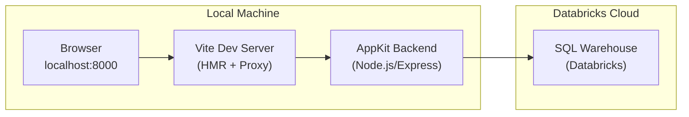
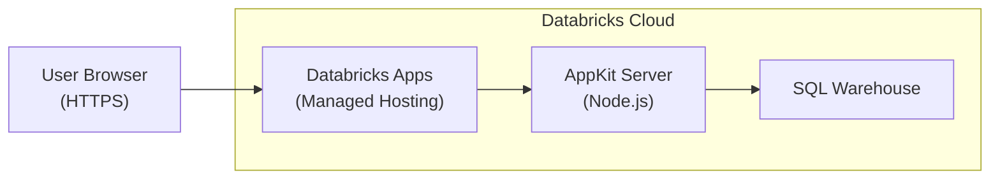
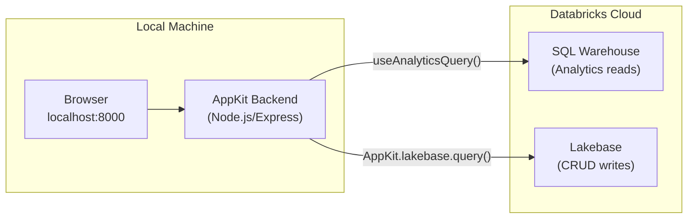
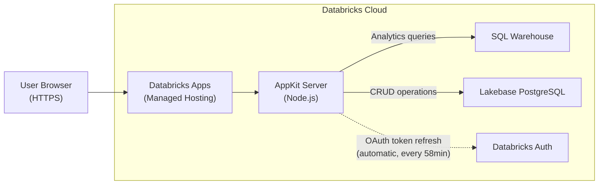

# Build and Deploy Databricks Apps with AppKit

**Last Updated:** April 2026
**Created by:** Prashanth Subrahmanyam

## Background

This document is a comprehensive guide to building, deploying, and testing web applications on the Databricks platform using **AppKit** — a TypeScript SDK with a plugin-based architecture for creating full-stack Databricks Apps. It walks through a complete lifecycle: scaffolding a project, building a UI from a PRD, deploying to Databricks Apps, wiring a Lakebase (managed PostgreSQL) backend, and running end-to-end verification.

This guide is structured as a series of **phases**, each designed to be given as a prompt to an AI coding assistant (Cursor, Claude Code, Windsurf, etc.). The assistant executes the instructions using the referenced Agent Skills, which contain the detailed implementation knowledge.

```
Phase 1              Phase 2            Phase 3            Phase 4              Phase 5
Scaffold, Build -->  Deploy        -->  Setup Lakebase --> Wire Lakebase   -->  Deploy + E2E Test
& Test Locally       (Analytics Only)   Project            Backend (local)      with Lakebase
```

### Two Pathways

| Pathway | Phases | Use When |
|---------|--------|----------|
| **Path A: Analytics Only** | Phase 1 -> Phase 2 | You only need SQL warehouse queries (dashboards, reports) |
| **Path B: Analytics + Lakebase** | Phase 1 -> Phase 2 -> Phase 3 -> Phase 4 -> Phase 5 | You need transactional data (CRUD), Lakebase PostgreSQL, and analytics |

---

## Pre-Requisites

Complete the pre-requisites checklist before beginning: [PRE-REQUISITES.md](../PRE-REQUISITES.md)

Key requirements:
- Databricks workspace with Apps and Lakebase enabled
- AI-powered IDE (Cursor recommended) with Claude Sonnet 4.5+
- Databricks CLI installed and authenticated
- Node.js v22+ installed
- A PRD document at `docs/design_prd.md` describing the application to build

---

## Workshop Parameters

Fill in these values before starting. They are referenced throughout all phases.

| Parameter | Value | Description |
|-----------|-------|-------------|
| `{workspace_url}` | __________________ | Your Databricks workspace URL (e.g. `https://myworkspace.cloud.databricks.com`) |
| `{use_case_slug}` | __________________ | Short app identifier (e.g. `bookings`, `inventory`, `analytics`) |
| `{user_app_name}` | __________________ | Lakebase project name (Path B only — set in Phase 3) |
| `{LAKEBASE_HOST}` | __________________ | Lakebase host address (Path B only — output of Phase 3) |

---

### Lakebase Setup [Path B only]

Lakebase project creation and configuration is handled in **Phase 3**. Do not create a project manually — Phase 3 walks through project creation, endpoint discovery, and compute optimization step by step.

Fill in `{user_app_name}` and `{LAKEBASE_HOST}` in the Workshop Parameters table above after completing Phase 3.

---

---

## Phase 1: Scaffold, Build, and Test Locally

In this phase, you will authenticate to Databricks, scaffold a new AppKit project with the analytics plugin, implement a UI from a PRD, and verify everything works locally. This is the foundation for all subsequent phases.

Start a new Agent thread and use the following prompt:

---

### Your Task

You are a full-stack developer building a web application on Databricks AppKit. Your goal is to scaffold an AppKit project, implement UI and backend features from a PRD, and test locally.

**Workspace:** `{workspace_url}`

**Working directory:** Run all app commands and create/edit app files under the `apps_lakebase/` folder. Design docs (PRD, UI design) remain in the parent `docs/` folder at repo root.

---

### Step 1.1: Authenticate and Set Up Variables

```bash
# Authenticate to Databricks
databricks auth login --host {workspace_url}

# Derive app name from your username + use case
USER_JSON=$(databricks current-user me --output json)
EMAIL=$(echo "$USER_JSON" | jq -r '.userName')
FIRSTNAME=$(echo "$EMAIL" | cut -d'@' -f1 | cut -d'.' -f1)
LASTINITIAL=$(echo "$EMAIL" | cut -d'@' -f1 | cut -d'.' -f2 | cut -c1)
APP_PREFIX="${FIRSTNAME}-${LASTINITIAL}"
APP_NAME="${APP_PREFIX}-{use_case_slug}"
echo "App: $APP_NAME | Email: $EMAIL"
```

**Important:** App names must be max 26 characters, lowercase letters/numbers/hyphens only (no underscores). Truncate if necessary.

---

### Step 1.2: Install Agent Skills and Scaffold the AppKit App

Read and follow **every step** in the `appkit-scaffold` skill at `@apps_lakebase/skills/appkit-scaffold/SKILL.md`. Do not skip any steps.

The skill will guide you through:
1. **Installing Databricks Agent Skills** — required before scaffolding. Do not skip this.
2. **Scaffolding the AppKit project** inside `apps_lakebase/`

**Parameters to use** (the skill needs these values):
- **Profile:** Use `$PROFILE` from Step 1.1 (or select one via `databricks auth profiles`)
- **App name:** Use `$APP_NAME` from Step 1.1
- **Features:** `analytics` (the PRD will need data queries)
- **Description:** `"{use_case_slug} dashboard"`
- **Working directory:** Run `cd apps_lakebase` first so the app is created inside `apps_lakebase/`

After the skill completes scaffold + `npm install`, verify config files:

```bash
grep "name:" app.yaml
grep "name:" databricks.yml
```

If these don't match `$APP_NAME`, update them manually.

**From this point on, all file paths are relative to `apps_lakebase/$APP_NAME/`** — this is your app root.

---

### Step 1.3: Read the PRD

Review `@docs/design_prd.md` (parent `docs/` folder at repo root) to understand:

- User personas and their needs
- Key user journeys (Happy Path only)
- Core features and requirements
- Data requirements — what tables/queries will the UI need?

---

### Step 1.4: Build the App

Read and follow the `appkit-build` skill at `@apps_lakebase/skills/appkit-build/SKILL.md`. The skill covers the full workflow: SQL queries, type generation, backend plugins, frontend components, design quality, and testing.

**Demo data strategy:** Use static `data` arrays on AppKit data components (charts, tables) so the UI works immediately without a live backend. Write SQL files in `config/queries/` alongside and run `npm run typegen` to generate types — but keep the static data in place for now. The swap from static demo data to live query-driven data happens later in Phase 4 (Lakebase wiring).

---

### Step 1.5: Create UI Design Document

Save a design overview to `@docs/ui_design.md` (parent `docs/` folder at repo root) describing:

- Key screens/pages
- Core components and their data sources
- Navigation flow
- Design direction and aesthetic choices

---

### Step 1.6: Test Locally

From your app directory (`apps_lakebase/$APP_NAME/`):

```bash
# Free port 8000 if something is already bound to it
lsof -ti:8000 | xargs kill -9 2>/dev/null || true

npm run dev
```

Open `http://localhost:8000` and verify:

- The UI loads without console errors
- Navigation works across pages
- Data queries return results (loading -> data flow)
- All interactive elements respond
- Static demo data renders correctly in all components

---

### What It Produces

- Scaffolded AppKit project at `apps_lakebase/$APP_NAME/`
- SQL query files in `config/queries/` for all data needs
- Generated TypeScript types via `npm run typegen`
- Backend server (`server/server.ts`) with analytics plugin registered
- Frontend pages and components (`client/src/`) with type-safe data fetching
- UI design document at `docs/ui_design.md`

---

### Expected Output

**Project directory tree:**

```
apps_lakebase/$APP_NAME/
├── app.yaml                    # App deployment configuration
├── databricks.yml              # Databricks bundle config
├── package.json                # Dependencies (@databricks/appkit, etc.)
├── tsconfig.json
├── config/
│   └── queries/
│       └── *.sql               # SQL query files (one per data need from the PRD)
├── server/
│   └── server.ts               # AppKit backend (analytics plugin)
├── client/
│   ├── index.html
│   ├── vite.config.ts
│   └── src/
│       ├── main.tsx
│       ├── App.tsx             # Root component with routing
│       └── appKitTypes.d.ts   # Auto-generated query types (from npm run typegen)
└── tests/
    └── smoke.spec.ts           # Smoke test (update selectors for your app)
```

Pages and components under `client/src/` will vary based on your PRD.

**Terminal output — `npm run dev`:**

Output format varies by AppKit version. Look for confirmation that the server is running on port 8000, the analytics plugin loaded, and the Vite dev server is ready. You may see a Registered Routes table and `[appkit:server]`-prefixed log lines — this is normal.

**Architecture — Local Development:**



**What you should see in the browser:**

```
┌─────────────────────────────────────────────────────────────┐
│  My App                                    Dashboard | Details│
├─────────────────────────────────────────────────────────────┤
│                                                             │
│  ┌──────────┐  ┌──────────┐  ┌──────────┐  ┌──────────┐   │
│  │ Total    │  │ Active   │  │ Revenue  │  │ Growth   │   │
│  │ Orders   │  │ Users    │  │ $12,450  │  │ +15.3%   │   │
│  │ 1,247    │  │ 342      │  │          │  │          │   │
│  └──────────┘  └──────────┘  └──────────┘  └──────────┘   │
│                                                             │
│  ┌─────────────────────────────┐  ┌────────────────────┐   │
│  │  Orders by Status           │  │  Recent Activity   │   │
│  │  ████████████ Completed 72% │  │  Order #1247 ...   │   │
│  │  ██████      Pending   20% │  │  Order #1246 ...   │   │
│  │  ███         Cancelled  8% │  │  Order #1245 ...   │   │
│  │                             │  │  Order #1244 ...   │   │
│  └─────────────────────────────┘  └────────────────────┘   │
│                                                             │
└─────────────────────────────────────────────────────────────┘
```

**Verification — curl test:**

```bash
$ curl -s http://localhost:8000 | head -1
<!DOCTYPE html>
```

---

### Checkpoint

> **Validate before proceeding.** Due to the non-deterministic nature of LLMs, it may take a few iterations of troubleshooting to ensure the app builds and runs correctly. Verify:
>
> - [ ] `npm run dev` starts without errors
> - [ ] The UI loads at `http://localhost:8000` with no console errors
> - [ ] All pages render with data (static demo arrays are OK — they'll be swapped to live data in Phase 4)
> - [ ] SQL files exist in `config/queries/` and `npm run typegen` has been run
> - [ ] `docs/ui_design.md` exists and describes the application
>
> **Do NOT proceed to Phase 2 until local testing passes.**

#### Context for Phase 2

Copy the following into your new Agent thread so it has the necessary context:

> - **App directory:** `apps_lakebase/$APP_NAME/` (run `ls apps_lakebase/` to confirm)
> - **CLI profile:** `$PROFILE` (e.g., `DEFAULT`)
> - **Workspace:** `{workspace_url}`
> - **Use case slug:** `{use_case_slug}`

---

---

## Phase 2: Deploy (Analytics Only)

In this phase, you will deploy the locally-tested application to Databricks Apps so it is accessible via a public HTTPS URL. This phase uses only the analytics (SQL warehouse) plugin — no Lakebase yet.

> **Path A stops here.** If you are only building an analytics dashboard (no Lakebase), Phase 2 is your final phase.

Start a new Agent thread and use the following prompt:

---

### Your Task

Deploy the locally-tested AppKit web application to Databricks Apps.

**Workspace:** `{workspace_url}`

**Working directory:** All app paths and commands use the `apps_lakebase/` folder. The scaffolded AppKit app lives at `apps_lakebase/$APP_NAME/`.

---

### Deployment Constraints

- Databricks App names must use only lowercase letters, numbers, and dashes (no underscores). Use hyphens: `my-app-name` not `my_app_name`.
- App names are max 26 characters.

---

### Step 2.1: Derive App Name and Set Profile

Derive your app name from your username + use case. This ensures the deployed app matches your `app.yaml` and `databricks.yml` configuration.

```bash
USER_JSON=$(databricks current-user me --output json)
EMAIL=$(echo "$USER_JSON" | jq -r '.userName')
FIRSTNAME=$(echo "$EMAIL" | cut -d'@' -f1 | cut -d'.' -f1)
LASTINITIAL=$(echo "$EMAIL" | cut -d'@' -f1 | cut -d'.' -f2 | cut -c1)
APP_PREFIX="${FIRSTNAME}-${LASTINITIAL}"
APP_NAME="${APP_PREFIX}-{use_case_slug}"
echo "Deploying app: $APP_NAME"
```

Select a CLI profile:

```bash
databricks auth profiles
PROFILE="DEFAULT"  # <-- set to your chosen profile name
```

Verify the app directory exists and `databricks.yml` points to the target workspace:

```bash
ls apps_lakebase/$APP_NAME/databricks.yml
grep "host:" apps_lakebase/$APP_NAME/databricks.yml
```

If deploying to a different workspace than where you scaffolded in Phase 1, update `databricks.yml` to match your target workspace, update the `sql_warehouse_id` variable for the new workspace, and clear old bundle state:

```bash
rm -rf apps_lakebase/$APP_NAME/.databricks
```

---

### Step 2.2: Deploy

Read and follow the `appkit-deploy` skill at `@apps_lakebase/skills/appkit-deploy/SKILL.md`. Run all skill commands from the `apps_lakebase/` directory.

The skill covers: config validation, build, deploy, UI verification, error diagnosis (3-iteration fix loop), and workspace app limit handling.

---

### What It Produces

- A running Databricks App accessible at `https://$APP_NAME.<workspace-region>.databricks.com`
- Service principal provisioned automatically for the app
- SQL warehouse queries executing in the cloud (same as local, but authenticated via the app's SP)

---

### Expected Output

**Terminal output — `databricks apps deploy`:**

```
$ cd apps_lakebase/$APP_NAME
$ databricks apps deploy --profile $PROFILE

Deploying app 'prashanth-s-bookings'...
Uploading source code... done
Building application... done
Starting application... done

App deployed successfully!
  URL:    https://prashanth-s-bookings.cloud.databricks.com
  Status: RUNNING
```

**Architecture — Deployed on Databricks:**



**App status — `databricks apps get`:**

```json
{
  "name": "prashanth-s-bookings",
  "url": "https://prashanth-s-bookings.cloud.databricks.com",
  "status": {
    "state": "RUNNING",
    "message": "Application is running"
  },
  "service_principal_id": "12345678-abcd-1234-efgh-123456789012",
  "create_time": "2026-04-10T14:30:00Z"
}
```

**App logs — healthy startup:**

Log format varies by AppKit version. Look for messages confirming the analytics plugin loaded and the server is listening on port 8000. Absence of ERROR-level messages indicates a healthy startup.

**What you should see in the browser:**

The same dashboard UI from Phase 1, now accessible at a public HTTPS URL. Data loads from the SQL warehouse via the app's service principal — no local machine required.

---

### Checkpoint

> **Validate before proceeding.**
>
> - [ ] The Databricks App is deployed and in `RUNNING` state
> - [ ] The web UI loads in browser at the app URL (React application, not an error page)
> - [ ] No errors in the app logs (`databricks apps logs $APP_NAME`)
> - [ ] SQL queries execute successfully (data loads in the UI, not empty tables) — *manual browser verification; check app logs for query errors if unable to open the browser*
>
> **Path A complete!** If you are not adding Lakebase, you are done.
>
> **Path B: Continue to Phase 3** to set up a Lakebase project.

#### Context for Phase 3

Copy the following into your new Agent thread so it has the necessary context:

> - **App directory:** `apps_lakebase/$APP_NAME/`
> - **CLI profile:** `$PROFILE` (e.g., `DEFAULT`)
> - **Workspace:** `{workspace_url}`
> - **Use case slug:** `{use_case_slug}`
> - The app has been deployed at least once (Service Principal exists)

---

---

## Phase 3: Setup Lakebase Project [Path B only]

In this phase, you will create and configure a Lakebase (managed PostgreSQL) project so the AppKit application can connect to a transactional database in subsequent phases. This is an infrastructure setup step — no application code changes are made here.

Start a new Agent thread and use the following prompt:

---

### Your Task

Create and configure a Lakebase (PostgreSQL) project so the AppKit application can connect to a transactional database in subsequent phases.

**Workspace:** `{workspace_url}`

**Working directory:** All app and Lakebase assets go under `apps_lakebase/`. The scaffolded AppKit app lives at `apps_lakebase/$APP_NAME/`.

---

### Skill Reference

Before running any `databricks postgres` commands, read the `databricks-lakebase` agent skill (installed via Databricks Agent Skills). If the skill is not available locally, fetch it from:
https://github.com/databricks/databricks-agent-skills/blob/main/skills/databricks-lakebase/SKILL.md

It is the authoritative reference for:
- CLI discovery (`databricks postgres -h` before every command)
- Resource hierarchy and naming conventions
- Autoscaling and scale-to-zero configuration
- Troubleshooting common errors

**Do NOT guess CLI syntax.** Use `databricks postgres <subcommand> -h` to discover exact flags, positional arguments, and JSON spec fields before constructing commands.

### CLI Best Practices

- Run from `apps_lakebase/` or use `apps_lakebase/scripts/` for scripts
- Run CLI commands outside the IDE sandbox to avoid SSL/TLS certificate errors

---

### Step 3.1: Verify Authentication

Ensure your CLI is authenticated to the correct workspace. This may already be done from Phase 1 — verify and re-authenticate if needed:

```bash
databricks auth login --host {workspace_url}
```

Select a CLI profile:

```bash
databricks auth profiles
PROFILE="DEFAULT"  # <-- set to your chosen profile name
```

> **Important:** The CLI profile must point to the workspace where Lakebase is enabled. If you used a different profile in Phase 1, update `PROFILE` accordingly.

---

### Step 3.2: Create Lakebase Project

Each workshop participant creates their own Lakebase project. This gives you full database access with no permission issues.

```bash
databricks postgres create-project {user_app_name} \
  --json '{"spec": {"display_name": "{user_app_name}"}}' \
  --profile $PROFILE
```

This is a long-running operation — the CLI waits for completion by default. It auto-provisions:
- A `production` branch
- A `primary` read-write endpoint (1 CU min/max, scale-to-zero enabled)
- A `databricks_postgres` default database

**If a Lakebase project already exists** (e.g., created via the Databricks UI), discover it:

```bash
databricks postgres list-projects --profile $PROFILE
databricks postgres list-endpoints projects/{user_app_name}/branches/production --output json --profile $PROFILE
```

---

### Step 3.3: Get Endpoint Hostname

Retrieve the endpoint hostname — this becomes your `{LAKEBASE_HOST}`:

```bash
databricks postgres get-endpoint \
  projects/{user_app_name}/branches/production/endpoints/primary \
  --output json --profile $PROFILE
```

From the JSON output, copy the value of `status.hosts.host` — this is your `LAKEBASE_HOST`.

Example: `my-project-abc123.lakebase.cloud.databricks.com`

Record this value — you will need it in Phase 4 (Lakebase wiring).

---

### Step 3.4: Optimize Compute and Enable Scale-to-Zero

Reduce the minimum compute units and set a suspend timeout to save cost during development:

```bash
databricks postgres update-endpoint \
  projects/{user_app_name}/branches/production/endpoints/primary spec \
  --json '{"spec": {"endpoint_type": "ENDPOINT_TYPE_READ_WRITE", "autoscaling_limit_min_cu": 0.5, "autoscaling_limit_max_cu": 2.0, "suspend_timeout_duration": "300s"}}' \
  --profile $PROFILE
```

This configures:
- **Min CU:** 0.5 (scales down to save cost when idle)
- **Max CU:** 2.0 (sufficient for development/workshop use)
- **Suspend timeout:** 300s (scales to zero after 5 minutes of inactivity)

---

### Step 3.5: Verify Project Ready

Confirm the endpoint is active and reachable:

```bash
databricks postgres get-endpoint \
  projects/{user_app_name}/branches/production/endpoints/primary \
  --output json --profile $PROFILE
```

Verify:
- `status.state` is `ACTIVE` (or `READY`)
- `status.hosts.host` is populated

If the endpoint is not yet active, wait and re-check. New projects typically reach `ACTIVE` state within 1-2 minutes.

If errors occur, consult the troubleshooting table in the `databricks-lakebase` agent skill — it covers `PERMISSION_DENIED`, credential issues, protected branches, and long-running operation timeouts.

---

### What It Produces

- A Lakebase Postgres Autoscaling project named `{user_app_name}`
- An active `primary` read-write endpoint on the `production` branch
- Optimized compute settings (0.5-2.0 CU, 300s scale-to-zero)

---

### Expected Output

**Project creation:**

```
$ databricks postgres create-project {user_app_name} --json '{"spec": {"display_name": "{user_app_name}"}}' --profile $PROFILE

Project created successfully.
  Name: {user_app_name}
  Branch: production
  Endpoint: primary (read-write)
```

**Endpoint hostname:**

```json
$ databricks postgres get-endpoint projects/{user_app_name}/branches/production/endpoints/primary --output json --profile $PROFILE

{
  "status": {
    "state": "ACTIVE",
    "hosts": {
      "host": "my-project-abc123.lakebase.cloud.databricks.com"
    }
  }
}
```

**Summary table:**

| Output | Value |
|--------|-------|
| **Project name** | `{user_app_name}` |
| **Endpoint name** | `projects/{user_app_name}/branches/production/endpoints/primary` |
| **LAKEBASE_HOST** | *(hostname from Step 3.3)* |

---

### Checkpoint

> **Validate before proceeding.**
>
> - [ ] Databricks CLI authenticated and profile selected
> - [ ] Lakebase project `{user_app_name}` created (or existing project discovered)
> - [ ] Endpoint hostname (`LAKEBASE_HOST`) captured from Step 3.3
> - [ ] Compute optimized: min 0.5 CU, max 2.0 CU, 300s suspend timeout
> - [ ] Endpoint status is `ACTIVE`
>
> **Do NOT proceed to Phase 4 until the Lakebase endpoint is active.**

#### Context for Phase 4

Copy the following into your new Agent thread so it has the necessary context:

> - **App directory:** `apps_lakebase/$APP_NAME/`
> - **CLI profile:** `$PROFILE` (e.g., `DEFAULT`)
> - **Workspace:** `{workspace_url}`
> - **Lakebase project:** `{user_app_name}`
> - **Lakebase host:** `{LAKEBASE_HOST}`
> - The app has been deployed at least once (Service Principal exists)

---

---

## Phase 4: Wire Lakebase Backend [Path B only]

In this phase, you will add the Lakebase (managed PostgreSQL) plugin to the AppKit project, create database tables and seed data, build API routes for CRUD operations, and complete the switch from static demo data to live data. This phase focuses on local development and testing.

> **Prerequisite:** Phase 3 must be complete. The app must have been deployed at least once so the Service Principal exists and can create database objects.

Start a new Agent thread and use the following prompt:

---

### Your Task

Wire the AppKit web application to a Lakebase database so the UI displays real data from both a SQL warehouse (analytics/reporting) and Lakebase PostgreSQL (transactional CRUD). This step focuses on local development and testing.

**Workspace:** `{workspace_url}`

**Working directory:** All app code and commands use the `apps_lakebase/` folder. The scaffolded AppKit app lives at `apps_lakebase/$APP_NAME/`.

**Your Lakebase Project:** `{user_app_name}` (from Phase 3)

**Your Lakebase Host:** `{LAKEBASE_HOST}` (from Phase 3)

**WARNING:** Ensure `{user_app_name}` and `{LAKEBASE_HOST}` match your Databricks workspace Lakebase setup. If you haven't created a Lakebase project yet, complete **Phase 3** first.

> **Important:** The CLI profile used for Phase 4 must point to the workspace where your Lakebase project lives. If this differs from the profile used in Phase 1, update `$PROFILE` accordingly.

---

### Part A: Add the Lakebase Plugin

Add the Lakebase plugin to the AppKit project. For additional details beyond what's covered here, see `@apps_lakebase/skills/appkit-plugin-add/references/plugin-lakebase.md`.

#### Step 4.A1: Install the Package

```bash
cd apps_lakebase/$APP_NAME
npm install @databricks/lakebase
```

#### Step 4.A2: Register the Plugin

In `server/server.ts`, add `lakebase` to the existing plugin list:

```typescript
import { createApp, server, analytics, lakebase } from "@databricks/appkit";

await createApp({
  plugins: [server(), lakebase(), analytics()],
});
```

#### Step 4.A3: Configure Environment Variables

**For local development** — add to `.env` in the app root (`apps_lakebase/$APP_NAME/.env`):

```env
LAKEBASE_ENDPOINT=projects/{user_app_name}/branches/production/endpoints/primary
PGHOST={LAKEBASE_HOST}
PGDATABASE=databricks_postgres
PGSSLMODE=require
```

**For deployment** — add to `app.yaml`:

```yaml
env:
  - name: LAKEBASE_ENDPOINT
    valueFrom: postgres
```

When deployed with a `postgres` database resource, `PGHOST`, `PGDATABASE`, `PGSSLMODE`, `PGUSER`, `PGPORT`, and `PGAPPNAME` are auto-injected by the platform. Only `LAKEBASE_ENDPOINT` must be set explicitly.

#### Step 4.A4: Add Postgres Resource to databricks.yml

Since the app was scaffolded with `--features analytics` only, the `databricks.yml` does not include a Lakebase resource. Add the `postgres` resource so that `databricks apps deploy` provisions Lakebase access for the Service Principal:

```yaml
resources:
  - name: postgres
    postgres:
      branch: projects/{user_app_name}/branches/production
      permission: CAN_CONNECT_AND_CREATE
```

Add this under the existing `resources:` section in `databricks.yml` (alongside the `sql-warehouse` resource). Without this, the deployed app's Service Principal will not have Lakebase connectivity.

#### Step 4.A5: Verify

```bash
cd apps_lakebase/$APP_NAME
npm run build
```

This must complete without import or module errors for `@databricks/lakebase`. If it fails, verify the package is in `package.json` dependencies.

---

### Part B: Wire UI to Backend

Write the backend DDL, API routes, and frontend data fetching code **before** deploying. The deploy in Part C will run this code on the Service Principal's first boot.

#### B1: Create Database Schema and Seed Data

In `server/server.ts`, after plugin initialization, use `AppKit.lakebase.query()` to create tables and seed data. Design DDL and seed data based on the PRD's data requirements.

```typescript
const AppKit = await createApp({
  plugins: [server(), lakebase(), analytics()],
});

// DDL — create tables (idempotent)
await AppKit.lakebase.query(`CREATE SCHEMA IF NOT EXISTS app`);
await AppKit.lakebase.query(`
  CREATE TABLE IF NOT EXISTS app.orders (
    id SERIAL PRIMARY KEY,
    user_id VARCHAR(255) NOT NULL,
    amount DECIMAL(10, 2) NOT NULL,
    status VARCHAR(50) DEFAULT 'pending',
    created_at TIMESTAMP DEFAULT CURRENT_TIMESTAMP
  )
`);

// DML — seed data (idempotent, count-check pattern)
const seedCheck = await AppKit.lakebase.query(`SELECT count(*) AS cnt FROM app.orders`);
if (parseInt(seedCheck.rows[0].cnt) === 0) {
  await AppKit.lakebase.query(`
    INSERT INTO app.orders (user_id, amount, status) VALUES
      ('demo-user', 99.99, 'completed'),
      ('alice', 45.00, 'pending'),
      ('bob', 72.50, 'completed')
  `);
  console.log("[Lakebase] Seed data inserted");
}
```

Use `CREATE TABLE IF NOT EXISTS` for DDL idempotency. For seed data, use a **count-check pattern** (`SELECT count(*)` → insert only if empty) rather than `ON CONFLICT DO NOTHING`, which does not prevent duplicates when using SERIAL primary keys without unique constraints on data columns.

#### B2: Add API Routes for Lakebase CRUD

AppKit Lakebase is **server-side only** — there are no frontend hooks like `useAnalyticsQuery` for Lakebase. Use `server.extend()` to add Express routes.

When using `server.extend()`, you must pass `autoStart: false` to the `server()` plugin and call `AppKit.server.start()` manually after registering routes:

```typescript
const AppKit = await createApp({
  plugins: [server({ autoStart: false }), lakebase(), analytics()],
});

AppKit.server.extend((app) => {
  // Health endpoint
  app.get("/api/health/lakebase", async (req, res) => {
    try {
      await AppKit.lakebase.query("SELECT 1");
      res.json({ status: "connected", source: "live" });
    } catch (err) {
      res.json({ status: "disconnected", error: String(err), source: "mock" });
    }
  });

  // Data endpoint with fallback
  app.get("/api/orders", async (req, res) => {
    try {
      const result = await AppKit.lakebase.query("SELECT * FROM app.orders ORDER BY created_at DESC");
      console.log(`[Lakebase] /api/orders returned ${result.rows.length} rows`);
      res.json({ data: result.rows, source: "live" });
    } catch (err) {
      console.warn(`[Lakebase] /api/orders failed, falling back to mock data: ${err}`);
      res.json({ data: [{ id: 1, user_id: "demo", amount: 99.99, status: "mock" }], source: "mock" });
    }
  });
});

await AppKit.server.start();
```

**Each API route must:**
- Return `{ data: [...], source: "live" }` on success
- Fall back to `{ data: [...], source: "mock" }` if Lakebase is unavailable
- Log the query being executed and the result row count (or error details)

**Include a health endpoint:** `GET /api/health/lakebase` returning connection status and source.

**Recommended: Create a `useLakebaseData` hook** to avoid duplicating `useState`/`useEffect`/`fetch` boilerplate on every page:

```tsx
import { useState, useEffect } from "react";

function useLakebaseData<T>(endpoint: string) {
  const [data, setData] = useState<T[]>([]);
  const [source, setSource] = useState<"live" | "mock" | "loading">("loading");
  const [error, setError] = useState<string | null>(null);

  useEffect(() => {
    fetch(endpoint)
      .then((res) => res.json())
      .then((json) => {
        setData(json.data ?? []);
        setSource(json.source ?? "mock");
      })
      .catch((err) => {
        setError(String(err));
        setSource("mock");
      });
  }, [endpoint]);

  return { data, source, error };
}
```

Usage: `const { data, source, error } = useLakebaseData<Order>("/api/orders");`

#### B3: Replace Static Data with Live Sources

**Decide what goes where — data architecture:**

| Data Category | Where It Lives | Frontend Pattern | Examples |
|--------------|---------------|-----------------|----------|
| **Analytics / Reporting** (read-only aggregations, dashboards, charts) | SQL Warehouse | `useAnalyticsQuery("queryKey", params)` | Revenue trends, user counts, status breakdowns |
| **Transactional / CRUD** (data users create, update, or delete) | Lakebase | `fetch('/api/...')` or `useLakebaseData()` | Bookings, reviews, user profiles, orders |

**Rule of thumb:** If the UI has a "Create", "Edit", or "Delete" button for the data, it belongs in Lakebase. If it's a read-only chart or dashboard metric, it stays on the SQL warehouse.

**Replace static demo data with live data sources:**

- For **SQL warehouse reads** (analytics/reporting): Replace static `data` props with `useAnalyticsQuery("queryKey", params)` using SQL files in `config/queries/`
- For **Lakebase CRUD reads** (transactional data): Replace static `data` with `fetch('/api/...')` calls (or the `useLakebaseData` hook) to the Express routes from B2

> **Note:** AppKit chart components (`BarChart`, `AreaChart`, `DonutChart`, `DataTable`) that use the `queryKey` prop are bound to the analytics plugin. Keep these on SQL warehouse queries. Only convert pages that fetch data manually (using `useAnalyticsQuery` with `data`/`loading`/`error` destructuring or static arrays) to Lakebase API fetch calls.

**Add a ConnectionStatus component:**

Create a component that shows the data source on every page:

```tsx
function ConnectionStatus({ source, context }: { source: "live" | "mock" | "loading"; context?: string }) {
  if (source === "loading") return <span>{context ? `Loading ${context}...` : "Loading..."}</span>;
  if (source === "live") return <span className="text-green-600">Live Data{context ? ` — ${context}` : ""}</span>;
  return <span className="text-yellow-600">Mock Data{context ? ` — ${context}` : ""}</span>;
}
```

Place this at the **top of every page** that fetches data from Lakebase so users clearly see whether they're viewing live or mock data. Pass a `context` string describing the specific data being loaded for that page (e.g., `context="orders"`, `context="bookings"`, `context="user profiles"`).

**Defensive data handling** — prevent runtime errors:

- Initialize arrays with `[]`, not `undefined`
- Use optional chaining: `data?.slice()`, `data?.map()`
- Provide fallbacks: `(data ?? []).map(...)` or `data || []`
- Check before rendering: `{data && data.map(...)}`
- **PostgreSQL DECIMAL→string coercion:** Lakebase (via `node-pg`) returns `DECIMAL`/`NUMERIC` columns as strings (e.g., `"189.00"` not `189`). Always coerce with `Number(row.amount)` before arithmetic or comparisons — otherwise `a + b` produces string concatenation (`"73" + "51" = "7351"`) instead of addition.

#### Connection Resilience

AppKit's Lakebase plugin handles most resilience automatically:

- **OAuth token rotation:** 1-hour tokens with 2-minute refresh buffer (automatic)
- **Token caching:** Minimizes API calls (automatic)
- **OpenTelemetry instrumentation:** Query duration, pool connections, token refresh (automatic)

Configure pool settings for additional resilience:

```typescript
await createApp({
  plugins: [
    lakebase({
      pool: {
        max: 10,
        connectionTimeoutMillis: 5000,
        idleTimeoutMillis: 30000,
      },
    }),
  ],
});
```

Add try/catch with fallback to mock data in every Express route handler (as shown in B2). Log failures at WARNING level.

---

### Part C: Deploy and Configure Permissions

Now that the code is written (Part B), deploy so the Service Principal runs the DDL and creates database objects on first boot.

Your app runs as a service principal. When created with the Lakebase resource (via `databricks.yml`), the Service Principal automatically gets `CONNECT_AND_CREATE` permission — it can connect and create new objects but cannot access existing schemas or tables.

#### Step 4.C1: Deploy the App

```bash
cd apps_lakebase/$APP_NAME
databricks apps deploy --profile $PROFILE
```

The Service Principal creates and owns all database objects (schemas, tables, sequences) on startup. This is required before local development can work.

#### Step 4.C2: Get Service Principal ID (for reference)

```bash
databricks apps get $APP_NAME --output json --profile $PROFILE | jq -r '.service_principal_id'
```

Save this — you may need it for troubleshooting.

#### Step 4.C3: Verify app.yaml Has Correct Env Vars

Confirm `app.yaml` has the Lakebase endpoint configured:

```bash
grep "LAKEBASE_ENDPOINT" apps_lakebase/$APP_NAME/app.yaml
```

You should see:

```yaml
env:
  - name: LAKEBASE_ENDPOINT
    valueFrom: postgres
```

Do NOT set `PGUSER` or `PGPASSWORD` — the plugin handles OAuth token rotation automatically.

#### Step 4.C4: Grant Local Development Permissions

To run `npm run dev` locally against the deployed Lakebase database, grant permissions to your own Databricks identity. Connect to the Lakebase database and run this SQL:

```sql
CREATE EXTENSION IF NOT EXISTS databricks_auth;

DO $$
DECLARE
  subject TEXT := '<YOUR_EMAIL>';  -- Your Databricks email (e.g. name@company.com)
  schema TEXT := 'app';
BEGIN
  PERFORM databricks_create_role(subject, 'USER');
  EXECUTE format('GRANT CONNECT ON DATABASE "databricks_postgres" TO %I', subject);
  EXECUTE format('GRANT ALL ON SCHEMA %s TO %I', schema, subject);
  EXECUTE format('GRANT ALL PRIVILEGES ON ALL TABLES IN SCHEMA %s TO %I', schema, subject);
  EXECUTE format('GRANT ALL PRIVILEGES ON ALL SEQUENCES IN SCHEMA %s TO %I', schema, subject);
  EXECUTE format('ALTER DEFAULT PRIVILEGES IN SCHEMA %s GRANT ALL ON TABLES TO %I', schema, subject);
  EXECUTE format('ALTER DEFAULT PRIVILEGES IN SCHEMA %s GRANT ALL ON SEQUENCES TO %I', schema, subject);
END $$;
```

Replace `<YOUR_EMAIL>` with your actual Databricks login email.

**How to run this SQL** — choose one method:

1. **Lakebase SQL Console** — open the Lakebase project in the Databricks UI (Compute > Lakebase Postgres > your project), click the branch, and use the built-in SQL editor.

2. **`psql` with OAuth credentials:**
   ```bash
   # Generate short-lived credentials
   CREDS=$(databricks postgres generate-database-credential --profile $PROFILE)
   PGUSER=$(echo "$CREDS" | jq -r '.username')
   PGPASSWORD=$(echo "$CREDS" | jq -r '.password')

   # Connect
   PGPASSWORD=$PGPASSWORD psql -h {LAKEBASE_HOST} -U $PGUSER -d databricks_postgres --set=sslmode=require
   ```

3. **Temporary admin route** — add a one-time Express route in `server.ts` that executes the SQL via `AppKit.lakebase.query()`, deploy, hit the endpoint once, then remove the route.

After granting, `npm run dev` will authenticate using your Databricks OAuth identity.

#### Permission Error Patterns

If you see these errors:

- `role "xxxxxxxx-xxxx-xxxx-xxxx-xxxxxxxxxxxx" does not exist` — The Service Principal or your identity lacks a Lakebase role. Re-deploy the app (Step 4.C1) so the SP creates objects, or re-run the SQL grant (Step 4.C4) for your own identity.
- `Connection attempt 1/5 failed (scale-to-zero wake?)` — Normal for the first connection after an idle period. Lakebase autoscaling instances scale to zero. Wait and retry.
- `permission denied for sequence` — Re-deploy the app so the Service Principal re-creates objects (it owns them), or manually grant via SQL: `GRANT ALL ON ALL SEQUENCES IN SCHEMA app TO "<service-principal-id>";`

---

### Part D: Local Build and Test

Run all commands from the app directory (`apps_lakebase/$APP_NAME/`).

#### Build and Run

```bash
cd apps_lakebase/$APP_NAME
npm run dev
```

#### Verify

Open `http://localhost:8000` in your browser and check:

- The UI loads correctly
- Navigation works between pages
- ConnectionStatus indicator shows data source ("Live Data" or "Mock Data")
- Backend API endpoints respond (check browser dev tools Network tab)
- No console errors

#### Test API Endpoints

```bash
curl -s "http://localhost:8000/api/health/lakebase" | jq .
```

Expected: `{ "status": "connected", "source": "live" }` (or `"disconnected"` / `"mock"` if Lakebase is unavailable — the app should still work with mock fallback data).

---

### What It Produces

- `@databricks/lakebase` plugin integrated into the AppKit project
- Database schema and seed data (DDL/DML in `server/server.ts`)
- Backend API routes for all CRUD operations with live/mock fallback
- `GET /api/health/lakebase` health endpoint
- ConnectionStatus component on all data-driven pages
- All static demo data replaced with live query-driven data

---

### Expected Output

**Architecture — Dual Data Sources:**



**API health check — Lakebase connected:**

```json
$ curl -s http://localhost:8000/api/health/lakebase | jq .
{
  "status": "connected",
  "source": "live"
}
```

**API data endpoint — live data:**

```json
$ curl -s http://localhost:8000/api/orders | jq .
{
  "data": [
    {
      "id": 1,
      "user_id": "demo-user",
      "amount": 99.99,
      "status": "completed",
      "created_at": "2026-04-10T14:45:00.000Z"
    }
  ],
  "source": "live"
}
```

**Before/After — The Phase 1 to Phase 2 Switch:**

```
BEFORE (Phase 1 — static demo data):          AFTER (Phase 4 — live Lakebase data):
┌────────────────────────────────┐             ┌────────────────────────────────┐
│  ⚠ Mock Data — orders         │             │  ✓ Live Data — orders          │
│                                │             │                                │
│  id │ user   │ amount │ status │             │  id │ user   │ amount │ status │
│  ───┼────────┼────────┼────────│             │  ───┼────────┼────────┼────────│
│  1  │ demo   │ $99.99 │ mock   │             │  1  │ demo-  │ $99.99 │ compl- │
│     │        │        │        │             │  2  │ user   │ $45.00 │ eted   │
│  (hardcoded static array)      │             │  3  │ alice  │ $72.50 │ pend-  │
│                                │             │  (live from Lakebase)  │ ing    │
└────────────────────────────────┘             └────────────────────────────────┘
```

**Terminal output — `npm run dev` with Lakebase:**

Output format varies by AppKit version. Look for confirmation that the server is running on port 8000, both the analytics and Lakebase plugins loaded, and the ConnectionPool initialized. You should see your DDL statements executing successfully and `[Lakebase]`-prefixed query logs with row counts.

---

### Checkpoint

> **Validate before proceeding.** This is a critical integration point. Verify thoroughly:
>
> - [ ] `@databricks/lakebase` is in `package.json` and `npm run build` succeeds
> - [ ] `lakebase()` is registered in `server/server.ts`
> - [ ] `.env` has `LAKEBASE_ENDPOINT`, `PGHOST`, `PGDATABASE`, `PGSSLMODE`
> - [ ] `app.yaml` has `LAKEBASE_ENDPOINT` with `valueFrom: postgres`
> - [ ] `databricks.yml` has the `postgres` resource with the correct branch path
> - [ ] App deployed once so Service Principal owns DB objects
> - [ ] Local dev permissions granted (SQL grant for your email)
> - [ ] `GET /api/health/lakebase` returns `{ "status": "connected", "source": "live" }`
> - [ ] All data API endpoints return `"source": "live"` with actual rows
> - [ ] ConnectionStatus shows "Live Data" on all data pages
> - [ ] No static demo data arrays remain in the frontend code
>
> **Do NOT proceed to Phase 5 until all Lakebase endpoints return live data locally.**

#### Context for Phase 5

Copy the following into your new Agent thread so it has the necessary context:

> - **App directory:** `apps_lakebase/$APP_NAME/`
> - **CLI profile:** `$PROFILE` (e.g., `DEFAULT`)
> - **Workspace:** `{workspace_url}`
> - **Lakebase project:** `{user_app_name}`
> - All Lakebase API endpoints return `"source": "live"` locally
> - `app.yaml` has `LAKEBASE_ENDPOINT` with `valueFrom: postgres`

---

---

## Phase 5: Deploy and E2E Test with Lakebase [Path B only]

In this phase, you will deploy the Lakebase-wired application to Databricks Apps and run comprehensive end-to-end testing — verifying API correctness, Lakebase connectivity in production, log health, and connection resilience after idle periods.

Start a new Agent thread and use the following prompt:

---

### Your Task

Deploy the locally-tested web application to Databricks Apps and run comprehensive end-to-end testing to verify Lakebase connectivity, API correctness, and idle resilience.

**Workspace:** `{workspace_url}`

**Working directory:** All app paths and commands use the `apps_lakebase/` folder. The scaffolded AppKit app lives at `apps_lakebase/$APP_NAME/`.

**Prerequisite:** Complete the Lakebase wiring step (Phase 4) first. Local testing must pass before deployment.

---

### Deployment Constraints

- Databricks App names must use only lowercase letters, numbers, and dashes (no underscores). Use hyphens: `my-app-name` not `my_app_name`.
- App names are max 26 characters.

---

### Step 5.1: Set Variables and Validate Lakebase Config

Derive your app name and select a CLI profile:

```bash
USER_JSON=$(databricks current-user me --output json)
EMAIL=$(echo "$USER_JSON" | jq -r '.userName')
FIRSTNAME=$(echo "$EMAIL" | cut -d'@' -f1 | cut -d'.' -f1)
LASTINITIAL=$(echo "$EMAIL" | cut -d'@' -f1 | cut -d'.' -f2 | cut -c1)
APP_PREFIX="${FIRSTNAME}-${LASTINITIAL}"
APP_NAME="${APP_PREFIX}-{use_case_slug}"

databricks auth profiles
PROFILE="DEFAULT"  # <-- set to your chosen profile name
```

Verify `app.yaml` has the Lakebase-specific environment binding (in addition to the generic checks the deploy skill performs):

```bash
grep "LAKEBASE_ENDPOINT" apps_lakebase/$APP_NAME/app.yaml
```

You should see `LAKEBASE_ENDPOINT` with `valueFrom: postgres`. If missing, add it before deploying:

```yaml
env:
  - name: LAKEBASE_ENDPOINT
    valueFrom: postgres
```

---

### Step 5.2: Deploy

Read and follow the `appkit-deploy` skill at `@apps_lakebase/skills/appkit-deploy/SKILL.md`. Run all skill commands from the `apps_lakebase/` directory.

The skill covers: config validation, build, deploy, UI verification, error diagnosis (3-iteration fix loop), and workspace app limit handling.

After the skill completes, capture the app URL for subsequent testing:

```bash
APP_URL=$(databricks apps get $APP_NAME --output json --profile $PROFILE | jq -r '.url')
echo "App URL: $APP_URL"
```

---

### Step 5.3: Test All Backend APIs

Test the Lakebase health endpoint and all data endpoints:

```bash
# Health endpoint
curl -s "$APP_URL/api/health/lakebase" | jq .

# Test each data endpoint used by your UI pages.
# Replace with your actual API endpoints:
curl -s "$APP_URL/api/orders" | jq .
# curl -s "$APP_URL/api/bookings" | jq .
# curl -s "$APP_URL/api/listings" | jq .
# ... add all endpoints that fetch from Lakebase
```

**Verify each response includes:**

- `"source": "live"` (not `"mock"`) when Lakebase is connected
- Actual data rows from your Lakebase tables
- Health endpoint returns `{ "status": "connected", "source": "live" }`

If any endpoint returns `"source": "mock"`, there is a Lakebase connection issue — proceed to Step 5.5.

---

### Step 5.4: Check Logs for Lakebase Connections

```bash
databricks apps logs $APP_NAME --tail-lines 100 --search lakebase --profile $PROFILE
```

You should see INFO logs showing:

- `ConnectionPool initialised` — the Lakebase plugin started successfully
- Connection attempts to Lakebase (may include retries on first connect after scale-to-zero wake)
- `[Lakebase]` prefixed query logs with row counts for each endpoint

If the `--search` flag is not supported by your CLI version, fall back to:

```bash
databricks apps logs $APP_NAME --tail-lines 100 --profile $PROFILE | grep -i lakebase
```

---

### Step 5.5: Fix Lakebase Errors (up to 3 iterations)

If Lakebase-specific errors occur (the deploy skill already handles generic AppKit errors), check the logs:

```bash
databricks apps logs $APP_NAME --tail-lines 100 --profile $PROFILE
```

#### Lakebase-Specific Errors

| Error | Cause | Fix |
|-------|-------|-----|
| `ERR_MODULE_NOT_FOUND` for `@databricks/lakebase` | Package not installed | Verify `@databricks/lakebase` is in `package.json` dependencies; redeploy |
| `LAKEBASE_ENDPOINT is not set` or `PGHOST is not set` | Missing env vars in `app.yaml` | Add `LAKEBASE_ENDPOINT` with `valueFrom: postgres` to `app.yaml`; redeploy |
| `role "xxxxxxxx-xxxx-..." does not exist` | Service Principal lacks Lakebase role | Re-deploy the app so the SP re-creates and owns objects. See Phase 4 Permission Error Patterns |
| `permission denied for sequence` | SP lacks GRANT on sequences for SERIAL columns | Re-deploy the app so the SP re-creates objects, or grant manually: `GRANT ALL ON ALL SEQUENCES IN SCHEMA app TO "<sp-id>";` |
| `Connection attempt 1/5 failed` | Normal on first request — Lakebase autoscaling cold start | Wait and retry. The connection pool handles retries automatically |
| `token's identity did not match` | OAuth token mismatch | Verify `app.yaml` has `LAKEBASE_ENDPOINT` with `valueFrom: postgres`; do NOT set `PGUSER` or `PGPASSWORD` manually |

**Fix cycle:**

1. Identify the error from logs
2. Apply the fix in `apps_lakebase/$APP_NAME/`
3. Redeploy: `cd apps_lakebase/$APP_NAME && databricks apps deploy --profile $PROFILE`
4. Re-check logs and re-test endpoints

Repeat up to 3 times. If errors persist after 3 attempts, report them for manual investigation.

---

### Step 5.6: Idle Connection Test (CRITICAL)

After confirming all endpoints return `"source": "live"`, wait 3-5 minutes without interacting with the app. Lakebase autoscaling instances may scale to zero during idle periods.

After waiting, reload the app in your browser and re-test:

```bash
curl -s "$APP_URL/api/health/lakebase" | jq .
```

**Expected:** Still returns `"source": "live"`. The AppKit Lakebase plugin handles automatic OAuth token refresh and connection pool recovery.

If it returns `"source": "mock"` or the health check shows `"disconnected"`, check logs for `terminating connection` or `Connection attempt failed` errors:

```bash
databricks apps logs $APP_NAME --tail-lines 50 --profile $PROFILE
```

The connection pool should recover automatically after the autoscaling instance wakes. If it does not recover after 2-3 page reloads, verify pool settings in `server.ts`:

```typescript
lakebase({
  pool: {
    max: 10,
    connectionTimeoutMillis: 5000,
    idleTimeoutMillis: 30000,
  },
})
```

---

### What It Produces

- Production deployment with Lakebase + Analytics on Databricks Apps
- Verified API endpoints returning live data from Lakebase
- Confirmed connection resilience after idle periods
- Clean app logs with no errors

---

### Expected Output

**Full API test battery:**

```json
$ curl -s "$APP_URL/api/health/lakebase" | jq .
{
  "status": "connected",
  "source": "live"
}

$ curl -s "$APP_URL/api/orders" | jq .
{
  "data": [
    { "id": 1, "user_id": "demo-user", "amount": 99.99, "status": "completed", "created_at": "2026-04-10T14:45:00Z" },
    { "id": 2, "user_id": "alice",      "amount": 45.00, "status": "pending",   "created_at": "2026-04-10T14:46:00Z" },
    { "id": 3, "user_id": "bob",        "amount": 72.50, "status": "completed", "created_at": "2026-04-10T14:47:00Z" }
  ],
  "source": "live"
}
```

**App logs — healthy Lakebase connections:**

Log format varies by AppKit version. Check `databricks apps logs $APP_NAME --tail-lines 30 --profile $PROFILE` for: Analytics and Lakebase plugins loaded, ConnectionPool initialized, DDL executed, server listening on port 8000, and `[Lakebase]`-prefixed query logs. Absence of ERROR-level messages indicates a healthy startup.

**Idle connection test timeline:**

```
T+0:00  ───── All endpoints return "source": "live" ✓
        │
        │     (no interaction — app idle)
        │
T+3:00  ───── Lakebase may scale to zero
        │
T+5:00  ───── Reload browser + re-test
        │
        ▼
        curl /api/health/lakebase → { "status": "connected", "source": "live" } ✓
        ConnectionPool auto-recovered after cold start
```

**Architecture — Final Production State:**



**Final verification dashboard:**

```
┌──────────────────────────────────────────────────────────────────┐
│  E2E Verification Results                                        │
├──────────────────────────────┬──────────┬────────────────────────┤
│  Test                        │  Status  │  Details               │
├──────────────────────────────┼──────────┼────────────────────────┤
│  App deployed & RUNNING      │  PASS ✓  │  State: RUNNING        │
│  UI loads in browser         │  PASS ✓  │  React app rendered    │
│  /api/health/lakebase        │  PASS ✓  │  source: live          │
│  /api/orders                 │  PASS ✓  │  3 rows, source: live  │
│  App logs — no errors        │  PASS ✓  │  ConnectionPool OK     │
│  SQL warehouse queries       │  PASS ✓  │  Analytics data loaded │
│  Idle test (5 min)           │  PASS ✓  │  Auto-recovered        │
│  ConnectionStatus UI         │  PASS ✓  │  Shows "Live Data"     │
├──────────────────────────────┼──────────┼────────────────────────┤
│  TOTAL                       │  8/8 ✓   │  All tests passed      │
└──────────────────────────────┴──────────┴────────────────────────┘
```

---

### Checkpoint

> **Final validation — your application is production-ready.**
>
> - [ ] Databricks App is deployed and in `RUNNING` state
> - [ ] Web UI is accessible at the app URL (React application, not an error page)
> - [ ] ConnectionStatus shows "Live Data" (connected to Lakebase)
> - [ ] `GET /api/health/lakebase` returns `{ "status": "connected", "source": "live" }`
> - [ ] All data API endpoints return `"source": "live"` with real data from Lakebase
> - [ ] No errors in the app logs
> - [ ] SQL warehouse queries execute successfully (analytics data loads in the UI)
> - [ ] Idle connection test passes (still "Live Data" after 3-5 minutes idle)
>
> **Congratulations!** Your AppKit application is deployed, connected to both SQL Warehouse and Lakebase, and verified end-to-end.

---

---

## Final Checklist

Combined verification across all phases:

### Phase 1 — Scaffold & Build
- [ ] Databricks CLI authenticated and `APP_NAME` set
- [ ] AppKit project scaffolded inside `apps_lakebase/` with analytics plugin
- [ ] SQL files exist in `config/queries/` for every data need from the PRD
- [ ] `npm run typegen` run and types generated
- [ ] Frontend implements key pages with type-safe data fetching
- [ ] `npm run dev` runs cleanly at `http://localhost:8000`

### Phase 2 — Deploy
- [ ] Databricks App deployed and in `RUNNING` state
- [ ] Web UI loads at the app URL
- [ ] SQL queries execute successfully in the cloud

### Phase 3 — Lakebase Setup (Path B)
- [ ] Lakebase project created (or existing project discovered)
- [ ] Endpoint hostname (`LAKEBASE_HOST`) captured
- [ ] Compute optimized: min 0.5 CU, max 2.0 CU, 300s suspend timeout
- [ ] Endpoint status is `ACTIVE`

### Phase 4 — Lakebase Wiring (Path B)
- [ ] `@databricks/lakebase` installed and registered
- [ ] Environment variables configured (`.env` + `app.yaml`)
- [ ] `databricks.yml` has `postgres` resource with correct branch path
- [ ] DDL and seed data run idempotently (count-check pattern)
- [ ] All API routes return `{ data, source }` with live/mock fallback
- [ ] ConnectionStatus component on all data pages
- [ ] All static demo data replaced with live data

### Phase 5 — E2E Test (Path B)
- [ ] All API endpoints return `"source": "live"` in production
- [ ] App logs show healthy Lakebase connections
- [ ] Idle connection test passes (3-5 minutes)
- [ ] Final verification dashboard: 8/8 tests passed
