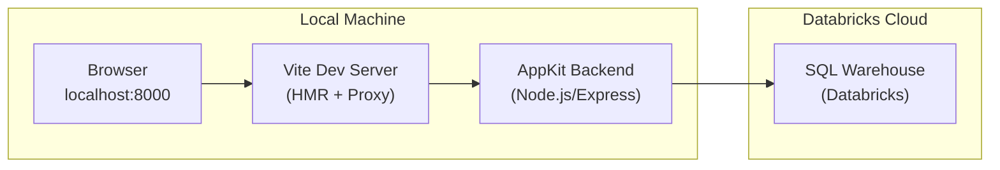
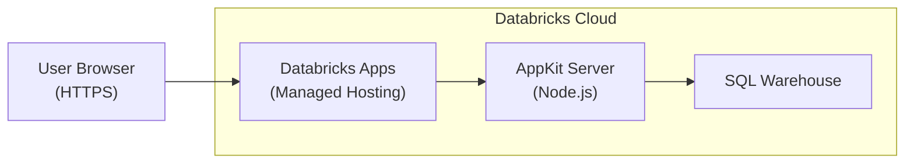
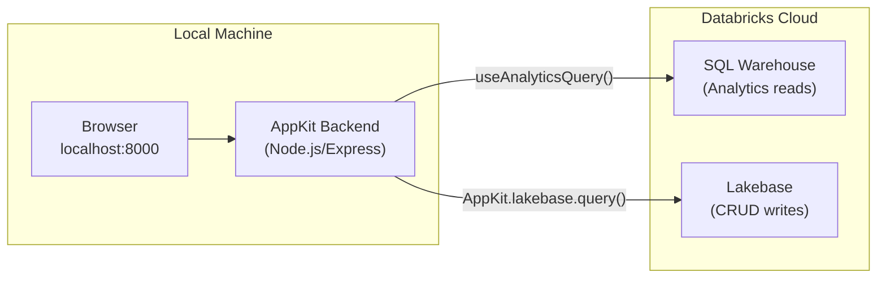
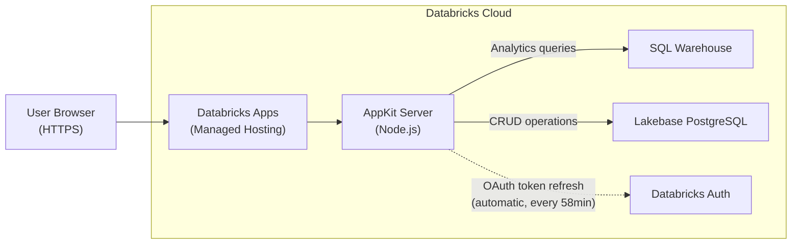

# Build and Deploy Databricks Apps with AppKit

**Last Updated:** April 2026
**Created by:** Prashanth Subrahmanyam

## Background

This document is a comprehensive guide to building, deploying, and testing web applications on the Databricks platform using **AppKit** — a TypeScript SDK with a plugin-based architecture for creating full-stack Databricks Apps. It walks through a complete lifecycle: scaffolding a project, building a UI from a PRD, deploying to Databricks Apps, wiring a Lakebase (managed PostgreSQL) backend, and running end-to-end verification.

This guide is structured as a series of **phases**, each designed to be given as a prompt to an AI coding assistant (Cursor, Claude Code, Windsurf, etc.). The assistant executes the instructions using the referenced Agent Skills, which contain the detailed implementation knowledge.

```
Phase 1                Phase 2              Phase 3                Phase 4
Scaffold, Build   -->  Deploy          -->  Wire Lakebase     -->  Deploy + E2E Test
& Test Locally         (Analytics Only)     Backend (local)        with Lakebase
```

### Two Pathways

| Pathway | Phases | Use When |
|---------|--------|----------|
| **Path A: Analytics Only** | Phase 1 -> Phase 2 | You only need SQL warehouse queries (dashboards, reports) |
| **Path B: Analytics + Lakebase** | Phase 1 -> Phase 2 -> Phase 3 -> Phase 4 | You need transactional data (CRUD), Lakebase PostgreSQL, and analytics |

---

## Pre-Requisites

Complete the pre-requisites checklist before beginning: [PRE-REQUISITES.md](../PRE-REQUISITES.md)

Key requirements:
- Databricks workspace with Apps and Lakebase enabled
- AI-powered IDE (Cursor recommended) with Claude Sonnet 4.5+
- Databricks CLI installed and authenticated
- Node.js v22+ installed
- A PRD document at `docs/design_prd.md` describing the application to build

---

## Workshop Parameters

Fill in these values before starting. They are referenced throughout all phases.

| Parameter | Value | Description |
|-----------|-------|-------------|
| `{workspace_url}` | __________________ | Your Databricks workspace URL (e.g. `https://myworkspace.cloud.databricks.com`) |
| `{use_case_slug}` | __________________ | Short app identifier (e.g. `bookings`, `inventory`, `analytics`) |
| `{user_app_name}` | __________________ | Lakebase project name (Path B only, from setup_lakebase step) |
| `{LAKEBASE_HOST}` | __________________ | Lakebase host address (Path B only, from setup_lakebase step) |

---

---

## Phase 1: Scaffold, Build, and Test Locally

In this phase, you will authenticate to Databricks, scaffold a new AppKit project with the analytics plugin, implement a UI from a PRD, and verify everything works locally. This is the foundation for all subsequent phases.

Start a new Agent thread and use the following prompt:

---

### Your Task

You are a full-stack developer building a web application on Databricks AppKit. Your goal is to scaffold an AppKit project, implement UI and backend features from a PRD, and test locally.

**Workspace:** `{workspace_url}`

**Working directory:** Run all app commands and create/edit app files under the `apps_lakebase/` folder. Design docs (PRD, UI design) remain in the parent `docs/` folder at repo root.

---

### Step 1.1: Authenticate and Set Up Variables

```bash
# Authenticate to Databricks
databricks auth login --host {workspace_url}

# Derive app name from your username + use case
FIRSTNAME=$(databricks current-user me --output json | jq -r '.userName' | cut -d'@' -f1 | cut -d'.' -f1)
LASTINITIAL=$(databricks current-user me --output json | jq -r '.userName' | cut -d'@' -f1 | cut -d'.' -f2 | cut -c1)
USERNAME="${FIRSTNAME}-${LASTINITIAL}"
APP_NAME="${USERNAME}-{use_case_slug}"
EMAIL=$(databricks current-user me --output json | jq -r '.userName')
echo "App: $APP_NAME | Email: $EMAIL"
```

**Important:** App names must be max 26 characters, lowercase letters/numbers/hyphens only (no underscores). Truncate if necessary.

---

### Step 1.2: Install Agent Skills and Scaffold the AppKit App

Read and follow the `appkit-scaffold` skill at `@apps_lakebase/skills/appkit-scaffold/SKILL.md`.

The skill will guide you through:
1. Installing Databricks Agent Skills (for data exploration, CLI execution, workspace discovery)
2. Scaffolding the AppKit project inside `apps_lakebase/`

**Select a CLI profile:**

```bash
# List available profiles and choose one
databricks auth profiles
PROFILE="DEFAULT"  # <-- set to your chosen profile name
```

**Scaffold command** (run from the repo root so the app is created inside `apps_lakebase/`):

```bash
# Get warehouse ID (needed for analytics)
WAREHOUSE_ID=$(databricks experimental aitools tools get-default-warehouse --profile $PROFILE)

# Scaffold with analytics plugin (the PRD will need data queries)
cd apps_lakebase
databricks apps init --name $APP_NAME --description "{use_case_slug} dashboard" --features analytics --warehouse-id $WAREHOUSE_ID --run none --profile $PROFILE
```

After scaffold completes:

```bash
cd $APP_NAME
npm install
```

**Verify config files** were generated with the correct app name:

```bash
grep "name:" app.yaml
grep "name:" databricks.yml
```

If these don't match `$APP_NAME`, update them manually.

**From this point on, all file paths are relative to `apps_lakebase/$APP_NAME/`** — this is your app root.

---

### Step 1.3: Read the PRD

Review `@docs/design_prd.md` (parent `docs/` folder at repo root) to understand:

- User personas and their needs
- Key user journeys (Happy Path only)
- Core features and requirements
- Data requirements — what tables/queries will the UI need?

---

### Step 1.4: Build the App

Read and follow the `appkit-build` skill at `@apps_lakebase/skills/appkit-build/SKILL.md`. The skill covers the full workflow: SQL queries, type generation, backend plugins, frontend components, design quality, and testing.

**Demo data strategy:** Start by using static `data` arrays on AppKit data components (charts, tables) so the UI works immediately. Write SQL files in `config/queries/` alongside. Once types are generated via `npm run typegen`, swap components from static `data` to query-driven `queryKey` + `params`. All static data must be replaced before declaring the build complete.

---

### Step 1.5: Create UI Design Document

Save a design overview to `@docs/ui_design.md` (parent `docs/` folder at repo root) describing:

- Key screens/pages
- Core components and their data sources
- Navigation flow
- Design direction and aesthetic choices

---

### Step 1.6: Test Locally

From your app directory (`apps_lakebase/$APP_NAME/`):

```bash
npm run dev
```

Open `http://localhost:8000` and verify:

- The UI loads without console errors
- Navigation works across pages
- Data queries return results (loading -> data flow)
- All interactive elements respond
- All static demo data has been replaced with query-driven data

---

### What It Produces

- Scaffolded AppKit project at `apps_lakebase/$APP_NAME/`
- SQL query files in `config/queries/` for all data needs
- Generated TypeScript types via `npm run typegen`
- Backend server (`server/server.ts`) with analytics plugin registered
- Frontend pages and components (`client/src/`) with type-safe data fetching
- UI design document at `docs/ui_design.md`

---

### Expected Output

**Project directory tree:**

```
apps_lakebase/$APP_NAME/
├── app.yaml                    # App deployment configuration
├── databricks.yml              # Databricks bundle config
├── package.json                # Dependencies (@databricks/appkit, etc.)
├── config/
│   └── queries/
│       ├── dashboard-summary.sql    # SQL for main dashboard
│       ├── orders-by-status.sql     # SQL for status breakdown
│       └── recent-activity.sql      # SQL for activity feed
├── server/
│   └── server.ts               # AppKit backend (analytics plugin)
├── client/
│   └── src/
│       ├── App.tsx             # Root component with routing
│       ├── pages/
│       │   ├── Dashboard.tsx   # Main dashboard page
│       │   └── Details.tsx     # Detail view page
│       └── components/
│           ├── SummaryCards.tsx # KPI summary cards
│           ├── DataTable.tsx   # Data table component
│           └── Chart.tsx       # Visualization component
└── .generated/
    └── types/                  # Auto-generated query types
```

**Terminal output — `npm run dev`:**

```
$ npm run dev

> my-app@1.0.0 dev
> appkit dev

  AppKit v1.x.x

  ✓ Server running at http://localhost:8000
  ✓ Analytics plugin loaded (warehouse: abc123def456)
  ✓ Vite dev server ready

  Open http://localhost:8000 in your browser
```

**Architecture — Local Development:**



**What you should see in the browser:**

```
┌─────────────────────────────────────────────────────────────┐
│  My App                                    Dashboard | Details│
├─────────────────────────────────────────────────────────────┤
│                                                             │
│  ┌──────────┐  ┌──────────┐  ┌──────────┐  ┌──────────┐   │
│  │ Total    │  │ Active   │  │ Revenue  │  │ Growth   │   │
│  │ Orders   │  │ Users    │  │ $12,450  │  │ +15.3%   │   │
│  │ 1,247    │  │ 342      │  │          │  │          │   │
│  └──────────┘  └──────────┘  └──────────┘  └──────────┘   │
│                                                             │
│  ┌─────────────────────────────┐  ┌────────────────────┐   │
│  │  Orders by Status           │  │  Recent Activity   │   │
│  │  ████████████ Completed 72% │  │  Order #1247 ...   │   │
│  │  ██████      Pending   20% │  │  Order #1246 ...   │   │
│  │  ███         Cancelled  8% │  │  Order #1245 ...   │   │
│  │                             │  │  Order #1244 ...   │   │
│  └─────────────────────────────┘  └────────────────────┘   │
│                                                             │
└─────────────────────────────────────────────────────────────┘
```

**Verification — curl test:**

```bash
$ curl -s http://localhost:8000 | head -1
<!DOCTYPE html>
```

---

### Checkpoint

> **Validate before proceeding.** Due to the non-deterministic nature of LLMs, it may take a few iterations of troubleshooting to ensure the app builds and runs correctly. Verify:
>
> - [ ] `npm run dev` starts without errors
> - [ ] The UI loads at `http://localhost:8000` with no console errors
> - [ ] All pages render with real query data (no static demo arrays remaining)
> - [ ] `docs/ui_design.md` exists and describes the application
>
> **Do NOT proceed to Phase 2 until local testing passes.**

---

---

## Phase 2: Deploy (Analytics Only)

In this phase, you will deploy the locally-tested application to Databricks Apps so it is accessible via a public HTTPS URL. This phase uses only the analytics (SQL warehouse) plugin — no Lakebase yet.

> **Path A stops here.** If you are only building an analytics dashboard (no Lakebase), Phase 2 is your final phase.

Start a new Agent thread and use the following prompt:

---

### Your Task

Deploy the locally-tested AppKit web application to Databricks Apps.

**Workspace:** `{workspace_url}`

**Working directory:** All app paths and commands use the `apps_lakebase/` folder. The scaffolded AppKit app lives at `apps_lakebase/$APP_NAME/`.

---

### Deployment Constraints

- Databricks App names must use only lowercase letters, numbers, and dashes (no underscores). Use hyphens: `my-app-name` not `my_app_name`.
- App names are max 26 characters.

---

### Step 2.1: Derive App Name and Set Profile

Derive your app name from your username + use case. This ensures the deployed app matches your `app.yaml` and `databricks.yml` configuration.

```bash
FIRSTNAME=$(databricks current-user me --output json | jq -r '.userName' | cut -d'@' -f1 | cut -d'.' -f1)
LASTINITIAL=$(databricks current-user me --output json | jq -r '.userName' | cut -d'@' -f1 | cut -d'.' -f2 | cut -c1)
USERNAME="${FIRSTNAME}-${LASTINITIAL}"
APP_NAME="${USERNAME}-{use_case_slug}"
echo "Deploying app: $APP_NAME"
```

Select a CLI profile:

```bash
databricks auth profiles
PROFILE="DEFAULT"  # <-- set to your chosen profile name
```

---

### Step 2.2: Deploy

Read and follow the `appkit-deploy` skill at `@apps_lakebase/skills/appkit-deploy/SKILL.md`. Run all skill commands from the `apps_lakebase/` directory.

The skill covers: config validation, build, deploy, UI verification, error diagnosis (3-iteration fix loop), and workspace app limit handling.

---

### What It Produces

- A running Databricks App accessible at `https://$APP_NAME.<workspace-region>.databricks.com`
- Service principal provisioned automatically for the app
- SQL warehouse queries executing in the cloud (same as local, but authenticated via the app's SP)

---

### Expected Output

**Terminal output — `databricks apps deploy`:**

```
$ cd apps_lakebase/$APP_NAME
$ databricks apps deploy --profile $PROFILE

Deploying app 'prashanth-s-bookings'...
Uploading source code... done
Building application... done
Starting application... done

App deployed successfully!
  URL:    https://prashanth-s-bookings.cloud.databricks.com
  Status: RUNNING
```

**Architecture — Deployed on Databricks:**



**App status — `databricks apps get`:**

```json
{
  "name": "prashanth-s-bookings",
  "url": "https://prashanth-s-bookings.cloud.databricks.com",
  "status": {
    "state": "RUNNING",
    "message": "Application is running"
  },
  "service_principal_id": "12345678-abcd-1234-efgh-123456789012",
  "create_time": "2026-04-10T14:30:00Z"
}
```

**App logs — healthy startup:**

```
$ databricks apps logs prashanth-s-bookings --tail-lines 20 --profile $PROFILE

2026-04-10T14:30:15Z [INFO]  AppKit v1.x.x starting...
2026-04-10T14:30:16Z [INFO]  Analytics plugin loaded (warehouse: abc123def456)
2026-04-10T14:30:16Z [INFO]  Server listening on port 8000
2026-04-10T14:30:17Z [INFO]  Application ready
```

**What you should see in the browser:**

The same dashboard UI from Phase 1, now accessible at a public HTTPS URL. Data loads from the SQL warehouse via the app's service principal — no local machine required.

---

### Checkpoint

> **Validate before proceeding.**
>
> - [ ] The Databricks App is deployed and in `RUNNING` state
> - [ ] The web UI loads in browser at the app URL (React application, not an error page)
> - [ ] No errors in the app logs (`databricks apps logs $APP_NAME`)
> - [ ] SQL queries execute successfully (data loads in the UI, not empty tables)
>
> **Path A complete!** If you are not adding Lakebase, you are done.
>
> **Path B: Continue to Phase 3** to add a Lakebase backend.

---

---

## Phase 3: Wire Lakebase Backend [Path B only]

In this phase, you will add the Lakebase (managed PostgreSQL) plugin to the AppKit project, create database tables and seed data, build API routes for CRUD operations, and complete the switch from static demo data to live data. This phase focuses on local development and testing.

> **Prerequisite:** Phase 2 must be complete. The app must have been deployed at least once so the Service Principal exists and can create database objects.

Start a new Agent thread and use the following prompt:

---

### Your Task

Wire the AppKit web application to a Lakebase database so the UI displays real data. This step focuses on local development and testing — complete the Phase 1 (static demo data) to Phase 2 (live query-driven data) switch.

**Workspace:** `{workspace_url}`

**Working directory:** All app code and commands use the `apps_lakebase/` folder. The scaffolded AppKit app lives at `apps_lakebase/$APP_NAME/`.

**Your Lakebase Project:** `{user_app_name}` (from the setup_lakebase step)

Use the project name and `LAKEBASE_HOST` from the setup_lakebase step.

**WARNING:** The Lakebase Instance/Project Name and Host Name above are configured in the Workshop Parameters. Ensure these match your Databricks workspace Lakebase setup before proceeding.

---

### Part A: Add the Lakebase Plugin

Add the Lakebase plugin to the AppKit project. For additional details beyond what's covered here, see `@apps_lakebase/skills/appkit-plugin-add/references/plugin-lakebase.md`.

#### Step 3.A1: Install the Package

```bash
cd apps_lakebase/$APP_NAME
npm install @databricks/lakebase
```

#### Step 3.A2: Register the Plugin

In `server/server.ts`, add `lakebase` to the existing plugin list:

```typescript
import { createApp, server, analytics, lakebase } from "@databricks/appkit";

await createApp({
  plugins: [server(), lakebase(), analytics()],
});
```

#### Step 3.A3: Configure Environment Variables

**For local development** — add to `.env` in the app root (`apps_lakebase/$APP_NAME/.env`):

```env
LAKEBASE_ENDPOINT=projects/{user_app_name}/branches/production/endpoints/primary
PGHOST=<LAKEBASE_HOST>
PGDATABASE=databricks_postgres
PGSSLMODE=require
```

Replace `<LAKEBASE_HOST>` with the actual host from the setup_lakebase step.

**For deployment** — add to `app.yaml`:

```yaml
env:
  - name: LAKEBASE_ENDPOINT
    valueFrom: postgres
```

When deployed with a `postgres` database resource, `PGHOST`, `PGDATABASE`, `PGSSLMODE`, `PGUSER`, `PGPORT`, and `PGAPPNAME` are auto-injected by the platform. Only `LAKEBASE_ENDPOINT` must be set explicitly.

#### Step 3.A4: Verify

```bash
cd apps_lakebase/$APP_NAME
npm run build
```

This must complete without import or module errors for `@databricks/lakebase`. If it fails, verify the package is in `package.json` dependencies.

---

### Part B: Configure App Permissions

Your app runs as a service principal. When created with the Lakebase resource via `databricks apps init`, the Service Principal automatically gets `CONNECT_AND_CREATE` permission — it can connect and create new objects but cannot access existing schemas or tables.

The deploy-first approach ensures the Service Principal creates and owns all database objects. No manual role grants are needed for the SP.

#### Step 3.B1: Deploy the App First

Deploy the app so the Service Principal creates schemas and tables on startup (the DDL in `server.ts` from Part C runs on first boot):

```bash
cd apps_lakebase/$APP_NAME
databricks apps deploy --profile $PROFILE
```

The Service Principal creates and owns all objects. This is required before local development can work.

#### Step 3.B2: Get Service Principal ID (for reference)

```bash
databricks apps get $APP_NAME --output json --profile $PROFILE | jq -r '.service_principal_id'
```

Save this — you may need it for troubleshooting.

#### Step 3.B3: Verify app.yaml Has Correct Env Vars

Confirm `app.yaml` has the Lakebase endpoint configured:

```bash
grep "LAKEBASE_ENDPOINT" apps_lakebase/$APP_NAME/app.yaml
```

You should see:

```yaml
env:
  - name: LAKEBASE_ENDPOINT
    valueFrom: postgres
```

Do NOT set `PGUSER` or `PGPASSWORD` — the plugin handles OAuth token rotation automatically.

#### Step 3.B4: Grant Local Development Permissions

To run `npm run dev` locally against the deployed Lakebase database, grant `databricks_superuser` to your own Databricks identity. Connect to the Lakebase database and run this SQL:

```sql
CREATE EXTENSION IF NOT EXISTS databricks_auth;

DO $$
DECLARE
  subject TEXT := '<YOUR_EMAIL>';  -- Your Databricks email (e.g. name@company.com)
  schema TEXT := 'app';
BEGIN
  PERFORM databricks_create_role(subject, 'USER');
  EXECUTE format('GRANT CONNECT ON DATABASE "databricks_postgres" TO %I', subject);
  EXECUTE format('GRANT ALL ON SCHEMA %s TO %I', schema, subject);
  EXECUTE format('GRANT ALL PRIVILEGES ON ALL TABLES IN SCHEMA %s TO %I', schema, subject);
  EXECUTE format('GRANT ALL PRIVILEGES ON ALL SEQUENCES IN SCHEMA %s TO %I', schema, subject);
  EXECUTE format('ALTER DEFAULT PRIVILEGES IN SCHEMA %s GRANT ALL ON TABLES TO %I', schema, subject);
  EXECUTE format('ALTER DEFAULT PRIVILEGES IN SCHEMA %s GRANT ALL ON SEQUENCES TO %I', schema, subject);
END $$;
```

Replace `<YOUR_EMAIL>` with your actual Databricks login email.

Run this SQL via the Lakebase SQL console, `psql`, or by adding a temporary admin route in `server.ts` that executes it via `AppKit.lakebase.query()`.

After granting, `npm run dev` will authenticate using your Databricks OAuth identity.

#### Permission Error Patterns

If you see these errors:

- `role "xxxxxxxx-xxxx-xxxx-xxxx-xxxxxxxxxxxx" does not exist` — The Service Principal or your identity lacks a Lakebase role. Re-deploy the app (Step 3.B1) so the SP creates objects, or re-run the SQL grant (Step 3.B4) for your own identity.
- `Connection attempt 1/5 failed (scale-to-zero wake?)` — Normal for the first connection after an idle period. Lakebase autoscaling instances scale to zero. Wait and retry.
- `permission denied for sequence` — Re-deploy the app so the Service Principal re-creates objects (it owns them), or manually grant via SQL: `GRANT ALL ON ALL SEQUENCES IN SCHEMA app TO "<service-principal-id>";`

---

### Part C: Wire UI to Backend

#### C1: Create Database Schema and Seed Data

In `server/server.ts`, after plugin initialization, use `AppKit.lakebase.query()` to create tables and seed data. Design DDL and seed data based on the PRD's data requirements.

```typescript
const AppKit = await createApp({
  plugins: [server(), lakebase(), analytics()],
});

// DDL — create tables (idempotent)
await AppKit.lakebase.query(`CREATE SCHEMA IF NOT EXISTS app`);
await AppKit.lakebase.query(`
  CREATE TABLE IF NOT EXISTS app.orders (
    id SERIAL PRIMARY KEY,
    user_id VARCHAR(255) NOT NULL,
    amount DECIMAL(10, 2) NOT NULL,
    status VARCHAR(50) DEFAULT 'pending',
    created_at TIMESTAMP DEFAULT CURRENT_TIMESTAMP
  )
`);

// DML — seed data (idempotent)
await AppKit.lakebase.query(`
  INSERT INTO app.orders (user_id, amount, status)
  VALUES ('demo-user', 99.99, 'completed')
  ON CONFLICT DO NOTHING
`);
```

Use `CREATE TABLE IF NOT EXISTS` and `ON CONFLICT DO NOTHING` so the server is safe to restart without errors.

#### C2: Add API Routes for Lakebase CRUD

AppKit Lakebase is **server-side only** — there are no frontend hooks like `useAnalyticsQuery` for Lakebase. Use `server.extend()` to add Express routes:

```typescript
const AppKit = await createApp({
  plugins: [server({ autoStart: false }), lakebase(), analytics()],
});

AppKit.server.extend((app) => {
  // Health endpoint
  app.get("/api/health/lakebase", async (req, res) => {
    try {
      await AppKit.lakebase.query("SELECT 1");
      res.json({ status: "connected", source: "live" });
    } catch (err) {
      res.json({ status: "disconnected", error: String(err), source: "mock" });
    }
  });

  // Data endpoint with fallback
  app.get("/api/orders", async (req, res) => {
    try {
      const result = await AppKit.lakebase.query("SELECT * FROM app.orders ORDER BY created_at DESC");
      console.log(`[Lakebase] /api/orders returned ${result.rows.length} rows`);
      res.json({ data: result.rows, source: "live" });
    } catch (err) {
      console.warn(`[Lakebase] /api/orders failed, falling back to mock data: ${err}`);
      res.json({ data: [{ id: 1, user_id: "demo", amount: 99.99, status: "mock" }], source: "mock" });
    }
  });
});

await AppKit.server.start();
```

**Each API route must:**
- Return `{ data: [...], source: "live" }` on success
- Fall back to `{ data: [...], source: "mock" }` if Lakebase is unavailable
- Log the query being executed and the result row count (or error details)

**Include a health endpoint:** `GET /api/health/lakebase` returning connection status and source.

#### C3: Complete Phase 1 to Phase 2 Switch

Per the `appkit-build` skill's two-phase data pattern (`@apps_lakebase/skills/appkit-build/SKILL.md` Step 5):

**Replace static demo data with live data sources:**

- For **SQL warehouse reads** (analytics/reporting): Replace static `data` props with `useAnalyticsQuery("queryKey", params)` using SQL files in `config/queries/`
- For **Lakebase CRUD reads** (transactional data): Replace static `data` with `fetch('/api/...')` calls to the Express routes from C2

**Add a ConnectionStatus component:**

Create a component that shows the data source on every page:

```tsx
function ConnectionStatus({ source, context }: { source: "live" | "mock" | "loading"; context?: string }) {
  if (source === "loading") return <span>{context ? `Loading ${context}...` : "Loading..."}</span>;
  if (source === "live") return <span className="text-green-600">Live Data{context ? ` — ${context}` : ""}</span>;
  return <span className="text-yellow-600">Mock Data{context ? ` — ${context}` : ""}</span>;
}
```

Place this at the **top of every page** that fetches data from Lakebase so users clearly see whether they're viewing live or mock data. Pass a `context` string describing the specific data being loaded for that page (e.g., `context="orders"`, `context="bookings"`, `context="user profiles"`).

**Defensive data handling** — prevent runtime errors:

- Initialize arrays with `[]`, not `undefined`
- Use optional chaining: `data?.slice()`, `data?.map()`
- Provide fallbacks: `(data ?? []).map(...)` or `data || []`
- Check before rendering: `{data && data.map(...)}`

#### Connection Resilience

AppKit's Lakebase plugin handles most resilience automatically:

- **OAuth token rotation:** 1-hour tokens with 2-minute refresh buffer (automatic)
- **Token caching:** Minimizes API calls (automatic)
- **OpenTelemetry instrumentation:** Query duration, pool connections, token refresh (automatic)

Configure pool settings for additional resilience:

```typescript
await createApp({
  plugins: [
    lakebase({
      pool: {
        max: 10,
        connectionTimeoutMillis: 5000,
        idleTimeoutMillis: 30000,
      },
    }),
  ],
});
```

Add try/catch with fallback to mock data in every Express route handler (as shown in C2). Log failures at WARNING level.

---

### Part D: Local Build and Test

Run all commands from the app directory (`apps_lakebase/$APP_NAME/`).

#### Build and Run

```bash
cd apps_lakebase/$APP_NAME
npm run dev
```

#### Verify

Open `http://localhost:8000` in your browser and check:

- The UI loads correctly
- Navigation works between pages
- ConnectionStatus indicator shows data source ("Live Data" or "Mock Data")
- Backend API endpoints respond (check browser dev tools Network tab)
- No console errors

#### Test API Endpoints

```bash
curl -s "http://localhost:8000/api/health/lakebase" | jq .
```

Expected: `{ "status": "connected", "source": "live" }` (or `"disconnected"` / `"mock"` if Lakebase is unavailable — the app should still work with mock fallback data).

---

### What It Produces

- `@databricks/lakebase` plugin integrated into the AppKit project
- Database schema and seed data (DDL/DML in `server/server.ts`)
- Backend API routes for all CRUD operations with live/mock fallback
- `GET /api/health/lakebase` health endpoint
- ConnectionStatus component on all data-driven pages
- All static demo data replaced with live query-driven data (Phase 2 complete)

---

### Expected Output

**Architecture — Dual Data Sources:**



**API health check — Lakebase connected:**

```json
$ curl -s http://localhost:8000/api/health/lakebase | jq .
{
  "status": "connected",
  "source": "live"
}
```

**API data endpoint — live data:**

```json
$ curl -s http://localhost:8000/api/orders | jq .
{
  "data": [
    {
      "id": 1,
      "user_id": "demo-user",
      "amount": 99.99,
      "status": "completed",
      "created_at": "2026-04-10T14:45:00.000Z"
    }
  ],
  "source": "live"
}
```

**Before/After — The Phase 1 to Phase 2 Switch:**

```
BEFORE (Phase 1 — static demo data):          AFTER (Phase 3 — live Lakebase data):
┌────────────────────────────────┐             ┌────────────────────────────────┐
│  ⚠ Mock Data — orders         │             │  ✓ Live Data — orders          │
│                                │             │                                │
│  id │ user   │ amount │ status │             │  id │ user   │ amount │ status │
│  ───┼────────┼────────┼────────│             │  ───┼────────┼────────┼────────│
│  1  │ demo   │ $99.99 │ mock   │             │  1  │ demo-  │ $99.99 │ compl- │
│     │        │        │        │             │  2  │ user   │ $45.00 │ eted   │
│  (hardcoded static array)      │             │  3  │ alice  │ $72.50 │ pend-  │
│                                │             │  (live from Lakebase)  │ ing    │
└────────────────────────────────┘             └────────────────────────────────┘
```

**Terminal output — `npm run dev` with Lakebase:**

```
$ npm run dev

> my-app@1.0.0 dev
> appkit dev

  AppKit v1.x.x

  ✓ Server running at http://localhost:8000
  ✓ Analytics plugin loaded (warehouse: abc123def456)
  ✓ Lakebase plugin loaded (endpoint: projects/my-app/branches/production/endpoints/primary)
  ✓ ConnectionPool initialised (max: 10)
  ✓ Vite dev server ready

  [Lakebase] DDL: CREATE SCHEMA IF NOT EXISTS app — OK
  [Lakebase] DDL: CREATE TABLE IF NOT EXISTS app.orders — OK
  [Lakebase] DML: Seed data inserted — 1 row
  [Lakebase] /api/health/lakebase — connected
  [Lakebase] /api/orders returned 3 rows
```

---

### Checkpoint

> **Validate before proceeding.** This is a critical integration point. Verify thoroughly:
>
> - [ ] `@databricks/lakebase` is in `package.json` and `npm run build` succeeds
> - [ ] `lakebase()` is registered in `server/server.ts`
> - [ ] `.env` has `LAKEBASE_ENDPOINT`, `PGHOST`, `PGDATABASE`, `PGSSLMODE`
> - [ ] `app.yaml` has `LAKEBASE_ENDPOINT` with `valueFrom: postgres`
> - [ ] App deployed once so Service Principal owns DB objects
> - [ ] Local dev permissions granted (SQL grant for your email)
> - [ ] `GET /api/health/lakebase` returns `{ "status": "connected", "source": "live" }`
> - [ ] All data API endpoints return `"source": "live"` with actual rows
> - [ ] ConnectionStatus shows "Live Data" on all data pages
> - [ ] No static demo data arrays remain in the frontend code
>
> **Do NOT proceed to Phase 4 until all Lakebase endpoints return live data locally.**

---

---

## Phase 4: Deploy and E2E Test with Lakebase [Path B only]

In this phase, you will deploy the Lakebase-wired application to Databricks Apps and run comprehensive end-to-end testing — verifying API correctness, Lakebase connectivity in production, log health, and connection resilience after idle periods.

Start a new Agent thread and use the following prompt:

---

### Your Task

Deploy the locally-tested web application to Databricks Apps and run comprehensive end-to-end testing to verify Lakebase connectivity, API correctness, and idle resilience.

**Workspace:** `{workspace_url}`

**Working directory:** All app paths and commands use the `apps_lakebase/` folder. The scaffolded AppKit app lives at `apps_lakebase/$APP_NAME/`.

**Prerequisite:** Complete the Lakebase wiring step (Phase 3) first. Local testing must pass before deployment.

---

### Deployment Constraints

- Databricks App names must use only lowercase letters, numbers, and dashes (no underscores). Use hyphens: `my-app-name` not `my_app_name`.
- App names are max 26 characters.

---

### Step 4.1: Set Variables and Validate Lakebase Config

Derive your app name and select a CLI profile:

```bash
FIRSTNAME=$(databricks current-user me --output json | jq -r '.userName' | cut -d'@' -f1 | cut -d'.' -f1)
LASTINITIAL=$(databricks current-user me --output json | jq -r '.userName' | cut -d'@' -f1 | cut -d'.' -f2 | cut -c1)
USERNAME="${FIRSTNAME}-${LASTINITIAL}"
APP_NAME="${USERNAME}-{use_case_slug}"

databricks auth profiles
PROFILE="DEFAULT"  # <-- set to your chosen profile name
```

Verify `app.yaml` has the Lakebase-specific environment binding (in addition to the generic checks the deploy skill performs):

```bash
grep "LAKEBASE_ENDPOINT" apps_lakebase/$APP_NAME/app.yaml
```

You should see `LAKEBASE_ENDPOINT` with `valueFrom: postgres`. If missing, add it before deploying:

```yaml
env:
  - name: LAKEBASE_ENDPOINT
    valueFrom: postgres
```

---

### Step 4.2: Deploy

Read and follow the `appkit-deploy` skill at `@apps_lakebase/skills/appkit-deploy/SKILL.md`. Run all skill commands from the `apps_lakebase/` directory.

The skill covers: config validation, build, deploy, UI verification, error diagnosis (3-iteration fix loop), and workspace app limit handling.

After the skill completes, capture the app URL for subsequent testing:

```bash
APP_URL=$(databricks apps get $APP_NAME --output json --profile $PROFILE | jq -r '.url')
echo "App URL: $APP_URL"
```

---

### Step 4.3: Test All Backend APIs

Test the Lakebase health endpoint and all data endpoints:

```bash
# Health endpoint
curl -s "$APP_URL/api/health/lakebase" | jq .

# Test each data endpoint used by your UI pages.
# Replace with your actual API endpoints:
curl -s "$APP_URL/api/orders" | jq .
# curl -s "$APP_URL/api/bookings" | jq .
# curl -s "$APP_URL/api/listings" | jq .
# ... add all endpoints that fetch from Lakebase
```

**Verify each response includes:**

- `"source": "live"` (not `"mock"`) when Lakebase is connected
- Actual data rows from your Lakebase tables
- Health endpoint returns `{ "status": "connected", "source": "live" }`

If any endpoint returns `"source": "mock"`, there is a Lakebase connection issue — proceed to Step 4.5.

---

### Step 4.4: Check Logs for Lakebase Connections

```bash
databricks apps logs $APP_NAME --tail-lines 100 --search lakebase --profile $PROFILE
```

You should see INFO logs showing:

- `ConnectionPool initialised` — the Lakebase plugin started successfully
- Connection attempts to Lakebase (may include retries on first connect after scale-to-zero wake)
- `[Lakebase]` prefixed query logs with row counts for each endpoint

If the `--search` flag is not supported by your CLI version, fall back to:

```bash
databricks apps logs $APP_NAME --tail-lines 100 --profile $PROFILE | grep -i lakebase
```

---

### Step 4.5: Fix Lakebase Errors (up to 3 iterations)

If Lakebase-specific errors occur (the deploy skill already handles generic AppKit errors), check the logs:

```bash
databricks apps logs $APP_NAME --tail-lines 100 --profile $PROFILE
```

#### Lakebase-Specific Errors

| Error | Cause | Fix |
|-------|-------|-----|
| `ERR_MODULE_NOT_FOUND` for `@databricks/lakebase` | Package not installed | Verify `@databricks/lakebase` is in `package.json` dependencies; redeploy |
| `LAKEBASE_ENDPOINT is not set` or `PGHOST is not set` | Missing env vars in `app.yaml` | Add `LAKEBASE_ENDPOINT` with `valueFrom: postgres` to `app.yaml`; redeploy |
| `role "xxxxxxxx-xxxx-..." does not exist` | Service Principal lacks Lakebase role | Re-deploy the app so the SP re-creates and owns objects. See Phase 3 Permission Error Patterns |
| `permission denied for sequence` | SP lacks GRANT on sequences for SERIAL columns | Re-deploy the app so the SP re-creates objects, or grant manually: `GRANT ALL ON ALL SEQUENCES IN SCHEMA app TO "<sp-id>";` |
| `Connection attempt 1/5 failed` | Normal on first request — Lakebase autoscaling cold start | Wait and retry. The connection pool handles retries automatically |
| `token's identity did not match` | OAuth token mismatch | Verify `app.yaml` has `LAKEBASE_ENDPOINT` with `valueFrom: postgres`; do NOT set `PGUSER` or `PGPASSWORD` manually |

**Fix cycle:**

1. Identify the error from logs
2. Apply the fix in `apps_lakebase/$APP_NAME/`
3. Redeploy: `cd apps_lakebase/$APP_NAME && databricks apps deploy --profile $PROFILE`
4. Re-check logs and re-test endpoints

Repeat up to 3 times. If errors persist after 3 attempts, report them for manual investigation.

---

### Step 4.6: Idle Connection Test (CRITICAL)

After confirming all endpoints return `"source": "live"`, wait 3-5 minutes without interacting with the app. Lakebase autoscaling instances may scale to zero during idle periods.

After waiting, reload the app in your browser and re-test:

```bash
curl -s "$APP_URL/api/health/lakebase" | jq .
```

**Expected:** Still returns `"source": "live"`. The AppKit Lakebase plugin handles automatic OAuth token refresh and connection pool recovery.

If it returns `"source": "mock"` or the health check shows `"disconnected"`, check logs for `terminating connection` or `Connection attempt failed` errors:

```bash
databricks apps logs $APP_NAME --tail-lines 50 --profile $PROFILE
```

The connection pool should recover automatically after the autoscaling instance wakes. If it does not recover after 2-3 page reloads, verify pool settings in `server.ts`:

```typescript
lakebase({
  pool: {
    max: 10,
    connectionTimeoutMillis: 5000,
    idleTimeoutMillis: 30000,
  },
})
```

---

### What It Produces

- Production deployment with Lakebase + Analytics on Databricks Apps
- Verified API endpoints returning live data from Lakebase
- Confirmed connection resilience after idle periods
- Clean app logs with no errors

---

### Expected Output

**Full API test battery:**

```json
$ curl -s "$APP_URL/api/health/lakebase" | jq .
{
  "status": "connected",
  "source": "live"
}

$ curl -s "$APP_URL/api/orders" | jq .
{
  "data": [
    { "id": 1, "user_id": "demo-user", "amount": 99.99, "status": "completed", "created_at": "2026-04-10T14:45:00Z" },
    { "id": 2, "user_id": "alice",      "amount": 45.00, "status": "pending",   "created_at": "2026-04-10T14:46:00Z" },
    { "id": 3, "user_id": "bob",        "amount": 72.50, "status": "completed", "created_at": "2026-04-10T14:47:00Z" }
  ],
  "source": "live"
}
```

**App logs — healthy Lakebase connections:**

```
$ databricks apps logs prashanth-s-bookings --tail-lines 30 --profile $PROFILE

2026-04-10T15:10:00Z [INFO]  AppKit v1.x.x starting...
2026-04-10T15:10:01Z [INFO]  Analytics plugin loaded (warehouse: abc123def456)
2026-04-10T15:10:01Z [INFO]  Lakebase plugin loaded (endpoint: projects/prashanth-s-bookings/...)
2026-04-10T15:10:02Z [INFO]  ConnectionPool initialised (max: 10, idle: 30000ms)
2026-04-10T15:10:02Z [INFO]  DDL: CREATE SCHEMA IF NOT EXISTS app — OK
2026-04-10T15:10:02Z [INFO]  DDL: CREATE TABLE IF NOT EXISTS app.orders — OK
2026-04-10T15:10:03Z [INFO]  DML: Seed data — 0 new rows (already seeded)
2026-04-10T15:10:03Z [INFO]  Server listening on port 8000
2026-04-10T15:10:05Z [INFO]  [Lakebase] /api/health/lakebase — connected
2026-04-10T15:10:06Z [INFO]  [Lakebase] /api/orders returned 3 rows
```

**Idle connection test timeline:**

```
T+0:00  ───── All endpoints return "source": "live" ✓
        │
        │     (no interaction — app idle)
        │
T+3:00  ───── Lakebase may scale to zero
        │
T+5:00  ───── Reload browser + re-test
        │
        ▼
        curl /api/health/lakebase → { "status": "connected", "source": "live" } ✓
        ConnectionPool auto-recovered after cold start
```

**Architecture — Final Production State:**



**Final verification dashboard:**

```
┌──────────────────────────────────────────────────────────────────┐
│  E2E Verification Results                                        │
├──────────────────────────────┬──────────┬────────────────────────┤
│  Test                        │  Status  │  Details               │
├──────────────────────────────┼──────────┼────────────────────────┤
│  App deployed & RUNNING      │  PASS ✓  │  State: RUNNING        │
│  UI loads in browser         │  PASS ✓  │  React app rendered    │
│  /api/health/lakebase        │  PASS ✓  │  source: live          │
│  /api/orders                 │  PASS ✓  │  3 rows, source: live  │
│  App logs — no errors        │  PASS ✓  │  ConnectionPool OK     │
│  SQL warehouse queries       │  PASS ✓  │  Analytics data loaded │
│  Idle test (5 min)           │  PASS ✓  │  Auto-recovered        │
│  ConnectionStatus UI         │  PASS ✓  │  Shows "Live Data"     │
├──────────────────────────────┼──────────┼────────────────────────┤
│  TOTAL                       │  8/8 ✓   │  All tests passed      │
└──────────────────────────────┴──────────┴────────────────────────┘
```

---

### Checkpoint

> **Final validation — your application is production-ready.**
>
> - [ ] Databricks App is deployed and in `RUNNING` state
> - [ ] Web UI is accessible at the app URL (React application, not an error page)
> - [ ] ConnectionStatus shows "Live Data" (connected to Lakebase)
> - [ ] `GET /api/health/lakebase` returns `{ "status": "connected", "source": "live" }`
> - [ ] All data API endpoints return `"source": "live"` with real data from Lakebase
> - [ ] No errors in the app logs
> - [ ] SQL warehouse queries execute successfully (analytics data loads in the UI)
> - [ ] Idle connection test passes (still "Live Data" after 3-5 minutes idle)
>
> **Congratulations!** Your AppKit application is deployed, connected to both SQL Warehouse and Lakebase, and verified end-to-end.

---

---

## Final Checklist

Combined verification across all phases:

### Phase 1 — Scaffold & Build
- [ ] Databricks CLI authenticated and `APP_NAME` set
- [ ] AppKit project scaffolded inside `apps_lakebase/` with analytics plugin
- [ ] SQL files exist in `config/queries/` for every data need from the PRD
- [ ] `npm run typegen` run and types generated
- [ ] Frontend implements key pages with type-safe data fetching
- [ ] `npm run dev` runs cleanly at `http://localhost:8000`

### Phase 2 — Deploy
- [ ] Databricks App deployed and in `RUNNING` state
- [ ] Web UI loads at the app URL
- [ ] SQL queries execute successfully in the cloud

### Phase 3 — Lakebase Wiring (Path B)
- [ ] `@databricks/lakebase` installed and registered
- [ ] Environment variables configured (`.env` + `app.yaml`)
- [ ] DDL and seed data run idempotently
- [ ] All API routes return `{ data, source }` with live/mock fallback
- [ ] ConnectionStatus component on all data pages
- [ ] All static demo data replaced with live data

### Phase 4 — E2E Test (Path B)
- [ ] All API endpoints return `"source": "live"` in production
- [ ] App logs show healthy Lakebase connections
- [ ] Idle connection test passes (3-5 minutes)
- [ ] Final verification dashboard: 8/8 tests passed
