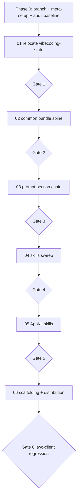

# 00 — Shared Overview (inherited by every milestone plan)

> This is the shared context every `NN-*.md` milestone plan in this directory inherits.
> Do not duplicate it inside milestone plans; reference it. When this file and a milestone
> plan disagree, **this file's "Authority" rule applies: defer to the Validation Ledger in
> [retrospectives/genie-code-refactor-handoff.md](../../genie-code-refactor-handoff.md)**
> over any prose here or there.

## North star

Make the workshop repo runnable from **either** an IDE+CLI client (Cursor) **or** Genie Code,
with **no regression** for the IDE path, under one principle:

> The **Declarative Automation Bundle is the one and only build artifact** for the data-product
> spine. Both clients author the same `databricks.yml` and deploy with `databricks bundle deploy
> --target dev`. On Genie Code this runs through the **`runDatabricksCli`** tool. The **one
> exception** is the Databricks App, which deploys outside the bundle: on Genie Code via the SDK
> `w.apps.deploy(…SNAPSHOT)` in `executeCode` (its build runs server-side, P11), or `apps deploy`
> through `runDatabricksCli` where the page allows (P10); in the IDE via the CLI (RULE_9).

Genie Code is **not a degraded client**: it has the CLI (via `runDatabricksCli`), a shell, and
Python/SQL on serverless compute. Remaining client differences are **environmental, not capability
gaps**, and are enumerated in the decision table below.

## Authoring discipline (governs every rule)

All artifacts — jobs, pipelines, schemas, volumes, Genie Spaces, the App's data resources — come
into existence exactly one way: **defined as a resource in the bundle**, brought to life by
**deploying the bundle**, identically on both surfaces. Genie Code *can* create artifacts directly
(`createAsset`, SDK `w.*.create()`, SQL DDL) — the workshop **deliberately does not**. Those
capabilities are reserved for **read-only, ad-hoc authoring support** (inspecting schemas,
confirming column names/types, checking lineage, sampling rows). The single creation event is deploy.

> **One sanctioned exception (user-approved):** a Genie Space may be created directly via
> `createAsset({assetType: "genie", ...})` as **RULE_8 Tier 3** — but **only** in a Genie Code session and
> **only** when neither bundle tier (1: native resource, 2: provisioning job) is viable. It is the
> last-resort escape hatch, prefix-named, and flagged non-version-controlled; it never becomes the default
> and has no IDE equivalent.

## Locked decisions (carried into all milestones)

1. One agent-agnostic content set. Bundle is the only build artifact (`bundle deploy --target dev`;
   App via `apps deploy`). No in-session artifact creation (RULE_10) — **two carve-outs: RULE_8 Tier 3**
   Genie-Space `createAsset`, Genie-Code-only and last-resort; and **idempotent foundation provisioning**
   (`CREATE SCHEMA IF NOT EXISTS` / `CREATE VOLUME IF NOT EXISTS` of the participant's own prefixed
   schema/volume, both clients, nothing else — audit-listed as sanctioned, not counted).
2. `vibecoding-state` relocates to a neutral home (`skills/vibecoding-state/`) and becomes the single
   place that detects the client and records environment capabilities; everything reads from it (no
   per-client forks).
3. **Source of truth = the regenerated `apps_lakebase/prompts/sections/*.md`.** They are extracted from
   the latest `02_seed_section_input_prompts.sql` via `extract_to_markdown.py` and propagated back via
   `sync_markdown_to_seed.py` (round-trip verified byte-clean across all 73 blocks). Edits are made in
   the section markdown. `apps_lakebase/prompts/` is **git-untracked in this repo by design**
   (`.gitignore:96`); it is version-controlled **manually in a separate repo**.
4. The AppKit App is **in scope for both clients** (validated): deploys via the SDK
   `w.apps.deploy(…SNAPSHOT)` in `executeCode` on Genie Code (or `apps deploy` through `runDatabricksCli`
   where the page allows) and via the CLI in the IDE — the one exception to the bundle-deploy spine (RULE_9).
5. **Client routing = single agnostic default body + `client_context` preamble (RULE_0), with scoped
   `genie-code` forks for high-friction steps. AMENDED by Milestone 07 (was: "forks are NOT the shipped
   mechanism").** *Original intent (retained as the default path):* one byte-identical body whose only
   client-varying surface is the RULE_0 preamble; "Genie Code Overrides" verbiage stays removed (it was
   unprofessional). **Milestone-07 amendment:** hands-on use showed Genie Code is not a frontier model and
   needs prescriptive, fully-spelled-out guidance a single agnostic body cannot carry without bloating the
   IDE path. So the `coding_assistant='genie-code'` fork is revived as a **sanctioned, SCOPED shipped
   mechanism** — **selective, not blanket**: fork only the demonstrably high-friction sections (skill-heavy
   loaders, artifact writers, deploy/scaffold), keep everything else single-body + RULE_0. A fork is a
   **wholesale override** selected by the app for `(section_tag, 'genie-code')` (fallback = default), carries
   `input_template`+`system_prompt` only, and is **prescriptive on paths and directives** (fully-qualified
   `skill_ref_root`-rooted skill paths, `<ARTIFACT_ROOT>`-anchored writes, explicit `runDatabricksCli`/deploy
   verbs, inlined `genie-code-environment` essentials). **Promotion rule:** start narrow; promote a section
   to a fork only when it misbehaves in Genie Code testing. **Guardrails (the reason the prior 11 forks were
   retired):** (a) the fork's learning **intent**, gate, and per-user prefix tokens (decision #7) MUST match
   the default — only *mechanics* differ, enforced by the `genie_gate` **`FORK_INTENT_PARITY`** check; (b)
   forks round-trip byte-clean through the existing tooling. Owned by **Milestone 07**
   ([07-genie-code-prescriptive-fork.md](07-genie-code-prescriptive-fork.md)).
6. **Override lessons are harvested before forks are retired.** Each fork's overrides are triaged into:
   (A) client-portability mechanics already covered by RULE_1/6/9 → fold into the single body via the
   sweep; (B) genuine cross-client correctness lessons → integrate into the relevant skill/section as
   client-agnostic guidance (Milestones 02/04/05); (C) Genie-Code bootstrap (clone repo, helper
   primitives) → move to the `client_context` preamble + PRE-REQUISITES Genie branch, never inlined
   per step. The triage ledger lives in [03-prompt-section-chain.md](03-prompt-section-chain.md) §Lesson
   Harvest and is consumed by the downstream milestones.
7. **Per-user artifact prefixing is an invariant (no regression). LOCKED.** The seed namespaces
   every participant's artifacts *inside a shared catalog* by a per-session prefix — schema
   `{user_schema_prefix}` (e.g. `varunrao_b_booking_app`), Lakebase project / app `{user_app_name}` =
   `${FIRSTNAME}-${LASTINITIAL}-{use_case_slug}` (seed header lines 17–19; app-name derivation lines
   345–351). This isolation MUST be preserved **exactly** in both clients. The Genie Code adaptation
   changes only *how* an artifact is created (always `bundle deploy`), **never what it is named**: the
   prefix tokens carry through unchanged into the bundle's `catalog`/`schema` variables, every resource
   name, and the **Genie Space title/name**. A swept line that drops or hard-codes a non-prefixed
   catalog/schema/space name is a regression, not a cleanup. UC-state acceptance checks (Milestone 04/05)
   assert objects under the **prefixed** schema, proving the convention held across clients.
8. **Genie Code self-knowledge lives in a durable skill; the cross-cutting common skills move to the shared
   repo-root `skills/` home. LOCKED (relocation pending M6).** The field guide
   [retrospectives/genie-code-field-guide.md](../../genie-code-field-guide.md) §6.8 names the meta-fix for
   every other gap: the agent must **begin each session knowing how Genie Code behaves** instead of
   re-discovering it live in front of the user (the cause of the long probe loops). We bake that into a
   **new common skill `genie-code-environment`** — a concise, evidence-tagged behavioral manifest distilled
   from the probe Ledger (P1–P18) + the field guide: page/surface tool-scoping; the three execution paths
   (`runDatabricksCli` → SDK → native tools) and the **"blocked ≠ impossible, try the next path"**
   discipline; the allow-list tiers (pre-approved / safety-gated / hard-blocked / redirected);
   `bundle deploy --target dev` + the CWD-pin + the FUSE create-then-validate gap; `apps init --output-dir`;
   npm/npx absence + **server-side build (P18)**; `aitools` hard-block → `git clone`; the RULE_8 Genie-Space
   tiers; and the **3-hop OAuth `requests.Session()`** app-test pattern (P17). `vibecoding-state` already
   **detects** the client and writes the capability block (decision #2); it now **points to
   `genie-code-environment`** for the *behavioral* detail — detection vs. explanation, no duplication. The
   two existing cross-cutting common skills get **short Genie-Code sections that reference it, not copies**:
   `databricks-asset-bundles` ← the deploy/CWD/FUSE/`bundle validate` rules; `databricks-expert-agent` ←
   surface-scoping + the path-fallback discipline. Because all three (`genie-code-environment`,
   `databricks-asset-bundles`, `databricks-expert-agent`) are `domain: common` / `used_by_stages: [all]` —
   genuinely shared across every component, not data-product-specific — they are **promoted to the repo-root
   `skills/` home alongside `skills/vibecoding-state/`**, and every reference (both `AGENTS.md` routing
   tables, the navigators, `used_by_stages` consumers) is updated. **Authoring is M2** (it owns `common/**`);
   the **relocation + reference rewrite is M6** (distribution), sequenced **after** M2 so the skills are
   edited once in place, then moved as a unit (no double-touch).
9. **Skill & section self-sufficiency — the state machine is the *fast path*, not a correctness dependency.
   LOCKED (lightweight authoring lens; applied M5/M6, regression I8).** `skills/vibecoding-state`
   `enter`/`exit` is the optimized path: run it once and the client, CLI channel, `state_file_root`, and
   upstream IDs are resolved and locked. But the workshop ships as **copy-paste, per-prompt**, frequently
   in **fresh Genie Code threads**, and skill/manifest auto-load is **not guaranteed** until M6/G3 enforces
   it — so a participant may reach a command **without `enter` having run in that thread**. Every
   command-bearing skill or prompt section must therefore also **stand alone**: (a) **client routing
   inline** — the one-line `> **Client note:**` hint sits directly above the first
   `databricks`/`bundle`/`apps` fence, verbs backticked so it stays audit-neutral; (b) **inputs
   self-resolving** — any value `enter` would inject (IDs, endpoint/space names, the per-user prefix,
   profile) is referenced with an explicit fallback (`<FROM_STEP_N_OR_VIBECODING_STATE>` or a one-line
   "obtain it via …"), never silently assumed present; (c) **paths anchored** — generated files anchor to
   the repo root (`{REPO_ROOT}` / `state_file_root`), never a bare relative path; (d) **degrade, don't
   block** — a section never *halts* because `enter` was skipped; it proceeds on the inline guidance. This
   is an **authoring lens, not new machinery** — it blesses what already shipped (**C2** inline routing,
   **C3** path anchoring, the `_OR_VIBECODING_STATE` placeholders) as a standing rule. **Redundancy is
   tiered (the C2 lesson):** on `enter`-gated sections the inline note is a terse **echo** (keep short, or a
   pointer to the resolved `## Environment Capabilities`); on non-gated sections it is **load-bearing**
   (keep full). This is **complementary to M6/G3, not in tension**: G3 makes the *fast path* fail-closed
   (force manifest load **when `enter` runs**); decision #9 keeps the section **correct when `enter` is
   skipped entirely**. The two cover disjoint cases — G3 the entry gate, #9 the no-gate fallback.

## Decision table (RULE_0–RULE_10) — quick reference

Authority: handoff §4. Each audit row's `action` column names the rule; every edit cites one.

| Rule | Trigger (audit class) | Edit |
|---|---|---|
| RULE_0 | `CLIENT_NAV` | Template the navigation preamble by `client_context`; body byte-identical across clients. |
| RULE_1 | `SCRIPT_DEPLOY`, `SHELL_DATABRICKS` | Deploy via `databricks bundle deploy --target dev`. IDE = local CLI; Genie Code = `runDatabricksCli`, whose **CWD is page-*type*-dependent** (P2: bundle-root on a bundle page, workspace home elsewhere) — so the participant must be **on the page of the bundle being deployed** (no `cd`). `--help`/`validate`/`summary` are unrestricted (P4); a **targetless** deploy is guardrail-blocked (P5); `bundle deploy --target dev` is mandatory and runs against the **on-page `databricks.yml`** (P6). Edit the **existing** on-page `databricks.yml` — newly API-created files don't reach the CLI's FUSE mount (P3). Never a bare-shell `databricks` call — **note** a last-resort escape hatch exists (`ENABLE_DATABRICKS_CLI=true` auto-installs the real CLI to `$HOME/bin/databricks` and a real `bundle deploy --target dev` has succeeded that way, field guide §2.5/§8), but it **violates this rule**; prefer navigating to the bundle's page. The **SDK has no `bundle deploy` equivalent** (composite client-side op) — `bundle deploy` is always the CLI path, never the SDK. |
| RULE_2 | `LOCAL_AUTH` | Move `databricks auth login` / token export to the **IDE branch** of `PRE-REQUISITES.md`; never in agnostic/Genie steps (Genie is pre-authenticated). |
| RULE_3 | `SETUP_SCRIPT` | Move setup-script build logic (Lakebase project/branch/endpoint, grants, bootstrap) into bundle resources / a bundle-run job. Keep `.sh` only as labeled local convenience, if at all. |
| RULE_4 | `LOCAL_SPARK` | Replace `databricks-connect`/local Spark with workspace serverless compute (bundle job/pipeline). Data logic unchanged; only where it runs moves. |
| RULE_5 | `PY_BUNDLE_CONFIG` | Standardize on YAML-defined bundle resources over the Python flavor. |
| RULE_6 | `LOCAL_PATH` | Normalize laptop-only absolute/relative paths to project/workspace-relative or UC references; prefer "paste schema inline" where a path resolves in only one client. **Per-occurrence judgment.** |
| RULE_8 | `GENIE_RESOURCE` | Genie Spaces deploy via **three tiers**, preferred first, with a **GO/NO-GO** that selects the active tier. **Tier 1 (preferred target):** a native `genie_spaces` bundle resource — **DABs support is landing ~this month**, so this is the intended end state and becomes the documented path **as soon as** `bundle validate` accepts it. As of P7 (2026-06-01) `genie_spaces` is **not yet** in the supported resource list, so flipping to Tier 1 is a **minor refactor** when the CLI lands it (re-run the GO/NO-GO, switch the flag — no rewrite). Until then **Tier 2 is the active fallback**. **Tier 2 (active fallback until Tier 1 lands, both clients):** a Genie-artifact JSON at `src/genie_spaces/<prefixed-name>.json` (`title`, `description`, `table_identifiers`, `warehouse_id`) provisioned by a **bundle-run job task** — a `deploy_genie_spaces.py` notebook (`notebook_task`, `dbutils.widgets` for `target_catalog`/`warehouse_id`) doing idempotent create/PATCH via the Genie REST API, `depends_on` the main pipeline. It runs *during* `bundle deploy`, so it is **not** in-session creation (RULE_10 holds). **Tier 3 (Genie-Code-only, confirmed working P8):** direct `createAsset({assetType: "genie", name: "<prefixed name>", tableIdentifiers: [...]})` — the space is live immediately, returns an ID. This is the **one sanctioned exception** to the authoring discipline (user-approved), used **only** in a Genie Code session when Tiers 1–2 are not viable; it produces workspace state the bundle does not own, so flag it as non-version-controlled and never the default. The spine carries the Tier 1 `genie_spaces` resource block ready-to-enable (kept commented until the GO/NO-GO passes) so the switch is a one-line flip. **App-context variant:** for the AppKit App, a Genie Space may be declarable as an `app.yaml` resource (P7 docs) — explore in M5. In every tier the Space **name carries the per-user prefix** (decision #7) and `table_identifiers` are fully-qualified under the prefixed schema. Record the chosen tier in `deploy_note` (`tier_1_native` once it lands, else `tier_2_provisioning_job`, or `tier_3_createasset` for the Genie-Code escape hatch). **(Supersedes the handoff's embedded script comment that said "create via SDK"; the Ledger/§2/§4 are authoritative.)** |
| RULE_9 | `APP_DEPLOY` | App is the deliberate exception: author `app.yaml` + resources; deploy with `apps init`/`apps deploy`. IDE = local CLI / `vibe2value deploy` (local Node build + sync). Genie Code = the SDK `w.apps.deploy(<name>, AppDeployment(source_code_path=…, mode=SNAPSHOT))` via `executeCode` (canonical: works from any context, P11), or `apps deploy` via `runDatabricksCli` **where the page allows it** (it is **page-gated**, hard-blocked on file-editor / standalone Apps pages, and its enhanced build needs CWD = the app root, P10). **No local npm step scripted** — the frontend build runs **server-side** in the Apps runtime (Gap 4 resolved, P11). |
| RULE_10 | `INSESSION_CREATE` | No in-session artifact creation. Rewrite `createAsset`/`w.*.create()`/provisioning DDL into a bundle resource. **Review, not auto-rewrite**: a `CREATE ...` that is the *body of a bundle-authored DLT/SQL resource* runs during deploy and **stays**. Test: if removing the statement changes the deployed bundle, it's creation → move; if it only informs authoring, it stays. **Two carve-outs:** (1) the RULE_8 **Tier 3** Genie-Space `createAsset` (Genie-Code-only, last-resort) — user-approved in-session creation, never the default; (2) idempotent foundation provisioning of the participant's own prefixed schema/volume, on both clients: `CREATE SCHEMA IF NOT EXISTS {catalog}.{user_schema_prefix}_agent` / `CREATE VOLUME IF NOT EXISTS {catalog}.{user_schema_prefix}_agent.{volume}` (and the `_ops` equivalents), nothing else (no tables, jobs, pipelines, SDK create calls or unprefixed names); the audit lists these as sanctioned and does not count them (`scripts/audit_genie_compat.py` `RULE_10_SANCTIONED`). |

## Capability block (Workstream 0 — written by `vibecoding-state.bootstrap`)

`vibecoding-state` writes an `## Environment Capabilities` block consumed by `enter`/`exit` and all prompts:

```yaml
environment_capabilities:
  client_context: ide_cli | genie_code        # detected at bootstrap
  cli_channel: local_shell | runDatabricksCli
  cli_version: <string> | unknown_on_genie_code  # `databricks --version` is hard-blocked on Genie Code (CONFIRMED P1, all page contexts); when unknown, version-dependent checks fall back to a behavior probe (`bundle validate` against a sample), never a numeric compare
  bundle_deploy: { verb: "bundle deploy --target dev", page_context_required: true }
  app_deploy:    { verb: "apps deploy", gated: true }
  destructive_ops: confirm_required
  state_file_root: <local path | git-folder workspace path>
  artifact_root: <repo root | clone path under /Workspace/Users/<email>/.assistant/skills/<repo>>  # where bare relative artifact writes resolve
  skill_ref_root: <empty | "skills/<clone-folder>">  # readSkillFile prefix for repo-relative skill paths on genie_code (M07)
```

> **Gap-1 correction (carried into Milestone 06):** the shipped `vibecoding-state` bootstrap reads
> `databricks --version` and `skill_helper_resolution` compares it numerically. That command is
> **hard-blocked on Genie Code (CONFIRMED P1)**, so the controller must set `cli_version: unknown_on_genie_code` when
> `client_context == genie_code` and route any `cli_version_dependent_schema` decision through the
> behavior probe above instead of the numeric gate. This is a follow-up edit to the M1 skill, owned by
> Milestone 06 (navigator/capability wiring).

## Validated Genie Code probe results (2026-06-01, session 2) — [TESTED]

Run live in a Genie Code serverless session. These **flip prior inferences** and refine the page-context
model; milestones below cite this table.

| # | Finding | Result | Affects |
|---|---|---|---|
| P1 | `databricks --version` via `runDatabricksCli` | **Hard-blocked** ("not in the allow-list"); `bundle validate`/`summary` pre-approved | Gap 1 — **confirmed**; controller must set `cli_version: unknown_on_genie_code`, use behavior probe |
| P2 | `runDatabricksCli` working directory | **CWD is page-*type*-dependent** (formally `[CONTESTED]` per field guide §9): = the **bundle-root on a bundle page** (proven — `bundle validate` parsed *that* file), = the **workspace home on non-bundle pages** (notebook/AppKit, where it can't find the project `databricks.yml`). No `cd`, no `--bundle-root` flag. Practical rule unchanged: **be on the page of the bundle you are deploying.** | RULE_1, M2/M4/M5, harness |
| P3 | Files written via `createAsset`/`editAsset` | **Do not sync to the CLI's FUSE mount** in-session — you must **edit the existing on-page `databricks.yml`**, not create a new bundle elsewhere | M2 spine, Genie Tier 2 |
| P4 | `bundle deploy --help` | Executes from any page that carries a bundle-root context (read-only, unrestricted) | RULE_1 |
| P5 | `bundle deploy` (targetless) | **Blocked by a content safety guardrail** ("could affect staging/production") — **not** a page block | RULE_1 — `--target dev` mandatory |
| P6 | `bundle deploy --target dev` | **Passes the guardrail and runs** from the page's bundle root (fails only on bad `databricks.yml` content) | RULE_1 — confirmed |
| P7 | `genie_spaces` as a **bundle** resource | **NOT a supported bundle resource type** (docs resource list: alert, app, catalog, cluster, dashboard, database_catalog, database_instance, experiment, external_location, job, model, model_serving_endpoint, pipeline, postgres_*, quality_monitor, registered_model, schema, secret_scope, sql_warehouse, synced_database_table, volume). Genie Space appears **only as a Databricks Apps (`app.yaml`) resource** | RULE_8 — Tier 1 (native) stays the **preferred target** (DABs support landing ~this month, minor refactor); **Tier 2 is the active fallback** until then |
| P8 | `createAsset({assetType:"genie", ...})` | **Works** — created a live space (ID returned), tables attached, prefixed name accepted | RULE_8 — **Tier 3 confirmed** |
| P9 | npm / pnpm / corepack in the shell | **All absent** (exit 127); `corepack enable` cannot help (corepack itself missing); npm registry reachable (200) | Gap 4 — context for P11 |
| P10 | `apps deploy` CLI **enhanced Node build** | **Not a reliable Genie Code path:** the enhanced flow only runs when CWD = the app project root, but `runDatabricksCli`'s CWD is pinned to the page's bundle root (P2) → falls back to "missing required argument: APP_NAME"; and `apps deploy` is **hard-blocked** on file-editor / standalone Apps pages (page-gated) | Gap 4, RULE_9 |
| P11 | App deploy via **SDK** | **Works from any context** — `w.apps.deploy(<name>, AppDeployment(source_code_path=…, mode=SNAPSHOT))` via `executeCode` → deployment ID, IN_PROGRESS → running, **no local npm**. Build is **server-side** in the Apps runtime. **Gap 4 RESOLVED** (residual: confirm a *fresh* rebuild from un-built source — §4a Probe 3) | Gap 4, RULE_9, PRE-REQUISITES — **no npm bootstrap needed** |
| P12 (session 3) | `aitools` verb family via `runDatabricksCli` (`aitools install`, `aitools tools`, legacy `experimental aitools install`) | **All hard-blocked** — same guardrail message; neither new nor legacy form allow-listed. CLI agent-skills install + `aitools tools` data commands (warehouse/query/schema) are **not viable** on Genie Code | M5 §4b, `01-appkit-scaffold` — use git-clone + `warehouses list` fallbacks |
| P13 (session 3) | Agent-skills **git-clone** fallback + git/node presence | **`git clone` of `databricks-agent-skills` succeeds** (git 2.52.0, github.com reachable, 8 skill packages); `node` present (`/usr/local/bin/node`), `npx`/`npm` **absent** (reconfirms P9) → `npx @databricks/appkit docs` unavailable, use `WebFetch` | M5 §4b — git-clone is the canonical Genie Code install path; AppKit docs via WebFetch |
| P14 (session 3) | `apps init` tier + **output location** (CWD pin) | **`apps init` pre-approved** (non-interactive `--name … --run none` clones template v0.38.0, 40 files, app.yaml+databricks.yml+package.json present). **BUT it IGNORES the CWD pin** — defaults to `/Workspace/{name}` (workspace root), NOT the page/home dir. **`--output-dir` is mandatory** to land the project in the user's home/repo dir (`--output-dir .` for the page's dir, or an explicit `/Workspace/Users/<email>/…` path). `apps manifest --help` is **hard-blocked**. npm-not-found warning appears but scaffold still completes (skips `npm install`, P9) | M5 §4b, `01-appkit-scaffold` — **add `--output-dir`**; `apps manifest` → fallback (read `appkit.plugins.json` post-scaffold / docs) |
| P15 (session 3) | `postgres list-*` discovery commands | **All pre-approved (read-tier):** `list-projects`, `list-databases`, `list-endpoints` returned full help. Unblocks the **Phase-2 Lakebase binding chain** (project_id → database_id → endpoint host). Note: `list-databases`/`list-endpoints` need a fully-qualified `PARENT = projects/{id}/branches/{id}` (the wiring convention uses `branches/production`, so OK); both flagged **Beta** | M5 §4b, `04-appkit-plugin-add` Phase-2 — confirmed available on Genie Code |
| P16 (session 3) | `apps validate` + `auth token` + **deployed-app testing** | **`apps validate --help` and `auth token --help` both hard-blocked** via `runDatabricksCli`. Token IS retrievable via **SDK `w.config.token`** (`executeCode`) — but a raw `Authorization: Bearer` header is **rejected by AppKit's OAuth middleware** (live ACTIVE app → `/api/health` **401**; `/` → **302** OAuth redirect). `apps validate` gate → skip on Genie Code, rely on server-side build logs. **Superseded by P17 for the auth question** (programmatic session IS achievable) | M5 §4b, `03-appkit-deploy`, `05-appkit-lakebase-wiring` |
| P17 (session 3) | **Programmatic auth to a deployed App** (OAuth handshake replay) | **WORKS — reverses P16's "impractical".** Replaying the **3-hop Databricks Apps OAuth flow in one `requests.Session()`** authenticates from `executeCode` with no PAT: (1) `GET app/` → 302 + `__Host-databricksapps_csrf` CSRF cookie; (2) `GET` the OIDC `authorize` URL with `Authorization: Bearer w.config.token` → 302 to callback w/ `code`; (3) `GET /.auth/callback?code…` (carrying the CSRF cookie) → 200 + `__Host-databricksapps` **session cookie**. The single Session must persist the CSRF cookie across all 3 hops (PKCE/CSRF match) or hop 3 → 403. The Session is then usable for all `/api/*` calls. (Note: genie-workbench has no dedicated `/api/health` route — the SPA is served as catch-all, so test **app-specific** routes.) | M5 §4b, `03-appkit-deploy`, `05-appkit-lakebase-wiring` — **automated E2E from Genie Code is viable**; browser remains the simplest manual path |
| P18 (session 3) | **Server-side rebuild from un-built source** (Gap 4 last residual — §4a Probe 3) | **CONFIRMED — closes Gap 4 entirely.** Scaffolded an app (no local build, no `dist/`, npm absent P9), baseline-deployed via SDK, then **edited `client/src/App.tsx` directly in the workspace** (string → `REBUILD-PROBE-1701`) and redeployed SNAPSHOT. Deploy status messages: baseline `Installing packages…` → `npm run start`; after edit `Downloading source code…` → **`Building app…`** → started. The **marker was live in the served JS bundle** (`/assets/index-*.js`), old string gone — verified via the P17 OAuth-session fetch. **The Apps runtime runs the full `npm install` + `npm run build` (Vite) pipeline server-side from synced source.** A Genie-Code-only participant editing `.tsx` + redeploying via SDK is fully valid with **no local Node toolchain** | Gap 4 **FULLY RESOLVED — no residual**; PRE-REQUISITES needs **no** workspace-side build step / npm bootstrap |

> **Refinement to the handoff's "page-context-gated" finding (P2/P4/P5/P6).** The precise model is
> **page-type-dependent CWD** (a bundle page → CWD = its bundle root; a non-bundle page → CWD = workspace
> home), not a per-page allow/deny of `bundle deploy`: `--help`/`validate`/`summary` are unrestricted, a
> **targetless** deploy is rejected by a *content* guardrail, and `bundle deploy --target dev` runs against
> the on-page `databricks.yml` **when you are on the bundle's page**. The practical workshop instruction is unchanged ("be on your bundle's page, use
> `--target dev`") but the mechanism is CWD-pinning + a target guardrail. The handoff Ledger prose
> ("hard-blocked off bundle pages") should be reconciled to this — **flagged for the user; handoff not
> edited here.**

## Repo shape this metaplan targets

- **86 `SKILL.md`** (`git ls-files '*/SKILL.md' 'SKILL.md'`): `data_product_accelerator/skills/` (~50),
  `genai-agents/` (~25), `apps_lakebase/skills/` (~10 AppKit), `agentic-framework/`. Manifest:
  [skill_manifest.txt](../../../skill_manifest.txt).
- **73 prompt sections** (62 standard + 11 `coding_assistant='genie-code'` forks):
  `02_seed_section_input_prompts.sql` →
  [extract_to_markdown.py](../../../apps_lakebase/prompts/extract_to_markdown.py) →
  [sections/](../../../apps_lakebase/prompts/sections/) →
  [sync_markdown_to_seed.py](../../../apps_lakebase/prompts/sync_markdown_to_seed.py) +
  [_seed_parser.py](../../../apps_lakebase/prompts/_seed_parser.py) → back to the seed.
  The seed table has **4 column-shapes**; tooling is schema-aware (round-trip clean).
- `.sh` build scripts concentrated in `apps_lakebase/skills/*/scripts/` (RULE_3 targets).
- Controller today: [genai-agents/vibecoding-state/SKILL.md](../../../genai-agents/vibecoding-state/SKILL.md).
- Navigators: root [AGENTS.md](../../../AGENTS.md), [data_product_accelerator/AGENTS.md](../../../data_product_accelerator/AGENTS.md),
  [genai-agents/00-course-orchestrator/SKILL.md](../../../genai-agents/00-course-orchestrator/SKILL.md),
  [apps_lakebase/skills/00-appkit-navigator/SKILL.md](../../../apps_lakebase/skills/00-appkit-navigator/SKILL.md).

## Phase 0 audit baseline (the traceable anchor)

Tool: [scripts/audit_genie_compat.py](../../../scripts/audit_genie_compat.py) (handoff §3.2 port; `ROOTS=["."]`
because the companion app repo is not in this workspace). Output: [genie_compat_audit.csv](../../../genie_compat_audit.csv).

> **Baseline refreshed after the seed→sections regeneration** (see "Source of truth" below). The
> `apps_lakebase/prompts/sections/` tree was regenerated from the latest
> `02_seed_section_input_prompts.sql` (63 stale files → **73** faithful files: 62 standard + 11
> `coding_assistant` forks), so the audit now reflects the current prompt set.

**Totals at baseline: 3,327 flags across 86 skills.**

By class:

| class | count | by class | count |
|---|---|---|---|
| APP_DEPLOY | 1921 | LOCAL_AUTH | 85 |
| SHELL_DATABRICKS | 639 | GENIE_RESOURCE | 38 |
| LOCAL_PATH | 317 | CLIENT_NAV | 22 |
| INSESSION_CREATE | 270 | SETUP_SCRIPT | 23 |
| | | LOCAL_SPARK | 7 |
| | | SCRIPT_DEPLOY | 5 |

By area × class (source areas; `retrospectives`/`presentations` are non-source, out of scope):

| area | APP_DEPLOY | CLIENT_NAV | GENIE_RESOURCE | INSESSION_CREATE | LOCAL_AUTH | LOCAL_PATH | LOCAL_SPARK | SETUP_SCRIPT | SHELL_DATABRICKS | SCRIPT_DEPLOY |
|---|---|---|---|---|---|---|---|---|---|---|
| apps_lakebase | 1199 | 21 | 8 | 100 | 44 | 47 | 0 | 10 | 309 | 5 |
| data_product_accelerator | 31 | 0 | 10 | 137 | 14 | 108 | 5 | 1 | 197 | 0 |
| genai-agents | 189 | 0 | 19 | 21 | 8 | 156 | 2 | 0 | 90 | 0 |
| agentic-framework | 17 | 0 | 0 | 0 | 0 | 0 | 0 | 0 | 0 | 0 |

> Re-generate at any gate with: `python3 scripts/audit_genie_compat.py --out <scope>.csv`.

**Regression harness (run every milestone):** [regression-suite.md](regression-suite.md) + the one-command
gate `scripts/genie_gate.py` (audit-no-regression + prompt round-trip + optional `bundle validate`).
Baseline locked at `genie_gate_baseline.json` (total **3,327**); advance it only after a milestone gate
passes review, so coupling ratchets down and can't silently return.

## Audit-row & validation conventions (every milestone plan obeys)

- **Trace**: every edit cites an audit row (`file:line:class → RULE_N`). No edit to a file not read first.
- **`INSESSION_CREATE` = review, not auto-rewrite** (handoff §3.2 note). DLT/pipeline/SQL-resource bodies stay.
- **Intent text is never touched** — only deploy verbs, creation paths, auth steps, paths, and the preamble change.
- **Documented-fact vs inference** is labeled in each plan's Done log.
- **Progressive disclosure (every authored/edited skill + navigator + AGENTS.md obeys).** Keep the
  always-loaded surface lightweight (field guide §6.8 + the navigators' own Tier-1 budget): a
  `SKILL.md`/navigator/`AGENTS.md` carries overview, routing, the 3–5 essential rules, and **pointers**;
  heavy detail (probe transcripts, command catalogs, recipes, per-client minutiae) lives in `references/`
  loaded **on demand** (Tier-4). The new `genie-code-environment` skill (decision #8) is authored this way —
  a thin SKILL.md body + a `references/` capability catalog. **Navigators MUST NOT inline Genie-Code
  behavior**: they detect `client_context` (from `skills/vibecoding-state`) and **route to
  `skills/genie-code-environment`** as an on-demand reference — they never paste its content into the
  always-loaded body. Any edit that would bloat a Tier-1 file is redirected to a reference. This is a
  gate-checked criterion wherever a milestone touches a navigator or always-loaded skill.
- **Validation gate** (end of every milestone): re-run the audit scoped to the touched area, confirm the
  expected residual drop with no regression elsewhere, then the milestone-specific check
  (`bundle validate`, sync `--dry-run` diff, UC-state query, App smoke test), then commit.

## Scope guardrails

- `INSESSION_CREATE` hits are review-not-rewrite (DLT/pipeline/SQL-resource bodies stay).
- `retrospectives/` and `presentations/` are non-source; out of scope (audit excludes the handoff doc itself).
- The `vibe-coding-workshop-app` repo is out of this workspace; only the skills/prompts that drive it change here.
- No destructive ops scripted (`bundle destroy`, deletes, `fs rm` are hard-blocked on Genie Code and unused).

## Milestone map



| # | Plan file | Scope anchor (audit rows it resolves) |
|---|---|---|
| 01 | `01-relocate-vibecoding-state.md` | Controller relocation + capability block (no audit rows; enables RULE_0/_1 wiring) |
| 02 | `02-common-bundle-spine.md` | `data_product_accelerator/skills/common/**` (RULE_1/5/8/10 + CI lane); **new `genie-code-environment` skill + Genie-behavior sections on the 2 common skills (decision #8)** |
| 03 | `03-prompt-section-chain.md` | `apps_lakebase/prompts/sections/**` (RULE_0 + in-body RULE_1–10) |
| 04 | `04-skills-sweep.md` | `data_product_accelerator/skills/**` + `genai-agents/**` (5-op checklist) |
| 05 | `05-appkit-skills.md` | `apps_lakebase/skills/**` (RULE_3/_9; App smoke test) |
| 06 | `06-scaffolding-distribution.md` | `PRE-REQUISITES.md`, both `AGENTS.md`, navigators, CI lane, regression suite; **promote the 3 common skills to repo-root `skills/` + rewrite references (decision #8)** |
